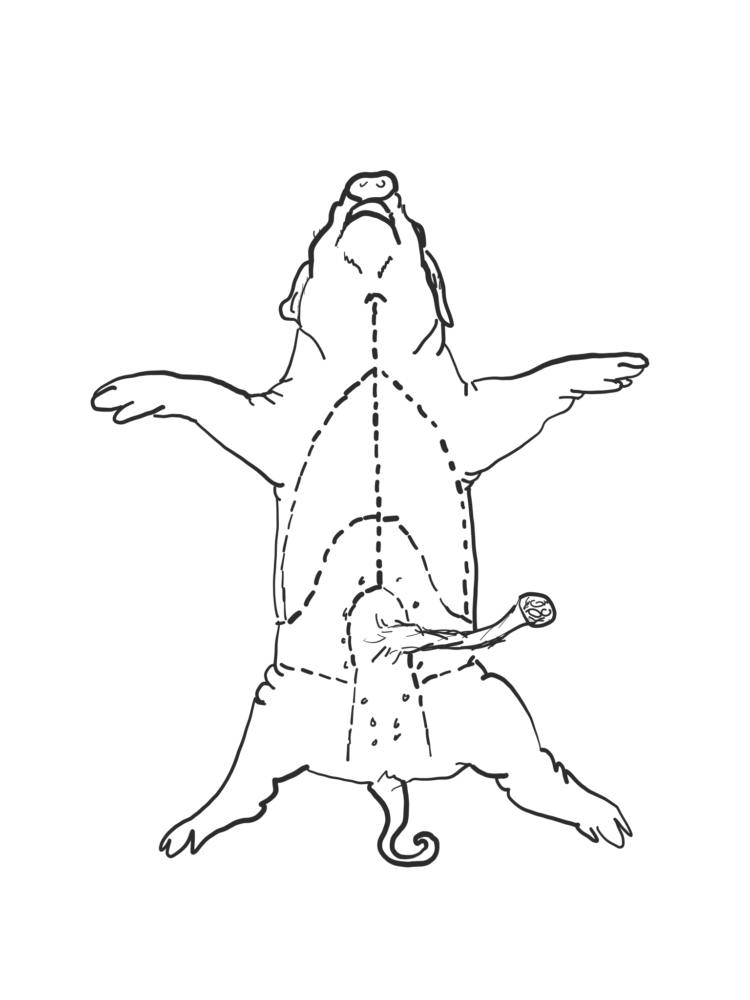

# Mammalian Anatomy I

The domestic pig (*Sus scrofa domesticus* or only *Sus domesticus*), often called swine, hog, or simply pig when there is no need to distinguish it from other pigs, is a large, even-toed ungulate. It is variously considered a subspecies of the wild boar or a distinct species. The domestic pig's head-plus-body-length ranges from 0.9 to 1.8 m, and the adult can weigh between 50 and 350 kg. Compared to other [even-toed ungulates](https://en.wikipedia.org/wiki/Even-toed_ungulate) (artiodactyls), its head is relatively long, pointed, and free of warts. Artiodactyls are generally herbivorous, but the domestic pig is an omnivore, like its wild relative. When used as livestock, domestic pigs are farmed primarily for the consumption of their meat, called pork. The animal's bones, hide, and bristles are also used in commercial products. Domestic pigs, especially miniature breeds, are often kept as pets. Female pigs reach sexual maturity at 3–12 months of age, and can mate every 18–24 days if they are not pregnant. The pregnancy period averages 112–120 days.

```{block2, type='rmdnote'}
The domestic pig, both as a live animal and source of post-mortem tissues, is one of the most valuable animal models used in biomedical research today, because of its biological, physiological and anatomical similarities to human beings. This is also the reason why we have chosen [fetal pigs](https://en.wikipedia.org/wiki/Fetal_pig) for dissection in this lab.
```

## Fetal Pig Dissection
1.  Obtain a dissecting pan, a pair of scissors, a scalpel, forceps, and a pointer.
2.  Obtain a fetal pig.
3.  Place your fetal pig in the dissecting pan ventral side up.
4.  Examine the fetal pig and locate two rows of nipples of mammary glands on the ventral abdominal
surface of both males and females.
5.  Locate the umbilical cord and make a transverse cut through the umbilical cord.
6.  Examine the cut end and locate the two umbilical arteries that carry blood from the fetal pig to the placenta, and the single umbilical vein that delivers nutrient-rich blood back to the fetal pig.
7.  Determine the sex of your specimen:
    *   Female: The urogenital opening in the female is immediately ventral to the anus and has a small genital papilla marking its location.
    *   Male: The scrotal sac is ventral to the anus and a urogenital opening is just posterior to the umbilical cord.
8.  Use a piece of string and tie one end of it around the ankle of the left foreleg.
9.  Pass the oither end of the string under the dissecting pan and tie it to the other foreleg. Stretch the string tightly so that it will hold the pig’s legs apart.
10. Tie a second piece of string in the same manner around the hindlegs.
11. Probe the chest area of the pig with your fingers. You should be able to feel the hard sternum (breastbone) and the ridges of the ribcage. Move your fingers down until you feel the bottom edge of the rib cage. This is where the diaphragm separates the thoracic and abdominal cavities.
12. Grab the tip of the umbilical cord with the thumb and index finger of your left hand (if you are right handed), holding the scissors in your left hand, make a careful incision just above of the umbilical cord (towards the head). When you see the opening of the abdominal cavity, continue cutting along the lines shown in Figure \@ref(fig:dissection).
13. Cut through the skin and the muscle, but be careful not to cut too deep to avoid damaging the internal organs. Use a forceps to hold the tissue away from the organs as you cut. Carry the incision all the way to the pan.
14. Lift up the flaps of skin, peel them back so they lay flat on the pan.
15. Do not remove the umbilical cord, cut around it as indicated.
16. Inspect the abdominal cavity and identify the organs located in this cavity (Figure \@ref(fig:pig)).
17. If your pig is a female, identify the uterus and ovaries (Figure \@ref(fig:female)).
18. If yor pig is male, dissect the groin area of the pig and identify the testes (Figure \@ref(fig:male)).
17. Use the scissors to cut through the rib cage and the sternum. When you reach the midpoint between the forelegs, make another incision towards the right and left side of the pig all the way down to the pan.
18. Pull back the rib cage and pin the two flaps to the pan to expose the thoracic cavity.
19. Carefully cut along the midline towards the mouth to expose the neck area (Figure \@ref(fig:neck)).


```{r dissection, fig.cap='Cut along the dotted lines to expose the abdominal and thoracic cavieties and the neck area.', echo=FALSE, message=FALSE, warning=FALSE}

```

```{r pig, fig.cap='Overview of the abdominal and thoracic cavities and the neck area.', echo=FALSE, message=FALSE, warning=FALSE}
knitr::include_graphics("./figures/pig/pig.png")
```

```{r female, fig.cap='Close-up of the uterus and ovaries.', echo=FALSE, message=FALSE, warning=FALSE}
knitr::include_graphics("./figures/pig/pig_uterus.png")
```

```{r male, fig.cap='Close-up of the testes.', echo=FALSE, message=FALSE, warning=FALSE}
knitr::include_graphics("./figures/pig/pig_testes.png")
```

```{r neck, fig.cap='Close-up of the neck area.', echo=FALSE, message=FALSE, warning=FALSE}
knitr::include_graphics("./figures/pig/pig_neck.png")
```

## Cleaning up
1.  Dispose of the remains of the pig in the red biohazard bins.
2.  Clean the dissection tray and instruments and return them to the place where you picked them up.
3.  Clean table tops with red bottled sanitizer
4.  Wash hands before leaving class

## Review Questions
1.  What are the names of the cavities that are separated by the diaphragm?
2.  Where is the pancreas located?
3.  What is the shape of the uterus in the pig?
4.  What shape the shapes of two major parts of the colon in the pig?
5.  What is the name of the part of the colon that where the small intestine fuses with the large intestine?
6.  Where is the thyroid gland located?
7.  Where is the thymus located?
