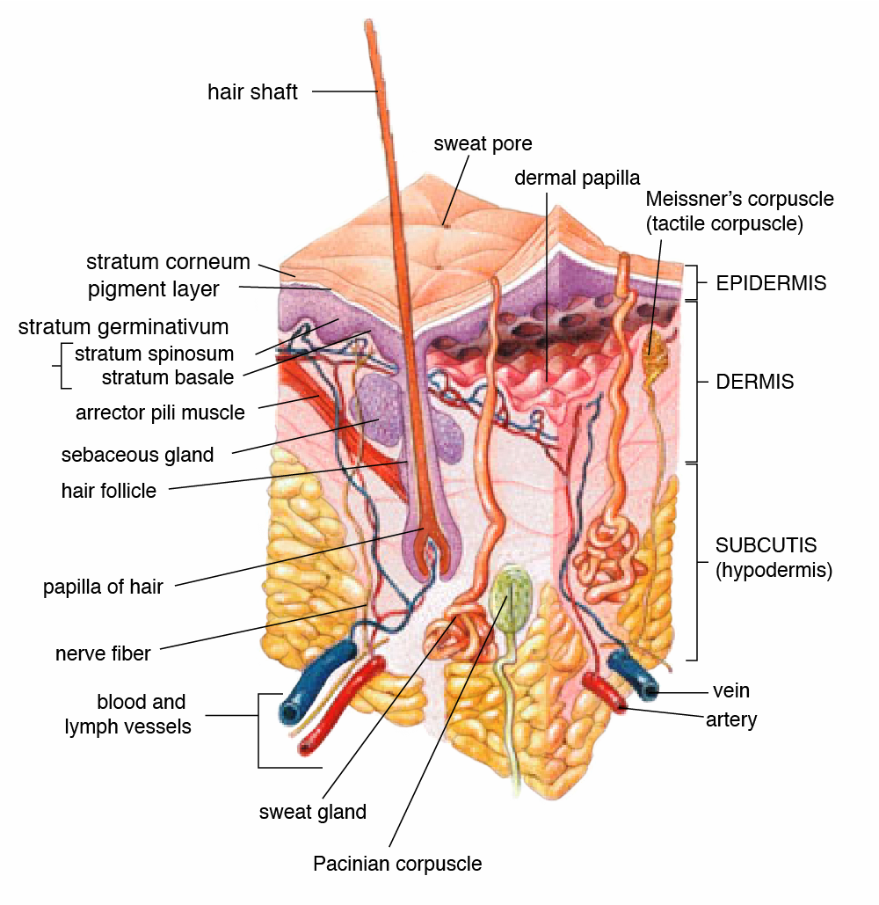
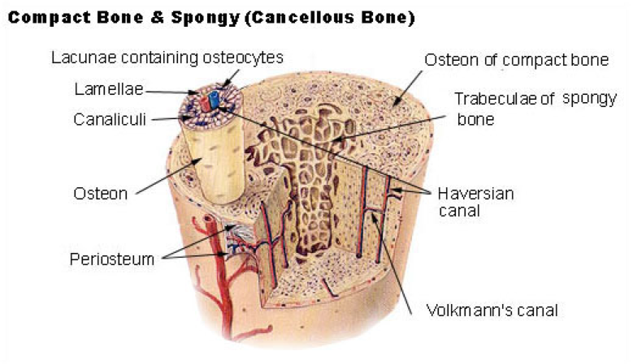
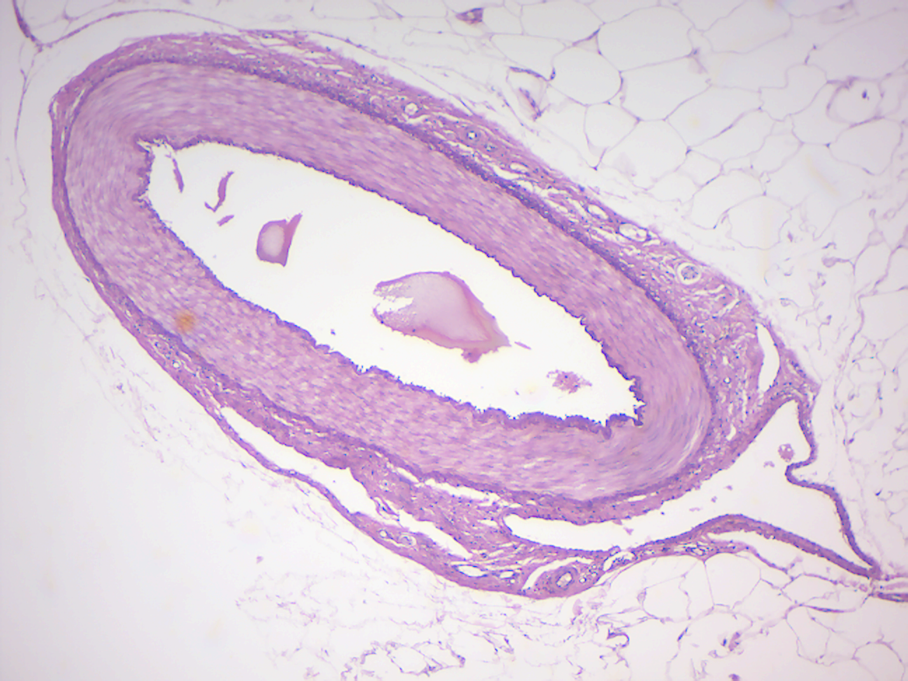
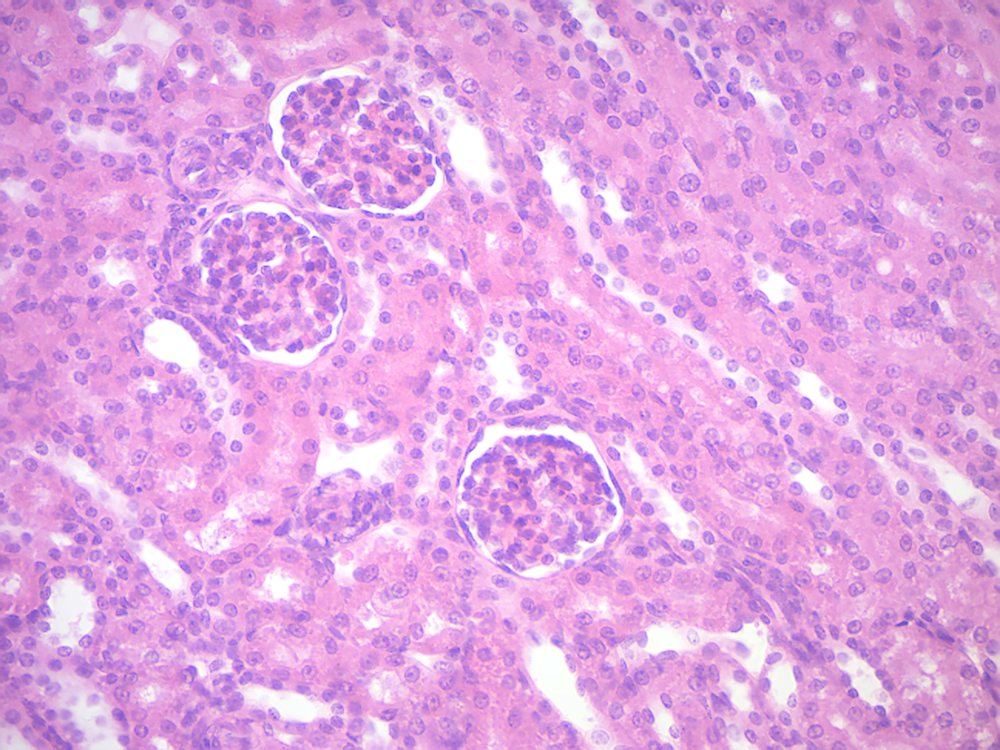
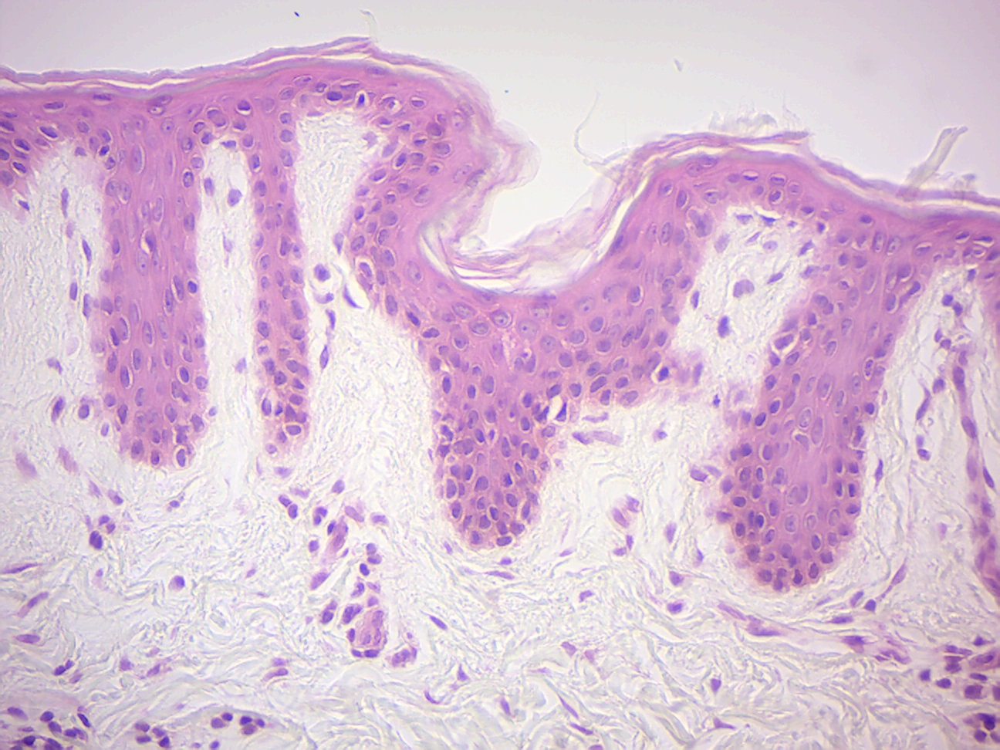
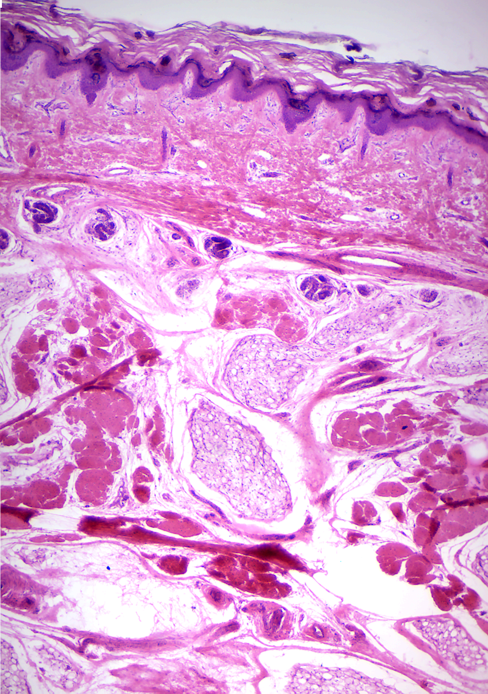
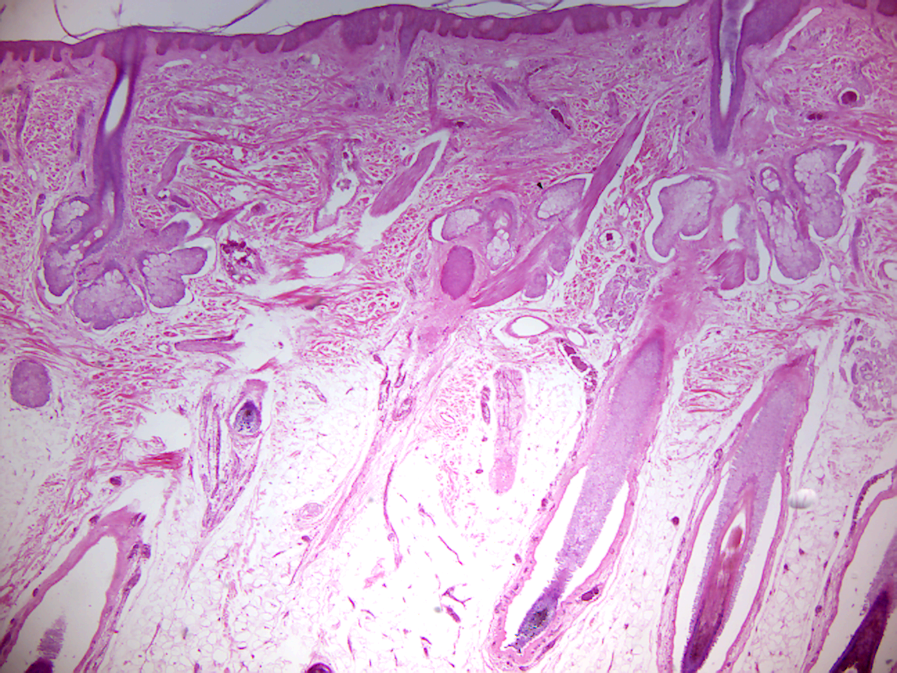
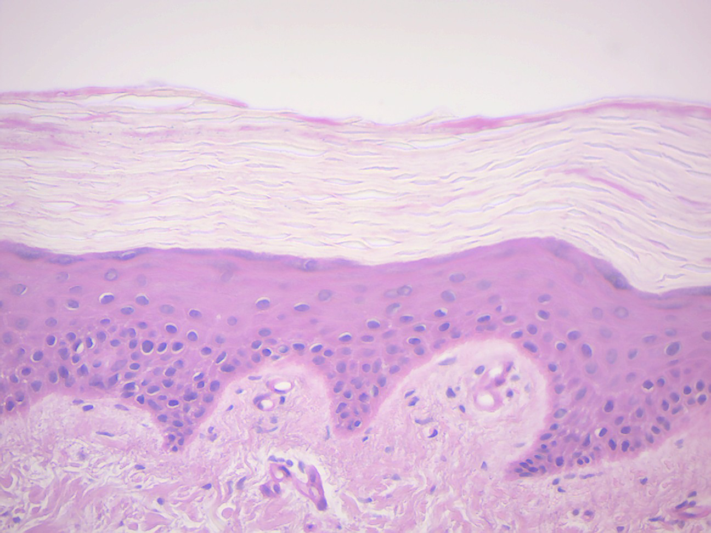
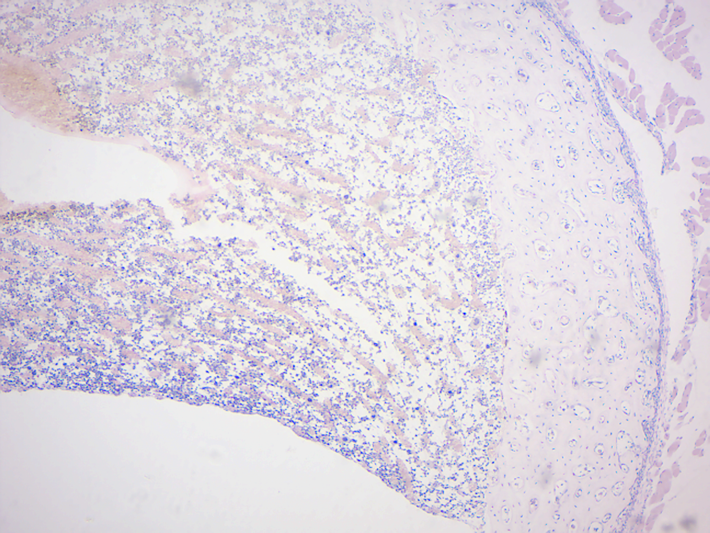

# Mammalian Anatomy II

## Skin
[Skin](https://en.wikipedia.org/wiki/Skin) is the soft outer tissue covering vertebrates. Other animal coverings, such as the arthropod exoskeleton, have different developmental origin, structure and chemical composition. The adjective cutaneous means "of the skin" (from Latin cutis, skin). In mammals, the skin is an organ of the integumentary system made up of multiple layers of ectodermal tissue, and guards the underlying muscles, bones, ligaments and internal organs. Skin of a different nature exists in amphibians, reptiles, and birds. All mammals have some hair on their skin, even marine mammals like whales, dolphins, and porpoises which appear to be hairless. The skin interfaces with the environment and is the first line of defense from external factors. For example, the skin plays a key role in protecting the body against pathogens and excessive water loss. Its other functions are insulation, temperature regulation, sensation, and the production of vitamin D folates. Severely damaged skin may heal by forming scar tissue. This is sometimes discolored and depigmented. The thickness of skin also varies from location to location on an organism. In humans for example, the skin located under the eyes and around the eyelids is the thinnest skin in the body at 0.5 mm thick, and is one of the first areas to show signs of aging such as "crows feet" and wrinkles. The skin on the palms and the soles of the feet is 4 mm thick and is the thickest skin on the body.

[Fur](https://en.wikipedia.org/wiki/Fur) is the hair covering of non-human mammals, particularly those mammals with extensive body hair that is soft and thick. Primarily, fur augments the insulation the skin provides but can also serve as a secondary sexual characteristic or as camouflage. On some animals, the skin is very hard and thick, and can be processed to create leather. Reptiles and fish have hard protective scales on their skin for protection, and birds have hard feathers, all made of tough β-keratins. Amphibian skin is not a strong barrier, especially regarding the passage of chemicals via skin and is often subject to osmosis and diffusive forces. For example, a frog sitting in an anesthetic solution would be sedated quickly, as the chemical diffuses through its skin. Amphibian skin plays key roles in everyday survival and their ability to exploit a wide range of habitats and ecological conditions.

Mammalian skin is composed of two primary layers:

*	the epidermis, which provides waterproofing and serves as a barrier to infection; and
*	the dermis, which serves as a location for the appendages of skin;

(ref:skin) [Anatomy of human skin.](https://commons.wikimedia.org/wiki/File:Skin.png)

```{r skin, fig.cap='(ref:skin)', echo=FALSE, message=FALSE, warning=FALSE}

```

## Epidermis
The [epidermis](https://en.wikipedia.org/wiki/Epidermis) is composed of the outermost layers of the skin. It forms a protective barrier over the body's surface, responsible for keeping water in the body and preventing pathogens from entering, and is a stratified squamous epithelium, composed of proliferating basal and differentiated suprabasal keratinocytes.

Keratinocytes are the major cells, constituting 95% of the epidermis, while Merkel cells, melanocytes and Langerhans cells are also present.
The epidermis can be further subdivided into the following strata or layers (beginning with the outermost layer):

*	Stratum corneum
*	Stratum lucidum (only in palms and soles)
*	Stratum granulosum
*	Stratum spinosum
*	Stratum germinativum (also called the stratum basale)

Keratinocytes in the stratum basale proliferate through mitosis and the daughter cells move up the strata changing shape and composition as they undergo multiple stages of cell differentiation to eventually loose their nuclei. During that process, keratinocytes will become highly organized, forming cellular junctions (desmosomes) between each other and secreting keratin proteins and lipids which contribute to the formation of an extracellular matrix and provide mechanical strength to the skin. Keratinocytes from the stratum corneum are eventually shed from the surface (desquamation).

The epidermis contains no blood vessels, and cells in the deepest layers are nourished by diffusion from blood capillaries extending to the upper layers of the dermis.

## Basement membrane
The epidermis and dermis are separated by a thin sheet of fibers called the basement membrane, and is made through the action of both tissues. The basement membrane controls the traffic of the cells and molecules between the dermis and epidermis but also serves, through the binding of a variety of cytokines and growth factors, as a reservoir for their controlled release during physiological remodeling or repair processes.

## Dermis
The [dermis](https://en.wikipedia.org/wiki/Dermis) is the layer of skin beneath the epidermis that consists of connective tissue and cushions the body from stress and strain. The dermis provides tensile strength and elasticity to the skin through an extracellular matrix composed of collagen fibrils, microfibrils, and elastic fibers, embedded in hyaluronan and proteoglycans.

It harbors many mechanoreceptors (nerve endings) that provide the sense of touch and heat through nociceptors and thermoreceptors. It also contains the hair follicles, sweat glands, sebaceous glands, apocrine glands, lymphatic vessels and blood vessels. The blood vessels in the dermis provide nourishment and waste removal from its own cells as well as for the epidermis.

The dermis is tightly connected to the epidermis through a basement membrane and is structurally divided into two areas: a superficial area adjacent to the epidermis, called the papillary region, and a deep thicker area known as the reticular region.

## Papillary region
The papillary region is composed of loose areolar connective tissue.This is named for its fingerlike projections called papillae that extend toward the epidermis. The papillae provide the dermis with a "bumpy" surface that interdigitates with the epidermis, strengthening the connection between the two layers of skin.

## Reticular region
The reticular region lies deep in the papillary region and is usually much thicker. It is composed of dense irregular connective tissue, and receives its name from the dense concentration of collagenous, elastic, and reticular fibers that weave throughout it. These protein fibers give the dermis its properties of strength, extensibility, and elasticity. Also located within the reticular region are the roots of the hair, sweat glands, sebaceous glands receptors, nails, and blood vessels.

## Subcutaneous tissue
The subcutaneous tissue (also hypodermis) is not part of the skin, and lies below the dermis. Its purpose is to attach the skin to underlying bone and muscle as well as supplying it with blood vessels and nerves. It consists of loose connective tissue and elastin. The main cell types are fibroblasts, macrophages and adipocytes (the subcutaneous tissue contains 50% of body fat). Fat serves as padding and insulation for the body.

Microorganisms like *Staphylococcus epidermidis* colonize the skin surface. The density of skin flora depends on region of the skin. The disinfected skin surface gets recolonized from bacteria residing in the deeper areas of the hair follicle, gut and urogenital openings.

## Muscle
[Muscle](https://en.wikipedia.org/wiki/Muscle) is a soft tissue found in most animals. Muscle cells contain protein filaments of actin and myosin that slide past one another, producing a contraction that changes both the length and the shape of the cell. Muscles function to produce force and motion. They are primarily responsible for maintaining and changing posture, locomotion, as well as movement of internal organs, such as the contraction of the heart and the movement of food through the digestive system via peristalsis.

Muscle tissues are derived from the mesodermal layer of embryonic germ cells in a process known as myogenesis. There are three types of muscle, skeletal or striated, cardiac, and smooth. Muscle action can be classified as being either voluntary or involuntary. Cardiac and smooth muscles contract without conscious thought and are termed involuntary, whereas the skeletal muscles contract upon command.

The term muscle is derived from the Latin musculus meaning "little mouse" perhaps because of the shape of certain muscles or because contracting muscles look like mice moving under the skin.

The muscular system consists of all the muscles present in a single body. There are approximately 650 skeletal muscles in the human body, but an exact number is difficult to define. The difficulty lies partly in the fact that different sources group the muscles differently and partly in that some muscles, such as palmaris longus, are not always present.

The muscular system is one component of the musculoskeletal system, which includes not only the muscles but also the bones, joints, tendons, and other structures that permit movement.

## Cartilage
[Cartilage](https://en.wikipedia.org/wiki/Cartilage) is a resilient and smooth elastic tissue, rubber-like padding that covers and protects the ends of long bones at the joints, and is a structural component of the rib cage, the ear, the nose, the bronchial tubes, the intervertebral discs, and many other body components. It is not as hard and rigid as bone, but it is much stiffer and much less flexible than muscle.

Because of its rigidity, cartilage often serves the purpose of holding tubes open in the body. Examples include the rings of the trachea, such as the cricoid cartilage and carina.

Cartilage is composed of specialized cells called chondrocytes that produce a large amount of collagenous extracellular matrix, abundant ground substance that is rich in proteoglycan and elastin fibers. Cartilage is classified in three types, elastic cartilage (Figure \@ref(fig:elastic)), hyaline cartilage (Figure \@ref(fig:hyaline)) and fibrocartilage (Figure \@ref(fig:fibro)), which differ in relative amounts of collagen and proteoglycan.

Cartilage does not contain blood vessels (it is avascular) or nerves (it is aneural). Nutrition is supplied to the chondrocytes by diffusion. The compression of the articular cartilage or flexion of the elastic cartilage generates fluid flow, which assists diffusion of nutrients to the chondrocytes. Compared to other connective tissues, cartilage has a very slow turnover of its extracellular matrix and does not repair.

## Bone
[Bones](https://en.wikipedia.org/wiki/Bone) support and protect the various organs of the body, produce red and white blood cells, store minerals, provide structure and support for the body, and enable mobility. Bones come in a variety of shapes and sizes and have a complex internal and external structure. They are lightweight yet strong and hard, and serve multiple functions.

Bone tissue (osseous tissue) is a hard tissue, a type of dense connective tissue. It has a honeycomb-like matrix internally, which helps to give the bone rigidity. Bone tissue is made up of different types of bone cells. Osteoblasts and osteocytes are involved in the formation and mineralization of bone; osteoclasts are involved in the resorption of bone tissue. Modified (flattened) osteoblasts become the lining cells that form a protective layer on the bone surface. The mineralized matrix of bone tissue has an organic component of mainly collagen called ossein and an inorganic component of bone mineral made up of various salts. Bone tissue is a mineralized tissue of two types, cortical bone and cancellous bone. Other types of tissue found in bones include bone marrow, endosteum, periosteum, nerves, blood vessels and cartilage.

In the human body at birth, there are over 270 bones but many of these fuse together during development, leaving a total of 206 separate bones in the adult, not counting numerous small sesamoid bones. The largest bone in the body is the femur or thigh-bone, and the smallest is the stapes in the middle ear.

The Latin word for bone is os, hence the many terms that use it as a prefix – such as osseous and osteopathy.

Bone is not uniformly solid, but includes a tough matrix. This matrix makes up about 30% of the bone and the other 70% is of salts that give strength to it. The matrix is made up of between 90 and 95% collagen fibers, and the remainder is ground substance. The primary tissue of bone, bone tissue (osseous tissue), is relatively hard and lightweight. Its matrix is mostly made up of a composite material incorporating the inorganic mineral calcium phosphate in the chemical arrangement termed calcium hydroxylapatite (this is the bone mineral that gives bones their rigidity) and collagen, an elastic protein which improves fracture resistance. The collagen of bone is known as ossein. Bone is formed by the hardening of this matrix around entrapped cells. When these cells become entrapped from osteoblasts they become osteocytes.

The hard, outer layer of bones is composed of cortical bone also called compact bone being much denser than cancellous bone. It forms the hard exterior (cortex) of bones. The cortical bone gives bone its smooth, white, and solid appearance. It facilitates bone's main functions: to support the whole body, protect organs, provide levers for movement, and store and release chemical elements, mainly calcium. It consists of multiple microscopic columns, each called an osteon. Each column is multiple layers of osteoblasts and osteocytes around a central canal called the Haversian canal. Volkmann's canals at right angles connect the osteons together. The columns are metabolically active, and as bone is reabsorbed and created the nature and location of the cells within the osteon will change. Cortical bone is covered by a periosteum on its outer surface, and an endosteum on its inner surface. The endosteum is the boundary between the cortical bone and the cancellous bone. The primary anatomical and functional unit of cortical bone is the osteon.

Spongy bone tissue is the internal tissue of the skeletal bone and is an open cell porous network. Spongy bone is typically found at the ends of long bones, near to joints and within the interior of vertebrae. Spongy bone is highly vascular and frequently contains red bone marrow where hematopoiesis, the production of blood cells, occurs. The primary anatomical and functional unit of spongy bone is the trabecula. The trabeculae are aligned towards the mechanical load distribution that a bone experiences within long bones such as the femur. Within these spaces are bone marrow and hematopoietic stem cells that give rise to platelets, red blood cells and white blood cells.


(ref:bone) [Compact and spongy bone.](https://commons.wikimedia.org/wiki/File:Illu_compact_spongy_bone.jpg)

```{r bone, fig.cap='(ref:bone)', echo=FALSE, message=FALSE, warning=FALSE}

```

## The kidneys
The [kidneys](https://en.wikipedia.org/wiki/Kidney) are two bean-shaped organs found on the left and right sides of the body in vertebrates. They are located at the back of the abdominal cavity in the retroperitoneal space. In adult humans, they are about 11 centimeters in length. They receive blood from the paired renal arteries; blood exits into the paired renal veins. Each kidney is attached to a ureter, a tube that carries excreted urine to the bladder.

The nephron is the structural and functional unit of the kidney. Each adult kidney contains around one million nephrons. The nephron utilizes four processes to alter the blood plasma which flows to it: filtration, reabsorption, secretion, and excretion. Via one or more of these mechanisms, the kidney participates in the control of the volume of various body fluid compartments, fluid osmolality, acid-base balance, various electrolyte concentrations, and removal of toxins. Filtration occurs in the glomerulus: one-fifth of the blood volume that enters the kidneys is filtered. Examples of substances reabsorbed are solute-free water, sodium, bicarbonate, glucose, and amino acids. Examples of substances secreted are hydrogen, ammonium, potassium and uric acid. The kidneys also carry out functions independent of the nephron. For example, they convert a precursor of vitamin D to its active form – calcitriol – and synthesize the hormones erythropoietin and renin.

## Sheep Kidney Dissection
1.  Obtain a dissecting pan and a set of dissecting instruments.
2.  Place the preserved sheep kidney on your dissecting tray.
3.  Cut the kidney in half making a frontal section. Start your incision on the side of the kidney opposite of the hilus and carefully make your way through the cortex, medulla, pelvis, ureter and renal blood vessels.
4.  Identify the following parts of the kidney
    * cortex
    * renal column
    * medullary pyramid
    * minor calyx
    * major calyx
    * renal pelvis
    * ureter
    * renal artery
    * renal vein

## Cleaning up
1.  Dispose of the dissected kidney in the red biohazard bins.
2.  Clean the dissection tray and get a sheep heart for dissection.

## The heart
The [heart](https://en.wikipedia.org/wiki/Heart) is a muscular organ in most animals, which pumps blood through the blood vessels of the circulatory system. Blood provides the body with oxygen and nutrients, as well as assists in the removal of metabolic wastes. In humans, the heart is located between the lungs, in the middle compartment of the chest.

In humans, other mammals, and birds, the heart is divided into four chambers: upper left and right atria; and lower left and right ventricles. Commonly the right atrium and ventricle are referred together as the right heart and their left counterparts as the left heart. Fish, in contrast, have two chambers, an atrium and a ventricle, while reptiles have three chambers. In a healthy heart blood flows one way through the heart due to heart valves, which prevent backflow. The heart is enclosed in a protective sac, the pericardium, which also contains a small amount of fluid. The wall of the heart is made up of three layers: epicardium, myocardium, and endocardium.

The heart pumps blood with a rhythm determined by a group of pacemaking cells in the sinoatrial node. These generate a current that causes contraction of the heart, traveling through the atrioventricular node and along the conduction system of the heart. The heart receives blood low in oxygen from the systemic circulation, which enters the right atrium from the superior and inferior venae cavae and passes to the right ventricle. From here it is pumped into the pulmonary circulation, through the lungs where it receives oxygen and gives off carbon dioxide. Oxygenated blood then returns to the left atrium, passes through the left ventricle and is pumped out through the aorta to the systemic circulation−where the oxygen is used and metabolized to carbon dioxide. The human heart beats at a resting rate close to 72 beats per minute. Exercise temporarily increases the rate, but lowers resting heart rate in the long term, and is good for heart health.
An adult human heart has a mass of 250–350 grams. The heart is typically the size of a fist.  Well-trained athletes can have much larger hearts due to the effects of exercise on the heart muscle, similar to the response of skeletal muscle.

The heart has four chambers, two upper atria, the receiving chambers, and two lower ventricles, the discharging chambers. The atria open into the ventricles via the atrioventricular valves, present in the atrioventricular septum. This distinction is visible also on the surface of the heart as the coronary sulcus. There is an ear-shaped structure in the upper right atrium called the right atrial appendage, or auricle, and another in the upper left atrium, the left atrial appendage. The right atrium and the right ventricle together are sometimes referred to as the right heart. Similarly, the left atrium and the left ventricle together are sometimes referred to as the left heart. The ventricles are separated from each other by the interventricular septum, visible on the surface of the heart as the anterior longitudinal sulcus and the posterior interventricular sulcus.

The heart has four valves, which separate its chambers. One valve lies between each atrium and ventricle, and one valve rests at the exit of each ventricle.

The valves between the atria and ventricles are called the atrioventricular valves. Between the right atrium and the right ventricle is the tricuspid valve. The tricuspid valve has three cusps, which connect to chordae tendinae and three papillary muscles named the anterior, posterior, and septal muscles, after their relative positions. The mitral valve lies between the left atrium and left ventricle. It is also known as the bicuspid valve due to its having two cusps, an anterior and a posterior cusp. These cusps are also attached via chordae tendinae to two papillary muscles projecting from the ventricular wall. These muscles prevent the valves from falling too far back when they close. During the relaxation phase of the cardiac cycle, the papillary muscles are also relaxed and the tension on the chordae tendineae is slight. As the heart chambers contract, so do the papillary muscles. This creates tension on the chordae tendineae, helping to hold the cusps of the atrioventricular valves in place and preventing them from being blown back into the atria.

Two additional semilunar valves sit at the exit of each of the ventricles. The pulmonary valve is located at the base of the pulmonary artery. This has three cusps which are not attached to any papillary muscles. When the ventricle relaxes blood flows back into the ventricle from the artery and this flow of blood fills the pocket-like valve, pressing against the cusps which close to seal the valve. The semilunar aortic valve is at the base of the aorta and also is not attached to papillary muscles. This too has three cusps which close with the pressure of the blood flowing back from the aorta.

Heart tissue, like all cells in the body, needs to be supplied with oxygen, nutrients and a way of removing metabolic wastes. This is achieved by the coronary circulation, which includes arteries, veins, and lymphatic vessels. Blood flow through the coronary vessels occurs in peaks and troughs relating to the heart muscle's relaxation or contraction.

Heart tissue receives blood from two arteries which arise just above the aortic valve. These are the left main coronary artery and the right coronary artery. The left main coronary artery splits shortly after leaving the aorta into two vessels, the left anterior descending and the left circumflex artery. The left anterior descending artery supplies heart tissue and the front, outer side, and the septum of the left ventricle. It does this by branching into smaller arteries – diagonal and septal branches. The left circumflex supplies the back and underneath of the left ventricle. The right coronary artery supplies the right atrium, right ventricle, and lower posterior sections of the left ventricle.

## Sheep Heart Dissection
1.  Obtain a dissecting pan and a set of dissecting instruments.
2.  Place the preserved sheep heart on your dissecting tray.
3.  Identify the right and left sides of the heart. Look closely and on one side you will see a diagonal line of blood vessels that divide the heart, this line is called the interventricular sulcus. The half that includes all of the apex (pointed end) of the heart is the left side.
4.  Locate the coronary arteries and veins that are on the surface of the heart.
5.  Find the flaps of dark tissue on the top of the heart. These ear-like flaps are called auricles.
6.  The front-most vessel is the pulmonary trunk.
7.  Just behind the pulmonary trunk is the aorta. Depending on how the heart was removed, you might also see a branch of the aorta called the brachiocephalic artery.
8.  Turn the heart so that you are looking at its dorsal side (the back of the heart.) Find the large opening at the top of the heart next to the right auricle. This is the superior vena cava. You may insert your finger into the vena cave superior to feel the inside of the right atrium.
9.  Locate another opening on the backside of the heart on the left side. This is the pulmonary vein. You may insert your finger again to feel the inside of the right atrium.
10. Use a scalpel to make an incision in the heart at the superior vena cava. The incision should follow the line of the right side of the heart so that you can open just the right side and see the right atrium, the right ventricle, and the tricuspid valve between them.
11. The chordae tendineae are attached to the thin flaps of the tricuspid. They are anchored to the wall of the heart at the papillary muscle.
12. Make a similar incision on the left side of the heart to expose the left atrium, left ventricle, and the bicuspid valve. Notice the chordae tendineae and the papillary muscle on this side of the heart.
13. Insert a probe into the aorta and observe where the probe exits the heart. You may even be able to find the small aortic semilunar valve a the place where the aorta connects to the heart.

## Cleaning up
1.  Dispose of the dissected heart in the red biohazard bins.
2.  Clean the dissection tray and instruments and return them to the place where you picked them up.
3.  Clean table tops with red bottled sanitizer
4.  Wash your hands.


## View Prepared Slides
1.  Cardiac Muscle (Figure \@ref(fig:cardiac))
    *   Identify: branched cardiac muscle cells, nuclei; intercalated disks
1.  Cardiac Muscle Human
    *   Identify: branched cardiac muscle cells, nuclei; intercalated disks
3.  Artery, Vein, Capillary x.s. (Figure \@ref(fig:vessels))
    *   Identify: artery, vein, capillary
4.  Atherosclerosis (Figure \@ref(fig:atherosclerosis))
    *   Locate: arteriosclecotic plaque
5.  Kidney (Figure \@ref(fig:kidney)).
    *   Locate: renal corpuscles, proximal and distal tubules, collecting ducts.

```{r vessels, fig.cap='Artery, vein, capillary.', echo=FALSE, message=FALSE, warning=FALSE}

```

```{r atherosclerosis, fig.cap='Atherosclerosis.', echo=FALSE, message=FALSE, warning=FALSE}
knitr::include_graphics("./figures/anatomy/atherosclerosis.png")
```

```{r kidney, fig.cap='Cortex of the kidney.', echo=FALSE, message=FALSE, warning=FALSE}

```


In the skin slides listed below identify as many of the following as you can find:

*   skin layers:  epidermis, dermis, sub-cutaneous
*   blood vessel
*   dense fibrous irregular connective tissue
*   keratinized layer in epidermis
*   adipose tissue
*   smooth muscle of pilli
*   stratified squamous epithelium
*   hair
*   hair follicle
*   hair root
*   hair papilla
*   sweat glands
*   sebaceous glands
*   Vater-Pacini corpuscle

1.  Unpigmented skin (Figure \@ref(fig:unpigmented))
3.  Axillary skin (Figure \@ref(fig:axillary))
4.  Skin, hairy mammal
6.  Human scalp hair shafts (Figure \@ref(fig:scalp))
7.  Cornified skin (Figure \@ref(fig:cornified))
13. Compact Bone (Figure \@ref(fig:compactbone))
    *   Identify:  Haversian Systems, osteocytes in lacunae, Haversian Canal, canaliculi, calcified matrix
14. Bone Ground Human x.s. (Figure \@ref(fig:groundbone))
    *   Identify:  Haversian Systems, osteocytes in lacunae, Haversian Canal, canaliculi, calcified matrix


```{r unpigmented, fig.cap='Unpigmented skin.', echo=FALSE, message=FALSE, warning=FALSE}

```

```{r axillary, fig.cap='Axillary skin.', echo=FALSE, message=FALSE, warning=FALSE}

```

```{r scalp, fig.cap='Human scalp.', echo=FALSE, message=FALSE, warning=FALSE}

```

```{r cornified, fig.cap='Cornified skin.', echo=FALSE, message=FALSE, warning=FALSE}

```

```{r compactbone, fig.cap='Compact Bone.', echo=FALSE, message=FALSE, warning=FALSE}

```

## The human skeleton
The [human skeleton](https://en.wikipedia.org/wiki/Human_skeleton) (Figure \@ref(fig:skeleton)) is the internal framework of the body. It is composed of around 270 bones at birth and around 206 bones by adulthood after some bones get fused together. The bone mass in the skeleton reaches maximum density around age 21. The human skeleton can be divided into the axial skeleton and the appendicular skeleton. The axial skeleton is formed by the vertebral column, the rib cage, the skull and other associated bones. The appendicular skeleton, which is attached to the axial skeleton, is formed by the shoulder girdle, the pelvic girdle and the bones of the upper and lower limbs.

The human skeleton performs six major functions; support, movement, protection, production of blood cells, storage of minerals, and endocrine regulation.

The human skeleton is not as sexually dimorphic as that of many other primate species, but subtle differences between sexes in the morphology of the skull, dentition, long bones, and pelvis exist. In general, female skeletal elements tend to be smaller and less robust than corresponding male elements within a given population. The human female pelvis is also different from that of males in order to facilitate childbirth. Unlike most primates, human males do not have penile bones.

(ref:skeleton) [The human skeleton.](https://commons.wikimedia.org/wiki/File:Human_skeleton_front_en.svg)

```{r skeleton, fig.cap='(ref:skeleton)', echo=FALSE, message=FALSE, warning=FALSE}
knitr::include_graphics("./figures/anatomy/skeleton.svg")
```

## Locate the following bones of the human skeleton:

1.  Axial skeleton:
    ```
    Skull Bones:
			Frontal    Mandible
			Parietal   Maxilla
			Temporal   Zygomatic
			Occipital  Nasal

    Vertebral Column:
			7 cervical   1 fused sacrum
			12 thoracic  1 fused coccyx
			5 lumbar

		Ribs – 12 pairs; notice the two pairs of “floating” ribs

		Sternum

		Hyoid bone (not shown on small plastic models)
    ```
1. Appendicular skeleton:
    ```
    Pectoral girdle:
		  Clavicle  Ulna
		  Scapula   Carpals
		  Humerus   Metacarpals
		  Radius    Phalanges

    Pelvic girdle:
		  Coccyx    Fibula
		  Femur     Tarsals
		  Patella   Metatarsals
		  Tibia     Phalanges
    ```
1.  Skulls:

    *   Adult: locate the following bones: frontal, occipital, temporal parietal, mandible, maxilla, zygomatic, nasal, sphenoid, ethmoid. Also locate the immoveable joints known as sutures.

    *   Fetal: locate the fontanel (“soft spot”)

    *   Female and Male Pelvic Bones: Notice the pubic arch angle and other characteristics and determine which are female and which are male. Locate the ilium, pubis, and ischium bones. Locate the public symphysis (classified as a slightly moveable joint) located between the pubic bones.

## Comparison of Vertebrate Skeletons

1. Compare the human skeleton to the following:
    ```
    Bony Fish   Bird
    Frog        Bat
    Snake       Cat
    Turtle      Monkey
    ```

1.  Locate the following bones in each skeleton (if possible):
    ```
    Humerus   Metacarpals Fibula
    Radius    Phalanges   Tarsals
    Ulna      Femur       Metatarsals
    ```

## Review Questions
1.  Describe the journey of the blood through the heart.
2.  Heart muscle receives blood from two arteries which arise just above the aortic valve. These are the `________` and the `________`.
3.  The basic functional unit of the kidney is the `________`.
4.  The blood is filtered in the `________` of the kidney.
5.  The valve between the right atrium and ventricle is called the `________` valve.
6.  The valve between the left atrium and ventricle is called the `________` valve.
7.  What is the difference between arteries and veins?
8.  The most superficial layer of the skin is called the `________`.
9.  The hard, outer layer of bones is composed of cortical bone also called `________` bone.
10. `________` bone tissue is the internal tissue of the skeletal bone and is an open cell porous network.  
