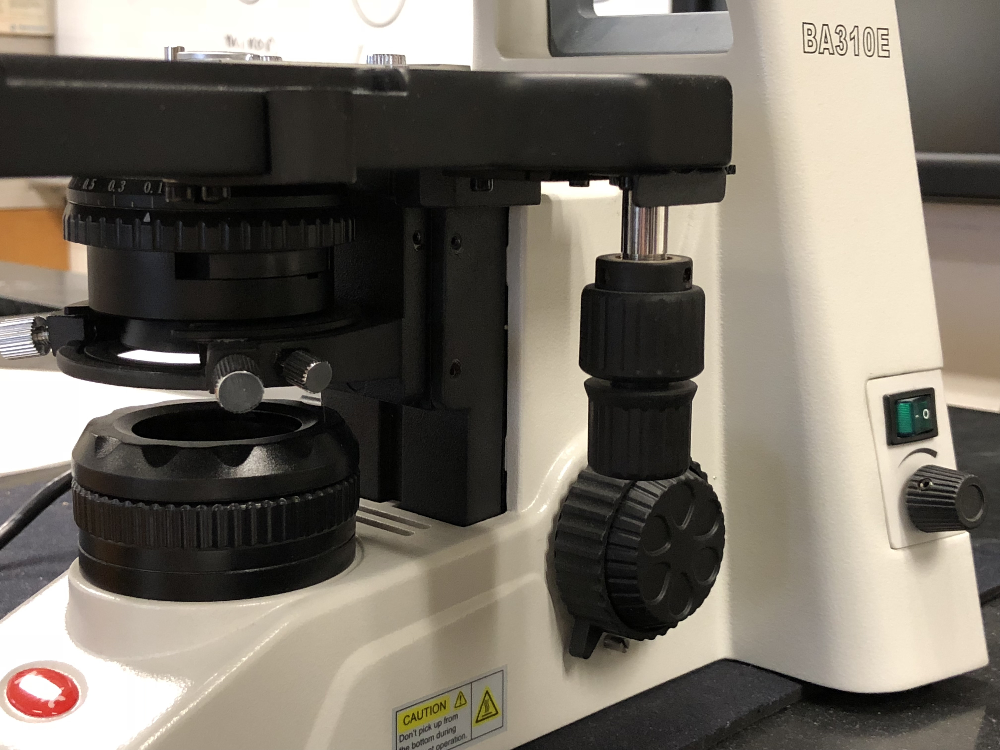

# A Refresher on How to Use The Microscope

A [microscope](https://en.wikipedia.org/wiki/Microscope) (from the Ancient Greek: mikrós, "small" and skopeîn, "to look" or "see") is an instrument used to see objects that are too small to be seen by the naked eye. Microscopic means invisible to the eye unless aided by a microscope.

There are many types of microscopes, and they may be grouped in different ways. One way is to describe the way the instruments interact with a sample to create images, either by sending a beam of light or electrons to a sample in its optical path, or by scanning across, and a short distance from, the surface of a sample using a probe. The most common microscope (and the first to be invented) is the [optical microscope](https://en.wikipedia.org/wiki/Optical_microscope), which uses light to pass through a sample to produce an image.

The objective lens of a microscope (Figure \@ref(fig:objectives)) is a cylinder containing one or more lenses that are typically made of glass. It is essentially a high-powered magnifying glass which is brought very close to the specimen being examined. The objective collects light from the sample so that it comes to a focus inside the microscope tube. This creates an enlarged image of the specimen.

```{r objectives, fig.cap='The microscope objectives.', echo=FALSE, message=FALSE, warning=FALSE}
knitr::include_graphics("./figures/microscope/Microscope_objectives.jpg")
```
The eyepieces, or ocular lenses (Figure \@ref(fig:oculars)), are the lenses that are closest to your eyes when you look through the microscope. The objective lens or mirror collects light and brings it to focus creating an image. The eyepiece is placed near the focal point of the objective to magnify this image. This image is inverted and can be seen by removing the eyepiece and placing a piece of tracing paper over the end of the tube. By carefully focusing a brightly lit specimen, a highly enlarged image can be seen. It is this real image that is viewed by the eyepiece lens that provides further enlargement. The amount of magnification depends on the focal length of the eyepiece. The ocular in our microscopes have a 10× magnification.

```{r oculars, fig.cap='The oculars (eye pieces) of the microscope.', echo=FALSE, message=FALSE, warning=FALSE}
knitr::include_graphics("./figures/microscope/Oculars.jpg")
```

Our microscopes have four objective lenses with different magnifications, screwed into the circular "nosepiece" which you rotate to select the required lens. These lenses are color coded for easier use. The least powerful lens is called the scanning objective lens and is a 4× objective. The second lens is referred to as the small objective lens and is 10× lens. The most powerful lens out of the four are referred to as the large objective lenses and are 40× and 100×. The 100× objective is an oil-immersion lens. This objective is specially designed for use with refractive index matching oil, which must fill the gap between the objective lens and the specimen.

```{r focus, fig.cap='The coarse (big wheel) and fine (small wheel) focus adjustment knobs.', echo=FALSE, message=FALSE, warning=FALSE}
knitr::include_graphics("./figures/microscope/focus.jpg")
```

The stage is a platform below the objective which supports the specimen being viewed. Adjustment knobs (on the left side of the microscope) move the stage up and down with separate adjustment for coarse and fine focusing (Figure \@ref(fig:focus)). In the center of the stage is a hole through which light passes to illuminate the specimen (Figure \@ref(fig:stage)). The stage has arms to hold slides (rectangular glass plates on which the specimen is mounted).

```{r stage, fig.cap='The stage with the slide holder and central opening showing the condenser lens.', echo=FALSE, message=FALSE, warning=FALSE}
knitr::include_graphics("./figures/microscope/stage.jpg")
```

The stage moves up and down for focus. Always start with the lowest magnification in order to center the specimen on the stage. After moving to a higher magnification re-focus using the fine focus knob. You may also have to adjust the horizontal positions using the horizontal stage and slide holder adjustment knobs hanging down on the right side of the stage (Figure \@ref(fig:condenser)). Our microscopes, an adjustable LEDs light source (knob on the right side). The condenser is a lens designed to focus light from the illumination source onto the sample. The light source and condenser also each include a diaphragm to influence the quality and intensity of the illumination. For our purposes, the diaphragms should always be completely open. Adjust the light intensity only using the knob on the right side of the frame of the microscope (the black knob below the green switch in Figure \@ref(fig:stage).

```{r condenser, fig.cap='The condenser (below the stage), the horizontal stage and slide holder adjustment knobs (hanging down from the stage), the light on switch and light intensity adjustment knob (in the back).', echo=FALSE, message=FALSE, warning=FALSE}

```
We have prepared a number of videos that introduce our microscopes to you and also demonstrate how you can capture images of the slides that you are viewing and transfer them to your own equipment.

Name of Video	Youtube address
Introduction to microscope	 https://youtu.be/2bRc3u9PMDA

Description of student and instructor microscope	 https://youtu.be/qQKLu4ULRM

Turn on tablet and view slide	 https://youtu.be/wOB2BSQBZFA

Student image capture option 1	 https://youtu.be/jdx1SR5dvJc

Student image capture option 2	 https://youtu.be/v5w-yuL8vg0

## Starting up the microscope
The tablets and microscopes must be turned on in a specific order:

1.	The microscope must be plugged in. If already plugged in, proceed to step 3.
2.	The Motic logo will appear on tablet. After a few seconds, the charging symbol appears.
3.	Press and hold the power button on the tablet for 6 seconds.
4.	The Motic symbol will appear again and tablet will start up.
5.	Turn on the microscope using the switch on the lower right side.

## Turning off the microscope
The tablets and microscopes must be turned off in a specific order:

1. Turn off the microscope using the switch on the lower right side.
2.	While the microscope is still plugged in, turn off the tablet by holding the power button down for a few seconds. Select power off.
3.	The Motic logo will appear on tablet.
4.	Wait until the charging symbol appears.
5.	Leave the microscope on the student bench and plugged in after turning it off.
6.	Place the cover over the microscope.
