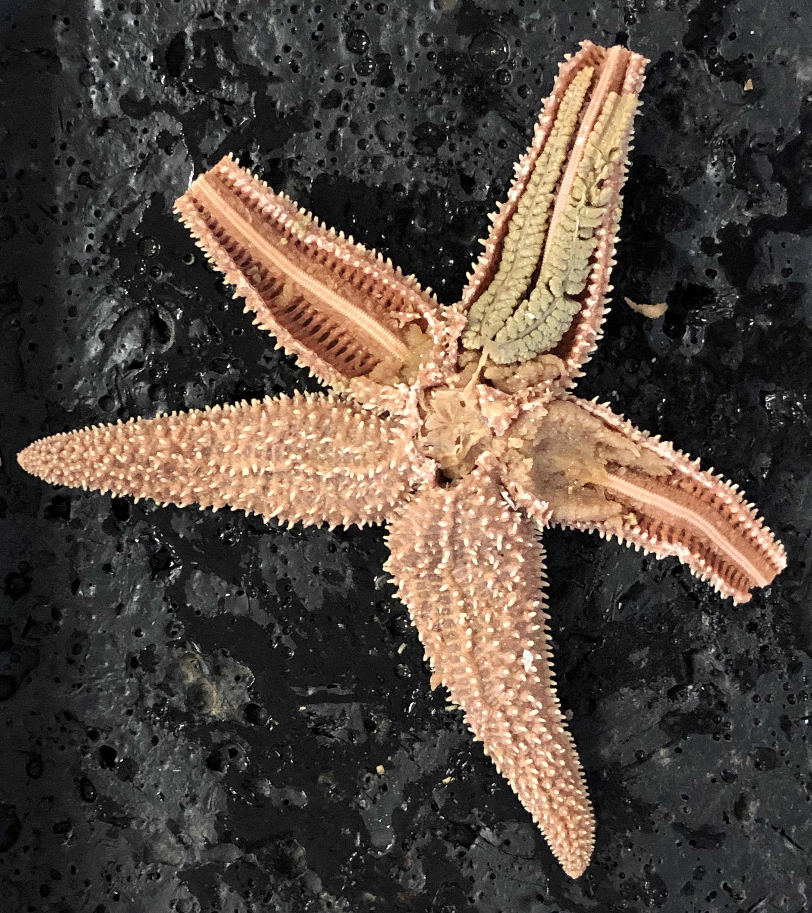
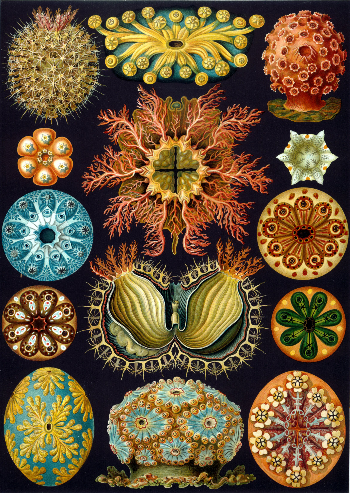
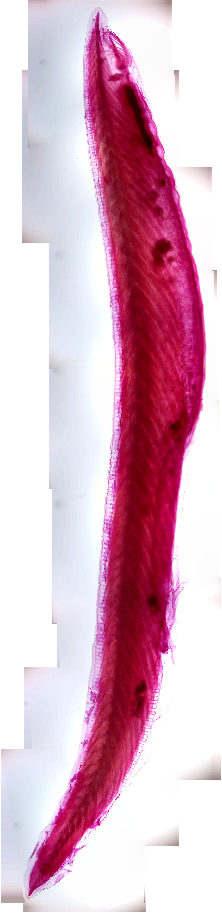

# Echinodermata, Hemichordata and Chordata

[Echinodermata](https://en.wikipedia.org/wiki/Echinoderm) (the phylum which includes starfish, sea urchins, sea cucumbers, and crinoids) and [Hemichordata](https://en.wikipedia.org/wiki/Hemichordate), form the [ambulacraria](https://en.wikipedia.org/wiki/Ambulacraria), the sister taxon of the chordates. The [Chordata](https://en.wikipedia.org/wiki/Chordate) and ambulacraria form the superphylum deuterostomia, composed of the deuterostomes. Deuterostomes are one of the two major divisions of the bilaterians, the other being the protostomes. During the early development of the embryo, in deuterostomes, the blastopore (the first opening to form) becomes the anus whereas in the protostomes, it becomes the mouth. In deuterostomes, the mouth develops at a later stage, at the opposite end of the blastula from the blastopore, and a gut forms connecting the two.

## Echinodermata
Echinoderm is the common name given to any member of the phylum Echinodermata (from Ancient Greek, echinos – "hedgehog" and derma – "skin") of marine animals. The adults are recognizable by their (usually five-point) radial symmetry, and include such well-known animals as sea stars, sea urchins, sand dollars, and sea cucumbers, as well as the sea lilies or "stone lilies". Echinoderms are found at every ocean depth, from the intertidal zone to the abyssal zone. The phylum contains about 7000 living species, making it the second-largest grouping of deuterostomes (a superphylum), after the chordates (which include the vertebrates, such as birds, fishes, mammals, and reptiles). Echinoderms are also the largest phylum that has no freshwater or terrestrial (land-based) representatives.

The first definitive members of the phylum appeared near the start of the Cambrian. One group of Cambrian echinoderms, the cinctans (Homalozoa), which are close to the base of the echinoderm origin, have been found to possess external gills used for filter feeding, like Chordata and Hemichordata.

The echinoderms are important both ecologically and geologically. Ecologically, there are few other groupings so abundant in the biotic desert of the deep sea, as well as shallower oceans. Most echinoderms are able to regenerate tissue, organs, limbs, and reproduce asexually; in some cases, they can undergo complete regeneration from a single limb. Geologically, the value of echinoderms is in their ossified skeletons, which are major contributors to many limestone formations, and can provide valuable clues as to the geological environment. They were the most used species in regenerative research in the 19th and 20th centuries.

Along with the chordates and hemichordates, echinoderms are deuterostomes, one of the two major divisions of the bilaterians, the other being the protostomes. During the early development of the embryo, in deuterostomes, the blastopore (the first opening to form) becomes the anus whereas in the protostomes, it becomes the mouth. In deuterostomes, the mouth develops at a later stage, at the opposite end of the blastula from the blastopore, and a gut forms connecting the two. The larvae of echinoderms have bilateral symmetry but this is lost during metamorphosis when their bodies are reorganized and develop the characteristic radial symmetry of the echinoderm, typically pentamerism (literally: consisting of 5 parts). The characteristics of adult echinoderms are the possession of a water vascular system with external tube feet and a calcareous endoskeleton consisting of ossicles connected by a mesh of collagen fibres.

Two main subdivisions are traditionally recognized:

1.  Eleutherozoa, which encompasses the Asteroidea (starfish), Ophiuroidea (brittle stars), Echinoidea (sea urchins and sand dollars) and Holothuroidea (sea cucumbers).
1.  Pelmatozoa, some of which are sessile while others move around. These consist of the Crinoidea (feather stars and sea lilies).

Echinoderms have a mesodermal skeleton composed of calcareous plates or ossicles. Each one of these, even the articulating spine of a sea urchin, is composed mineralogically of a crystal of calcite. If solid, these would form a heavy skeleton, so they have a sponge-like porous structure known as stereom. Ossicles may be fused together, as in the test of sea urchins, or may articulate with each other as in the arms of sea stars, brittle stars and crinoids. The ossicles may be flat plates or bear external projections in the form of spines, granules or warts and they are supported by a tough epidermis (skin). Skeletal elements are also deployed in some specialized ways, such as the "Aristotle's lantern" mouthparts of sea urchins used for grinding, the supportive stalks of crinoids and the structural "lime ring" of sea cucumbers.

The epidermis consists of cells responsible for the support and maintenance of the skeleton, as well as pigment cells, mechanoreceptor cells (which detect motion on the animal's surface), and sometimes gland cells which secrete sticky fluids or even toxins. The varied and often vivid colors of echinoderms are produced by the action of skin pigment cells.

Echinoderms possess a unique water vascular system. This is a network of fluid-filled canals derived from the coelom (body cavity) that function in gas exchange, feeding, sensory reception and locomotion. This system varies between different classes of echinoderm but typically opens to the exterior through a sieve-like madreporite on the aboral (upper) surface of the animal. The madreporite is linked to a slender duct, the stone canal, which extends to a ring canal that encircles the mouth or esophagus. From this, radial canals extend along the arms of asteroids and adjoin the test in the ambulacral areas of echinoids. Short lateral canals branch off the radial canals, each one ending in an ampulla. Part of the ampulla can protrude through a pore (or a pair of pores in sea urchins) to the exterior and is known as a podium or tube feet. The water vascular system assists with the distribution of nutrients throughout the animal's body and is most obviously expressed in the tube feet which can be extended or contracted by the redistribution of fluid between the foot and the internal sac.

Echinoderms possess a simple digestive system which varies according to the animal's diet. Starfish are mostly carnivorous and have a mouth, esophagus, two-part stomach, intestine and rectum, with the anus located in the center of the aboral body surface. In many species, the large cardiac stomach can be everted and digest food outside the body. In other species, whole food items such as mollusks may be ingested. Brittle stars have a blind gut with no intestine or anus. They have varying diets and expel food waste through their mouth. Sea urchins are herbivores and use their specialized mouthparts to graze, tear and chew algae and sometimes other animal or vegetable material. They have an esophagus, a large stomach and a rectum with the anus at the apex of the test. Sea cucumbers are mostly detritivores, sorting through the sediment with their buccal tentacles which are modified tube feet. Sand and mud accompanies their food through their simple gut which has a long, coiled intestine and a capacious cloaca. Crinoids are passive suspension feeders, catching plankton with their outstretched arms. Boluses of mucus-trapped food are passed to the mouth which is linked to the anus by a loop consisting of a short esophagus and longer intestine.

The coelomic cavities of echinoderms are complex. Aside from the water vascular system, echinoderms have a haemal coelom (or haemal system, the "haemal" being a misnomer), a perivisceral coelom, a gonadal coelom and often also a perihaemal coelom (or perihaemal system). The water vascular system, haemal system and perihaemal system form the tubular coelomic system. Echinoderms are an exception having both a coelomic circulatory system (i.e., the water vascular system) and a haemal circulatory system (i.e., the haemal and perihaemal systems). Haemal and perihaemal systems are derived from the coelom and form an open and reduced circulatory system. This usually consists of a central ring and five radial vessels. There is no true heart and the blood often lacks any respiratory pigment. Gaseous exchange occurs via dermal branchae or papulae in starfish, genital bursae in brittle stars, peristominal gills in sea urchins and cloacal trees in sea cucumbers. Exchange of gases also takes place through the tube feet. Echinoderms lack specialized excretory (waste disposal) organs and so nitrogenous waste, chiefly in the form of ammonia, diffuses out through the respiratory surfaces.

Echinoderms have a simple radial nervous system that consists of a modified nerve net consisting of interconnecting neurons with no central brain, although some do possess ganglia. Nerves radiate from central rings around the mouth into each arm or along the body wall; the branches of these nerves coordinate the movements of the organism and the synchronization of the tube feet. Starfish have sensory cells in the epithelium and have simple eyespots and touch-sensitive tentacle-like tube feet at the tips of their arms. Sea urchins have no particular sense organs but do have statocysts that assist in gravitational orientation, and they have sensory cells in their epidermis, particularly in the tube feet, spines and pedicellariae. Brittle stars, crinoids and sea cucumbers in general do not have sensory organs but some burrowing sea cucumbers of the order Apodida have a single statocyst adjoining each radial nerve and some have an eyespot at the base of each tentacle.

The gonads occupy much of the body cavities of sea urchins and sea cucumbers, while the less voluminous crinoids, brittle stars and starfish have two gonads in each arm. While the ancestral condition is considered to be the possession of one genital aperture, many organisms have multiple gonopores through which eggs or sperm may be released.

## Starfish
[Starfish](https://en.wikipedia.org/wiki/Starfish) or sea stars are star-shaped echinoderms belonging to the class Asteroidea. Common usage frequently finds these names being also applied to ophiuroids, which are correctly referred to as brittle stars or "basket stars". About 1,500 species of starfish occur on the seabed in all the world's oceans, from the tropics to frigid polar waters. They are found from the intertidal zone down to abyssal depths, 6,000 m below the surface.

Starfish are marine invertebrates. They typically have a central disc and five arms, though some species have a larger number of arms. The aboral or upper surface may be smooth, granular or spiny, and is covered with overlapping plates. Many species are brightly colored in various shades of red or orange, while others are blue, grey or brown. Starfish have tube feet operated by a hydraulic system and a mouth at the center of the oral or lower surface. They are opportunistic feeders and are mostly predators on benthic invertebrates. Several species have specialized feeding behaviors including eversion of their stomachs and suspension feeding. They have complex life cycles and can reproduce both sexually and asexually. Most can regenerate damaged parts or lost arms and they can shed arms as a means of defense. The Asteroidea occupy several significant ecological roles. Starfish, such as the ochre sea star (Pisaster ochraceus) and the reef sea star (Stichaster australis), have become widely known as examples of the keystone species concept in ecology. The tropical crown-of-thorns starfish (*Acanthaster planci*) is a voracious predator of coral throughout the Indo-Pacific region, and the northern Pacific sea star is considered to be one of the world's 100 worst invasive species.

The fossil record for starfish is ancient, dating back to the Ordovician around 450 million years ago, but it is rather poor, as starfish tend to disintegrate after death. Only the ossicles and spines of the animal are likely to be preserved, making remains hard to locate. With their appealing symmetrical shape, starfish have played a part in literature, legend, design and popular culture.

### Sexual reproduction
Most species of starfish are [gonochorous](https://en.wikipedia.org/wiki/Gonochorism), i.e. there are separate male and female individuals. These are usually not distinguishable externally as the gonads cannot be seen, but their sex is apparent when they spawn. Some species are simultaneous hermaphrodites, producing eggs and sperm at the same time and in a few of these, the same gonad, called an ovotestis, produces both eggs and sperm. Other starfish are sequential hermaphrodites. Protandrous individuals of species like Asterina gibbosa start life as males before changing sex into females as they grow older. In some species such as *Nepanthia belcheri*, a large female can split in half and the resulting offspring are males. When these grow large enough they change back into females. The lifespan of a starfish varies considerably between species, generally being longer in larger forms and in those with planktonic larvae (up to lifespan more than 30 years).

Some species of starfish have the ability to regenerate lost arms and can regrow an entire new limb given time. A few can regrow a complete new disc from a single arm, while others need at least part of the central disc to be attached to the detached part. Regrowth can take several months or years, and starfish are vulnerable to infections during the early stages after the loss of an arm.

Each starfish arm contains two gonads that release gametes through openings called gonoducts, located on the central disc between the arms. Fertilization is generally external but in a few species, internal fertilization takes place. In most species, the buoyant eggs and sperm are simply released into the water (free spawning) and the resulting embryos and larvae live as part of the plankton. In others, the eggs may be stuck to the undersides of rocks. In certain species of starfish, the females brood their eggs – either by simply enveloping them or by holding them in specialized structures. In brooding species, the eggs are relatively large, and supplied with yolk, and they generally develop directly into miniature starfish without an intervening larval stage. The developing young are called lecithotrophic because they obtain their nutrition from the yolk as opposed to "planktotrophic" larvae that feed in the water column.

In the tropics, a plentiful supply of phytoplankton is continuously available for starfish larvae to feed on. Spawning takes place at any time of year, each species having its own characteristic breeding season. In temperate regions, the spring and summer brings an increase in food supplies. The first individual of a species to spawn may release a pheromone that serves to attract other starfish to aggregate and to release their gametes synchronously. In other species, a male and female may come together and form a pair. This behavior is called pseudocopulation and the male climbs on top, placing his arms between those of the female. When she releases eggs into the water, he is induced to spawn. Starfish may use environmental signals to coordinate the time of spawning (day length to indicate the correct time of the year, dawn or dusk to indicate the correct time of day), and chemical signals to indicate their readiness to breed. In some species, mature females produce chemicals to attract sperm in the sea water.

Some species of starfish are able to reproduce asexually as adults either by fission of their central discs or by autotomy of one or more of their arms.

Most starfish embryos hatch at the blastula stage. The original ball of cells develops a lateral pouch, the archenteron. The entrance to this is known as the blastopore and it will later develop into the anus. Another invagination of the surface will fuse with the tip of the archenteron as the mouth while the interior section will become the gut. At the same time, a band of cilia develops on the exterior. This enlarges and extends around the surface and eventually onto two developing arm-like outgrowths. At this stage, the larva is known as a bipinnaria. The cilia are used for locomotion and feeding, their rhythmic beat wafting phytoplankton towards the mouth.

The next stage in development is a brachiolaria larva and involves the growth of three short, additional arms. These are at the anterior end, surround a sucker and have adhesive cells at their tips. Both bipinnaria and brachiolaria larvae are bilaterally symmetrical. When fully developed, the brachiolaria settles on the seabed and attaches itself with a short stalk formed from the ventral arms and sucker. Metamorphosis now takes place with a radical rearrangement of tissues. The left side of the larval body becomes the oral surface of the juvenile and the right side the aboral surface. Part of the gut is retained but the mouth and anus move to new positions. Some of the body cavities degenerate but others become the water vascular system and the visceral coelom. The starfish is now pentaradially symmetrical. It casts off its stalk and becomes a free-living juvenile starfish about 1 mm in diameter.

Please watch the following [video](https://youtu.be/wSGEt1mY2OM) showing the external anatomy of a crayfish:

<iframe width="560" height="315" src="https://www.youtube.com/embed/TioCree5axI" frameborder="0" allow="accelerometer; autoplay; encrypted-media; gyroscope; picture-in-picture" allowfullscreen></iframe>

Please watch the following [video](https://youtu.be/Xm2mF2IgLrA) showing the internal anatomy of a crayfish:

<iframe width="560" height="315" src="https://www.youtube.com/embed/Xm2mF2IgLrA" frameborder="0" allow="accelerometer; autoplay; encrypted-media; gyroscope; picture-in-picture" allowfullscreen></iframe>

## Starfish Dissection
1.  Get a dissecting pan, scissors and a pointer.
2.  Obtain a preserved starfish.
3.  Place the starfish in the dissecting pan with its dorsal or aboral (top) surface upward.
4.  Locate the central disc in the center of the starfish. Count and record the number of arms or rays the starfish has.
5.  Locate the small, round hard plate called the madreporite on top of the central disc. Water enters through this into the water vascular system.
6.  Feel the upper surface of the starfish for spines. These spines protect the starfish and are part of their  endoskeleton.
7.  Turn the starfish over to its ventral or oral surface.
8.  Locate the mouth in the center of the central disc. Find the ring of oral spines surrounding the mouth.
9.  Find the groove that extends down the underside of each arm. This is called the ambulacral groove.
10. Feel the numerous, soft tube feet inside each groove. The tube feet are part of the water vascular system and aid in movement and feeding.
11. With the starfish’s aboral surface facing you, choose three rays and cut off the tip of each ray.
12. Cut along each side of each ray towards the central disc and then carefully remove the flap of skin (Fig. \@ref(fig:starfish).
13. Inside each arm, locate two long digestive glands called the pyloric caeca. These make enzymes to digest food in the stomach.
14. Cut a circular flap of skin from the central disc. (You will have to also cut around the madreporite in order to remove this flap.) Observe the stomach under the central disc.
15. Remove the pyloric caeca from one of the dissected rays.
16. Find the gonads (testes or ovaries) underneath. These may be small if the starfish is NOT in breeding season.
17. In the third ray, remove both the pyloric cecae and the gonads to see the water vascular system. Embedded in the soft body wall are skeletal plates called ossicles.
18. Cut off the tip of a ray to observe the parts of the tube feet. Find the zipper-like ridge that extends the length of the ray. The tube feet are attached to these.
19. Locate the bulb-like top of a tube foot called the ampulla. This sac works like the top of an eyedropper to create suction. The bottom of the tube foot is a sucker.

```{r starfish, fig.cap='Starfish with exposed pyloric cecae, gonads and ambulacral ridge.', echo=FALSE, message=FALSE, warning=FALSE}

```

## View Prepared Slides of Asterias
1.  Starfish tube feet (Figure \@ref(fig:tubefeet))
    *   Locate: tube feet, suckers
3.  Asterias pedicellariae w.m. (Figure \@ref(fig:pedicellariae))
    *   Locate: pincer-like structures used to cleanse the skin.

```{r tubefeet, fig.cap='Starfish tube feet.', echo=FALSE, message=FALSE, warning=FALSE}

```

```{r pedicellariae, fig.cap='Starfish pedicellariae.', echo=FALSE, message=FALSE, warning=FALSE}
knitr::include_graphics("./figures/echinodermata/pedicellariae.jpg")
```

## Hemichordata
[Hemichordata](https://en.wikipedia.org/wiki/Hemichordate) is a phylum of marine deuterostome animals, generally considered the sister group of the echinoderms. They appear in the Lower or Middle Cambrian and include two main classes: Enteropneusta (acorn worms), and Pterobranchia. A third class, Planctosphaeroidea, is known only from the larva of a single species, Planctosphaera pelagica.

Acorn worms are solitary worm-shaped organisms. They generally live in burrows (the earliest secreted tubes) and are deposit feeders, but some species are pharyngeal filter feeders, while the family Torquaratoridae are free living detritivores. Many are well known for their production and accumulation of various halogenated phenols and pyrroles. Pterobranchs are filter-feeders, mostly colonial, living in a collagenous tubular structure called a coenecium.

The body of acorn worms is worm-shaped and divided into an anterior proboscis, an intermediate collar, and a posterior trunk. The proboscis is a muscular and ciliated organ used in locomotion and in the collection and transport of food particles. The mouth is located between the proboscis and the collar. The trunk is the longest part of the animal. It contains the pharynx, which is perforated with gill slits (or pharyngeal slits), the esophagus, a long intestine, and a terminal anus. It also contains the gonads.

## Chordata
A chordate is an animal belonging to the phylum [Chordata](https://en.wikipedia.org/wiki/Chordate); chordates possess a notochord, a hollow dorsal nerve cord, pharyngeal slits, an endostyle, and a muscular post-anal tail, for at least some period of their life cycle. Chordates are deuterostomes, as during the embryo development stage the anus forms before the mouth. They are also bilaterally symmetric coelomates with metameric segmentation and a circulatory system. In the case of vertebrate chordates, the notochord is usually replaced by a vertebral column during development.

Taxonomically, the phylum includes the following subphyla:

*   Vertebrata, which includes fish, amphibians, reptiles, birds, and mammals
*   Tunicata, which includes salps and sea squirts
*   Cephalochordata, which include the lancelets

Of the more than 65,000 living species of chordates, about half are bony fish of the superclass Osteichthyes (boney fish). The world's largest and fastest animals, the blue whale and peregrine falcon respectively, are chordates, as are humans. Fossil chordates are known from at least as early as the Cambrian explosion.

Chordates form a phylum of animals that are defined by having at some stage in their lives all of the following:

*   A notochord, a fairly stiff rod of cartilage that extends along the inside of the body. Among the vertebrate sub-group of chordates, the notochord develops into the spine, and in wholly aquatic species this helps the animal to swim by flexing its tail.
*   A dorsal neural tube. In fish and other vertebrates, this develops into the spinal cord, the main communications trunk of the nervous system
*   Pharyngeal slits. The pharynx is the part of the throat immediately behind the mouth. In fish, the slits are modified to form gills, but in some other chordates they are part of a filter-feeding system that extracts particles of food from the water in which the animals live.
*   Post-anal tail. A muscular tail that extends backwards behind the anus.
*   An endostyle. This is a groove in the ventral wall of the pharynx. In filter-feeding species it produces mucus to gather food particles, which helps in transporting food to the esophagus. It also stores iodine, and may be a precursor of the vertebrate thyroid gland.

There are soft constraints that separate chordates from certain other biological lineages, but have not yet been made part of the formal definition:

*   All chordates are deuterostomes. This means that, during the embryo development stage, the anus forms before the mouth.
*   All chordates are based on a bilateral body plan.
*   All chordates are coelomates, and have a fluid filled body cavity called a coelom with a complete lining called peritoneum derived from mesoderm (see Brusca and Brusca).

## Craniata (Vertebrata)
Craniates, one of the three subdivisions of chordates, all have distinct skulls. They include the hagfish which have no vertebrae. Michael J. Benton commented that "craniates are characterized by their heads, just as chordates, or possibly all deuterostomes, are by their tails".

Most are vertebrates, in which the notochord is replaced by the vertebral column. These consist of a series of bony or cartilaginous cylindrical vertebrae, generally with neural arches that protect the spinal cord, and with projections that link the vertebrae. However, hagfish have incomplete braincases and no vertebrae, and are therefore not regarded as vertebrates, but as members of the craniates, the group from which vertebrates are thought to have evolved. However, the cladistic exclusion of hagfish from the vertebrates is controversial, as they may be degenerate vertebrates who have lost their vertebral columns.

The position of lampreys is ambiguous. They have complete braincases and rudimentary vertebrae, and therefore may be regarded as vertebrates and true fish. However, molecular phylogenetics, which uses biochemical features to classify organisms, has produced both results that group them with vertebrates and others that group them with hagfish. If lampreys are more closely related to the hagfish than the other vertebrates, this would suggest that they form a clade, which has been named the Cyclostomata (literally: round mouths).

## Tunicates
Most [tunicates](https://en.wikipedia.org/wiki/Tunicate) appear as adults in two major forms, both of which are soft-bodied filter-feeders that lack the standard features of chordates: "sea squirts" are sessile and consist mainly of water pumps and filter-feeding apparatus; salps float in mid-water, feeding on plankton, and have a two-generation cycle in which one generation is solitary and the next forms chain-like colonies. However, all tunicate larvae have the standard chordate features, including long, tadpole-like tails; they also have rudimentary brains, light sensors and tilt sensors. The third main group of tunicates, Appendicularia (also known as Larvacea) retain tadpole-like shapes and active swimming all their lives, and were for a long time regarded as larvae of sea squirts or salps. The etymology of the term Urochorda(ta) (Balfour 1881) is from the ancient Greek oura, "tail") + Latin chorda ("cord"), because the notochord is only found in the tail. The term Tunicata (Lamarck 1816) is recognized as having precedence and is now more commonly used.

(ref:ascidians) [Ascidians](https://commons.wikimedia.org/wiki/File:Haeckel_Ascidiae.jpg)

```{r ascidians, fig.cap='(ref:ascidians)', echo=FALSE, message=FALSE, warning=FALSE}

```

## View Prepared Slides of Tunicates
1. [*Ascidian*](https://en.wikipedia.org/wiki/Ascidiacea) larva w.m. (Figure \@ref(fig:ascidian))
    * Identify: notochord

```{r ascidian, fig.cap='Ascician larva.', echo=FALSE, message=FALSE, warning=FALSE}

```

## Cephalochordates
Cephalochordates are small, "vaguely fish-shaped" animals that lack brains, clearly defined heads and specialized sense organs. These burrowing filter-feeders compose the earliest-branching chordate sub-phylum.

[Lancelet](https://en.wikipedia.org/wiki/Lancelet) (Amphioxus)
*Branchiostoma lanceolatum* (European lancelet) is a lancelet in the subphylum Cephalochordata. It is a marine invertebrate with a notochord but no backbone and is used as a model organism to study the evolutionary development of vertebrates.

Is found in shallow seas in the north-east Atlantic Ocean, from Norway, Scotland as well as further south to the Mediterranean Sea and the Black Sea. Its range has expanded through the Suez Canal to the northerly parts of the Indian Ocean and the coasts of East Africa. It burrows in soft substrates such as sand, gravel and shell fragments and is quite particular as to the size of the particles. It occurs from the low tide mark down to about 40 meters.

It has an elongated body, flattened laterally and pointed at both ends. A stiffening rod of tightly packed cells, the notochord, extends the whole length of the body. Above it is a nerve cord with a single frontal eye. The mouth is on the underside of the body and is surrounded by a tuft of 20 or 30 cirri or slender sensory appendages. The gut runs just below the notochord from the mouth to the anus, in front of the tail. There is a flap-like, vertical fin surrounding the pointed tail. Gas exchange takes place as water passes through gill slits in the mid region, and segmented gonads lie just behind these. The animal is pearly white and semi-transparent which enables the internal organs to be seen from outside. Its appearance is similar to a "primitive fish". It can grow up to 6 cm.

## View Prepared Slides of Lancelet
1. Lancelet w.m. (Figure \@ref(fig:lanceletwm))
    * Locate: dorsal hollow nerve cord, notochord, pharyngeal gill slit, buccal cavity, buccal cirri (oral tentacles), atriopore, anus, liver, myotomes, post-anal tail.
2. Lancelet x.s. through pharynx (Figure \@ref(fig:lanceletxs))
    * Locate: dorsal hollow nerve cord, notochord, pharyngeal gill slits, myotomes, liver.

```{r lanceletwm, fig.cap='A young adult lancelet.', echo=FALSE, message=FALSE, warning=FALSE}

```

```{r lanceletxs, fig.cap='Lancelet cross section.', echo=FALSE, message=FALSE, warning=FALSE}
knitr::include_graphics("./figures/echinodermata/lancelet_xs.jpg")
```

## Review Questions
1.  What are echinoderms?
2.  What are tube feet?
3.  What the five characteristics of chordates?
4.  What is the notochord?
5.  What are tunicates?
