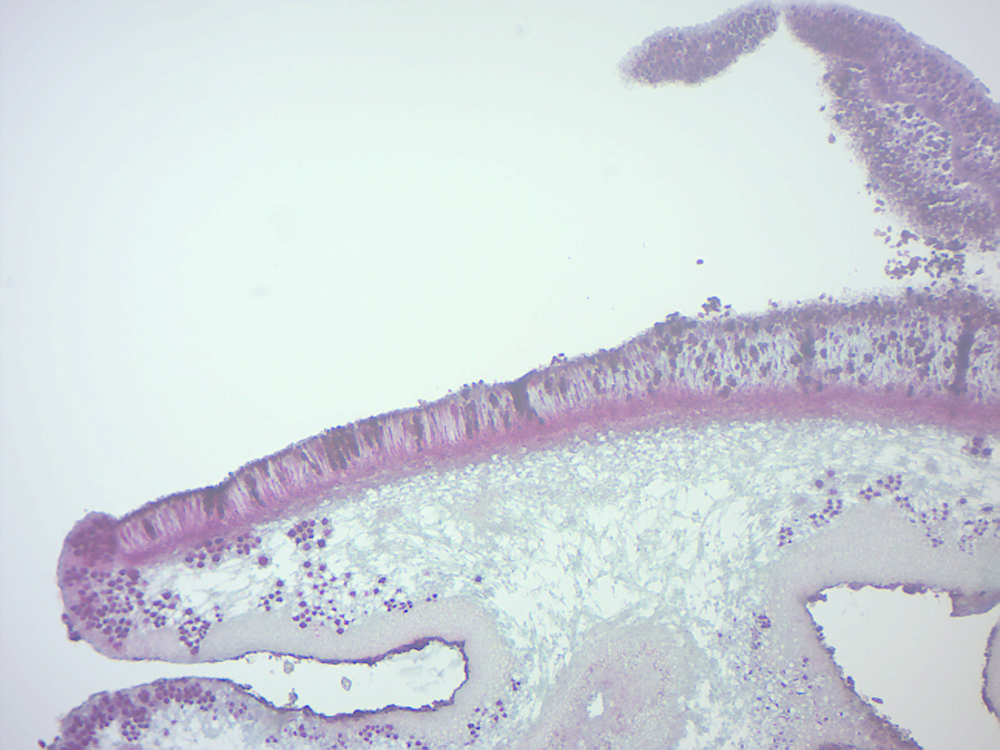

# Fungi
[Fungi](https://en.wikipedia.org/wiki/Fungus) are uni- or multicellular heterotrophic, eukaryotic organisms with external digestion. Fungi include microorganisms such as yeasts and molds and mushrooms. These organisms are classified as a kingdom, Fungi, which is separate from the other eukaryotic life kingdoms of protists, plants and animals. The English word fungus has been adopted from the Latin word fungus (mushroom) which in turn is derived from the Greek word sphongos meaning "sponge".

Fungi acquire their food by absorbing dissolved molecules, typically by secreting digestive enzymes into their environment (a process referred to as external digestion) unlike animals, which ingest food and digest it internally in their digestive systems (a process referred to as internal digestion). Fungi do not photosynthesize. Growth is their means of mobility, except for spores (a few of which are flagellated), which may travel through the air or water. Fungi are the principal decomposers in ecological systems. These and other differences place fungi in a single group of related organisms, named the Eumycota (true fungi or Eumycetes), which share a common ancestor (form a monophyletic group), an interpretation that is also strongly supported by molecular phylogenetics. This fungal group is distinct from the structurally similar myxomycetes (slime molds) and oomycetes (water molds). The discipline of biology devoted to the study of fungi is known as mycology (from the Greek mykes, mushroom). In the past, mycology was regarded as a branch of botany, although it is now known fungi are genetically more closely related to animals than to plants.

Abundant worldwide, most fungi are inconspicuous because of the small size of their structures, and their cryptic lifestyles in soil or on dead matter. Fungi include symbionts of plants, animals, or other fungi and also parasites. They may become noticeable when fruiting, either as mushrooms or as molds. Fungi perform an essential role in the decomposition of organic matter and have fundamental roles in nutrient cycling and exchange in the environment. They have long been used as a direct source of human food, in the form of mushrooms and truffles; as a leavening agent for bread; and in the fermentation of various food products, such as wine, beer, and soy sauce. Since the 1940s, fungi have been used for the production of antibiotics, and, more recently, various enzymes produced by fungi are used industrially and in detergents. Fungi are also used as biological pesticides to control weeds, plant diseases and insect pests. Many species produce bioactive compounds called mycotoxins that are toxic to animals including humans. The fruiting structures of a few species contain psychotropic compounds and are consumed recreationally or in traditional spiritual ceremonies. Fungi can break down manufactured materials and buildings, and become significant pathogens of humans and other animals. Losses of crops due to fungal diseases (e.g., rice blast disease) or food spoilage can have a large impact on human food supplies and local economies.

The fungus kingdom encompasses an enormous diversity of taxa with varied ecologies, life cycle strategies, and morphologies ranging from unicellular aquatic chytrids to large mushrooms. However, little is known of the true biodiversity of Kingdom Fungi, which has been estimated at 2.2 million to 3.8 million species, of which only 120,000 have been described. 8000 of them are detrimental to plants and 300 can be pathogenic to humans. Ever since the pioneering 18th and 19th century taxonomical works of Carl Linnaeus, Christian Hendrik Persoon, and Elias Magnus Fries, fungi have been classified according to their morphology (e.g., characteristics such as spore color or microscopic features) or physiology. Advances in molecular genetics have opened the way for DNA analysis to be incorporated into taxonomy, which has sometimes challenged the historical groupings based on morphology and other traits. Phylogenetic studies published in the last decade have helped reshape the classification within Kingdom Fungi, which is divided into one subkingdom, seven phyla, and ten subphyla.

## Microscopic Morphology
Most fungi grow as hyphae, which are cylindrical, thread-like structures 2–10 µm in diameter and up to several centimeters in length. Hyphae grow at their tips (apices); new hyphae are typically formed by emergence of new tips along existing hyphae by a process called branching, or occasionally growing hyphal tips fork, giving rise to two parallel-growing hyphae. Hyphae also sometimes fuse when they come into contact, a process called hyphal fusion (or anastamosis). These growth processes lead to the development of a mycelium, an interconnected network of hyphae. Hyphae can be either septate or coenocytic. Septate hyphae are divided into compartments separated by cross walls (internal cell walls, called septa, that are formed at right angles to the cell wall giving the hypha its shape), with each compartment containing one or more nuclei; coenocytic hyphae are not compartmentalized. Septa have pores that allow cytoplasm, organelles, and sometimes nuclei to pass through; an example is the dolipore septum in fungi of the phylum Basidiomycota. Coenocytic hyphae are in essence multinucleate supercells.
Many species have developed specialized hyphal structures for nutrient uptake from living hosts; examples include haustoria in plant-parasitic species of most fungal phyla, and arbuscules of several mycorrhizal fungi, which penetrate into the host cells to consume nutrients.
Although fungi are opisthokonts—a grouping of evolutionarily related organisms broadly characterized by a single posterior flagellum—all phyla except for the chytrids have lost their posterior flagella. Fungi are unusual among the eukaryotes in having a cell wall that, in addition to glucans (e.g., β-1,3-glucan) and other typical components, also contains the biopolymer chitin.

## Macroscopic Morphology
Fungal mycelia can become visible to the naked eye, for example, on various surfaces and substrates, such as damp walls and spoiled food, where they are commonly called molds. Mycelia grown on solid agar media in laboratory petri dishes are usually referred to as colonies. These colonies can exhibit growth shapes and colors (due to spores or pigmentation) that can be used as diagnostic features in the identification of species or groups. Some individual fungal colonies can reach extraordinary dimensions and ages as in the case of a clonal colony of *Armillaria solidipes*, which extends over an area of more than 900 ha (3.5 square miles), with an estimated age of nearly 9,000 years.
The apothecium—a specialized structure important in sexual reproduction in the ascomycetes—is a cup-shaped fruit body that is often macroscopic and holds the hymenium, a layer of tissue containing the spore-bearing cells. The fruit bodies of the basidiomycetes (basidiocarps) and some ascomycetes (ascocarps) can sometimes grow very large, and many are well known as mushrooms.

## Reproduction
Fungal reproduction is complex, reflecting the differences in lifestyles and genetic makeup within this diverse kingdom of organisms. It is estimated that a third of all fungi reproduce using more than one method of propagation. Environmental conditions trigger genetically determined developmental states that lead to the creation of specialized structures for sexual or asexual reproduction. These structures aid reproduction by efficiently dispersing spores or spore-containing propagules.

Asexual reproduction occurs via vegetative spores (conidia) or through mycelial fragmentation. Mycelial fragmentation occurs when a fungal mycelium separates into pieces, and each component grows into a separate mycelium. Mycelial fragmentation and vegetative spores maintain clonal populations adapted to a specific niche, and allow more rapid dispersal than sexual reproduction. The "Fungi imperfecti" (fungi lacking the perfect or sexual stage) or
Deuteromycota comprise all the species that lack an observable sexual cycle. Deuteromycota is not an accepted taxonomic clade, and is now taken to mean simply fungi that lack a known sexual stage.

## *Aspergillus*
[*Aspergillus*](https://en.wikipedia.org/wiki/Aspergillus) is a genus consisting of a few hundred species of mold found in various climates worldwide. *Aspergillus* was first catalogued in 1729 by the Italian priest and biologist Pier Antonio Micheli. Viewing the fungi under a microscope, Micheli was reminded of the shape of an aspergillum (holy water sprinkler), from Latin spargere (to sprinkle), and named the genus accordingly. Aspergillum is an asexual spore-forming structure common to all *Aspergillus* species; around one-third of species are also known to have a sexual stage.

## *Penicillium*
[*Penicillium*](https://en.wikipedia.org/wiki/Penicillium) ascomycetous fungi are of major importance in the natural environment as well as food and drug production. Some members of the genus produce penicillin, a molecule that is used as an antibiotic, which kills or stops the growth of certain kinds of bacteria. Other species are used in cheesemaking. The genus was first described in the scientific literature by Johann Heinrich Friedrich Link in his 1809 work Observationes in ordines plantarum naturales, writing "Penicillium. Thallus e floccis caespitosis septatis simplicibus aut ramosis fertilibus erectis apice penicillatis", where penicillatis referred to "pencil-like" (referring to a Camel's hair pencil brush).

## *Rhizopus stolonifer*
[*Rhizopus stolonifer*](https://en.wikipedia.org/wiki/Rhizopus_stolonifer) is commonly known as black bread mold. It is a member of Zygomycota and considered the most important species in the genus *Aspergillus*. It is one of the most common fungi in the world and has a global distribution although it is most commonly found in tropical and subtropical regions. It is a common agent of decomposition of stored foods. Like other members of the genus *Aspergillus*, *R. stolonifer* grows rapidly, mostly in indoor environments.

## Yeast
[Yeasts](https://en.wikipedia.org/wiki/Yeast) are single-celled fungi. The first yeast originated hundreds of millions of years ago, and 1,500 species are currently identified. They are estimated to constitute 1\% of all described fungal species. Yeasts are unicellular organisms which evolved from multicellular ancestors, with some species having the ability to develop multicellular characteristics by forming strings of connected budding cells known as pseudohyphae or false hyphae. Yeast sizes vary greatly, depending on species and environment, typically measuring 3–4 µm in diameter, although some yeasts can grow to 40 µm in size. Most yeasts reproduce asexually by mitosis, and many do so by the asymmetric division process known as budding.

Yeasts, with their single-celled growth habit, can be contrasted with molds, which grow hyphae. Fungal species that can take both forms (depending on temperature or other conditions) are called dimorphic fungi ("dimorphic" means "having two forms").

By fermentation, the yeast species *Saccharomyces cerevisiae* converts carbohydrates to carbon dioxide and alcohols – for thousands of years the carbon dioxide has been used in baking and the alcohol in alcoholic beverages. It is also a centrally important model organism in modern cell biology research, and is one of the most thoroughly researched eukaryotic microorganisms. Researchers have used it to gather information about the biology of the eukaryotic cell and ultimately human biology. Other species of yeasts, such as *Candida albicans*, are opportunistic pathogens and can cause infections in humans.

Yeasts do not form a single taxonomic or phylogenetic grouping. The term "yeast" is often taken as a synonym for *Saccharomyces cerevisiae* (baker’s or brewer’s yeast) but the phylogenetic diversity of yeasts is shown by their placement in two separate phyla: the Ascomycota and the Basidiomycota. The budding yeasts ("true yeasts") are classified in the order Saccharomycetales, within the phylum Ascomycota.

## View Prepared Slides of Fungi Lacking Sexual Stages
1.  *Aspergillus* conidiophores (Figure \@ref(fig:aspergillus))
      * Locate: conidiophores and conidiospores
2.  *Penicillium* (Figure \@ref(fig:penicillium))
      * Locate: conidiophores and conidiospores (asexual spores)
3.  *Penicillium* on orange peel (Figure \@ref(fig:orange))

(ref:aspergillus) *Aspergillus* conidiophores.

```{r aspergillus, fig.cap='(ref:aspergillus)', echo=FALSE, message=FALSE, warning=FALSE}
knitr::include_graphics("./figures/fungi/aspergillus.png")
```

(ref:penicillium) *Penicillium* conidiophores.

```{r penicillium, fig.cap='(ref:penicillium)', echo=FALSE, message=FALSE, warning=FALSE}

```

(ref:orange) *Penicillium* growing on orange peel.

```{r orange, fig.cap='(ref:orange)', echo=FALSE, message=FALSE, warning=FALSE}

```

Sexual reproduction with meiosis has been directly observed in all fungal phyla except Glomeromycota (genetic analysis suggests meiosis in Glomeromycota as well). It differs in many aspects from sexual reproduction in animals or plants. Differences also exist between fungal groups and have been used to discriminate species by morphological differences in sexual structures and reproductive strategies. The major fungal groupings have initially been delineated based on the morphology of their sexual structures and spores; for example, the spore-containing structures, asci (sacs) and basidia (clubs), can be used in the identification of ascomycetes (sac fungi) and basidiomycetes (club fungi), respectively. Some species may allow mating only between individuals of opposite mating type, whereas others can mate and sexually reproduce with any other individual or itself. Species of the former mating system are called heterothallic, and of the latter homothallic.

Most fungi have both a haploid and a diploid stage in their life cycles. In sexually reproducing fungi, compatible individuals may combine by fusing their hyphae together into an interconnected network; this process, anastomosis, is required for the initiation of the sexual cycle. Many ascomycetes and basidiomycetes go through a dikaryotic stage, in which the nuclei inherited from the two parents do not combine immediately after cell fusion, but remain separate in the hyphal cells.

In ascomycetes, dikaryotic hyphae of the hymenium (the spore-bearing tissue layer) form a characteristic hook at the hyphal septum. During cell division, formation of the hook ensures proper distribution of the newly divided nuclei into the apical and basal hyphal compartments. An ascus (plural asci) is then formed, in which karyogamy (nuclear fusion) occurs. Asci are embedded in an ascocarp, or fruiting body. Karyogamy in the asci is followed immediately by meiosis and the production of ascospores. After dispersal, the ascospores may germinate and form a new haploid mycelium.

## View Prepared Slides of Ascomycetes
1.  [*Peziza*](https://en.wikipedia.org/wiki/Peziza) apothecium (Figure \@ref(fig:peziza))
      * Locate: Hymenium layer, ascus with 8 ascospores, and infertile hyphae
2.  Yeast (Figure \@ref(fig:yeast))

(ref:peziza) *Peziza* apothecium.

```{r peziza, fig.cap='(ref:peziza)', echo=FALSE, message=FALSE, warning=FALSE}
knitr::include_graphics("./figures/fungi/peziza_apothecium.png")
```

```{r yeast, fig.cap='Yeast.', echo=FALSE, message=FALSE, warning=FALSE}
knitr::include_graphics("./figures/fungi/yeast.png")
```

## View Prepared Slides of Basidiomycetes
Sexual reproduction in basidiomycetes is similar to that of the ascomycetes. Compatible haploid hyphae fuse to produce a dikaryotic mycelium. However, the dikaryotic phase is more extensive in the basidiomycetes, often also present in the vegetatively growing mycelium. A specialized anatomical structure, called a clamp connection, is formed at each hyphal septum. As with the structurally similar hook in the ascomycetes, the clamp connection in the basidiomycetes is required for controlled transfer of nuclei during cell division, to maintain the dikaryotic stage with two genetically different nuclei in each hyphal compartment. A basidiocarp is formed in which club-like structures known as basidia generate haploid basidiospores after karyogamy and meiosis. The most commonly known basidiocarps are mushrooms, but they may also take other forms.

1.  [*Coprinus*](https://en.wikipedia.org/wiki/Coprinus) (Figure \@ref(fig:basidia))
      * Locate: gills, basidium with 4 basidiospores, hyphae

```{r basidia, fig.cap='*Coprinus* basidia with spores.', echo=FALSE, message=FALSE, warning=FALSE}

```

## View Prepared Slides of Glomeromycetes
In glomeromycetes (formerly zygomycetes), haploid hyphae of two individuals fuse, forming a gametangium, a specialized cell structure that becomes a fertile gamete-producing cell. The gametangium develops into a zygospore, a thick-walled spore formed by the union of gametes. When the zygospore germinates, it undergoes meiosis, generating new haploid hyphae, which may then form asexual sporangiospores. These sporangiospores allow the fungus to rapidly disperse and germinate into new genetically identical haploid fungal mycelia.

1.  *Rhizopus* sporangia (Figure \@ref(fig:rhizopussporangia))
      *  Locate: sporangium with spores, sporangiophore, and rhizoid and stolon, if possible
2.  *Rhizopus* conjugation (Figure \@ref(fig:rhizopusconjugation))
      *  Locate: gametangia (isogametes), zygospores, and various kinds of hyphae
3.  *Rhizopus* combination (sporangia and zygotes)
      *  Locate: sporangium with spores, zygospores, gametangia, and hyphae

(ref:rhizopussporangia) *Rhizopus* sporangia.

```{r rhizopussporangia, fig.cap='(ref:rhizopussporangia)', echo=FALSE, message=FALSE, warning=FALSE}

```

(ref:rhizopusconjugation) *Rhizopus* conjugation.

```{r rhizopusconjugation, fig.cap='(ref:rhizopusconjugation)', echo=FALSE, message=FALSE, warning=FALSE}
knitr::include_graphics("./figures/fungi/rhizopus_conjugation.png")
```

## Lichen
A [lichen](https://en.wikipedia.org/wiki/Lichen) (Figure \@ref(fig:lichens)) is a composite organism that arises from algae or cyanobacteria living among filaments of multiple fungi in a symbiotic relationship. The combined lichen has properties different from those of its component organisms. Lichens come in many colors, sizes, and forms. The properties are sometimes plant-like, but lichens are not plants. Lichens may have tiny, leafless branches (fruticose), flat leaf-like structures (foliose), flakes that lie on the surface like peeling paint (crustose), or other growth forms. Lichens occur from sea level to high alpine elevations, in many environmental conditions, and can grow on almost any surface. Lichens are abundant growing on bark, leaves, mosses, on other lichens, and hanging from branches "living on thin air" (epiphytes) in rain forests and in temperate woodland. They grow on rock, walls, gravestones, roofs, exposed soil surfaces, and in the soil as part of a biological soil crust. Different kinds of lichens have adapted to survive in some of the most extreme environments on Earth: arctic tundra, hot dry deserts, rocky coasts, and toxic slag heaps. They can even live inside solid rock, growing between the grains. It is estimated that 6\% of Earth's land surface is covered by lichen. There are about 20,000 known species of lichens.  Lichens may be long-lived, with some considered to be among the oldest living things. They are among the first living things to grow on fresh rock exposed after an event such as a landslide. The long life-span and slow and regular growth rate of some lichens can be used to date events.

(ref:lichens) [Lichens](https://commons.wikimedia.org/wiki/File:Haeckel_Lichenes.jpg) from Ernst Haeckel's [Kunstformen der Natur](https://en.wikipedia.org/wiki/Kunstformen_der_Natur), 1904.

```{r lichens, fig.cap='(ref:lichens)', echo=FALSE, message=FALSE, warning=FALSE}
knitr::include_graphics("./figures/fungi/Haeckel_Lichenes.png")
```

## View Prepared Slides of Lichens
1. Foliose lichen thallus and apothecia (Figure \@ref(fig:lichen))
      * Locate: fungal hyphae, and algal cells inside

```{r lichen, fig.cap='Foliose lichen thallus and apothecia.', echo=FALSE, message=FALSE, warning=FALSE}

```

## View Living Organisms
1.  Yeast
2.  *Rhizopus stolonifer* plate
3.  *Aspergillus* plate
4.  *Penicillium* plate

## Review Questions
1. What are fungi?
2. How do fungi get their nutrients?
3. What are yeasts?
4. What are lichen?
5. What is the name of the spore containing structure in sac fungi?
6. In club fungi, spores are attached to _____________.
7. What is a zygospore?
8. What are conidiophores?
