# Non-vascular Plants and Plants Without Seeds

[Plants](https://en.wikipedia.org/wiki/Plant) are multicellular, photoautotrophic eukaryotes. The term Viridiplantae (Latin for "green plants") includes the flowering plants, conifers and other gymnosperms, ferns, clubmosses, hornworts, liverworts, mosses and the green algae, and excludes the red and brown algae. Historically, plants formed one of two kingdoms covering all living things that were not animals, and both algae and fungi were treated as plants; however, all current definitions of "plant" exclude the fungi and some algae, as well as the prokaryotes (the archaea and bacteria).

Green plants have cell walls containing cellulose and obtain most of their energy from sunlight via photosynthesis by primary chloroplasts, derived from endosymbiosis with cyanobacteria. Their chloroplasts contain chlorophylls a and b, which gives them their green color. Some plants are parasitic and have lost the ability to produce normal amounts of chlorophyll or to photosynthesize. Plants are characterized by sexual reproduction and alternation of generations, although asexual reproduction is also common.

There are over 300,000 species of plants, of which the great majority, over 260,000, are seed plants. Green plants provide a substantial proportion of the world's molecular oxygen and are the basis of most of Earth's ecologies, especially on land. Plants that produce grains, fruits and vegetables form humankind's basic foodstuffs, and have been domesticated for millennia. Plants play many roles in culture. They are used as ornaments and, until recently and in great variety, they have served as the source of most medicines and drugs. The scientific study of plants is known as botany, a branch of biology.

The evolution of plants has resulted in increasing levels of complexity, from the earliest algal mats, through bryophytes, lycopods, ferns to the complex gymnosperms and angiosperms of today.

## Embryophytes
The plants that are likely most familiar to us are the multicellular land plants, called embryophytes. Embryophytes include the vascular plants, such as ferns, conifers and flowering plants. They also include the bryophytes, of which mosses and liverworts are the most common. All of these plants have eukaryotic cells with cell walls composed of cellulose, and most obtain their energy through photosynthesis, using light, water and carbon dioxide to synthesize food. A few plant species do not photosynthesize but are parasites on other species of photosynthetic plants. Embryophytes are believed to have evolved from green algae.

## Non-vascular plants
Non-vascular plants are plants without a vascular system consisting of xylem and phloem. Although non-vascular plants lack these particular tissues, many possess simpler tissues that are specialized for internal transport of water. Non-vascular plants do not have a wide variety of specialized tissue types. Mosses and leafy liverworts have structures that look like leaves but are not true leaves because they are single sheets of cells with no stomata, no internal air spaces and have no xylem or phloem.

## Bryophytes
[Bryophytes](https://en.wikipedia.org/wiki/Bryophyte) are an informal group consisting of three divisions of non-vascular land plants (embryophytes), the liverworts, hornworts and mosses. They are characteristically limited in size and prefer moist habitats although they can survive in drier environments. The bryophytes consist of about 20,000 plant species. Bryophytes produce enclosed reproductive structures (gametangia and sporangia), but they do not produce flowers or seeds. They reproduce via spores. The term "bryophyte" comes from bryon "tree-moss, oyster-green" and phyton "plant".

The defining features of bryophytes are:

*	 Their life cycles are dominated by the gametophyte stage.
*	 Their sporophytes are unbranched.
*	 They do not have a true vascular tissue containing lignin (although some have specialized tissues for the transport of water).

Bryophytes first appeared during the early Paleozoic. They can only survive where moisture is available for significant periods, although some species are desiccation-tolerant. Most species of bryophytes remain small throughout their life-cycle. This involves an alternation between two generations: a haploid stage, called the gametophyte, and a diploid stage, called the sporophyte. In bryophytes, the sporophyte is always unbranched and remains nutritionally dependent on its parent gametophyte. The bryophytes have the ability to secrete a cuticle on their outer surface, a waxy layer that confers resistant to desiccation. In the mosses and hornworts, a cuticle is usually only produced on the sporophyte. Stomata are not found in liverworts, but occur on the sporangia of mosses and hornworts, allowing gas exchange while controlling water loss.

## Mosses
[Mosses](https://en.wikipedia.org/wiki/Moss) [(Figure \@ref(fig:mosses))](https://commons.wikimedia.org/wiki/File:Haeckel_Muscinae.jpg) are small flowerless plants that typically grow in dense green clumps or mats, often in damp or shady locations. The individual plants are usually composed of simple leaves that are generally only one cell thick, attached to a stem that may be branched or unbranched and has only a limited role in conducting water and nutrients. Although some species have conducting tissues, these are generally poorly developed and structurally different from similar tissue found in vascular plants. Mosses do not have seeds and after fertilization develop sporophytes with unbranched stalks topped with single capsules containing spores. They are typically 0.2–10 cm tall, though some species are much larger. There are approximately 12,000 species. Mosses are commonly confused with lichens, hornworts, and liverworts.


(ref:mosses) [Mosses](https://commons.wikimedia.org/wiki/File:Haeckel_Muscinae.jpg) from Ernst Haeckel's [Kunstformen der Natur](https://en.wikipedia.org/wiki/Kunstformen_der_Natur), 1904.

```{r mosses, fig.cap='(ref:mosses)', echo=FALSE, message=FALSE, warning=FALSE}
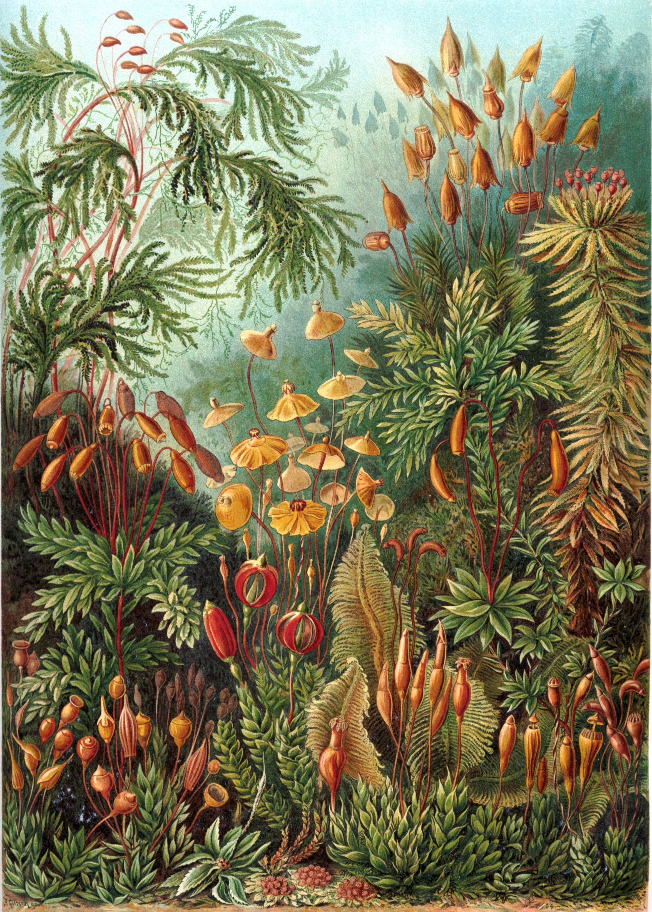
```

### Life cycle
The moss life-cycle (Figure \@ref(fig:moss)) starts with a haploid spore that germinates to produce a protonema (pl. protonemata), which is either a mass of thread-like filaments or thalloid (flat and thallus-like). Massed moss protonemata typically look like a thin green felt, and may grow on damp soil, tree bark, rocks, concrete, or almost any other reasonably stable surface. This is a transitory stage in the life of a moss, but from the protonema grows the gametophyte that is structurally differentiated into stems and leaves. A single mat of protonemata may develop several gametophore shoots, resulting in a clump of moss.
From the tips of the gametophyte stems or branches develop the sex organs of the mosses. The female organs are known as archegonia (sing. archegonium) and are protected by a group of modified leaves known as the perichaetum (plural, perichaeta). The archegonia are small flask-shaped clumps of cells with an open neck (venter) down which the male sperm swim. The male organs are known as antheridia (sing. antheridium) and are enclosed by modified leaves called the perigonium (pl. perigonia). The surrounding leaves in some mosses form a splash cup, allowing the sperm contained in the cup to be splashed to neighboring stalks by falling water droplets.
In the presence of water, sperm from the antheridia swim to the archegonia and fertilization occurs, leading to the production of a diploid sporophyte. The sperm of mosses is biflagellate, i.e. they have two flagellae that aid in propulsion. Since the sperm must swim to the archegonium, fertilization cannot occur without water. Some species (for example *Mnium hornum* or several species of *Polytrichum*) keep their antheridia in so called 'splash cups', bowl-like structures on the shoot tips that propel the sperm several decimeters when water droplets hit it, increasing the fertilization distance.
After fertilization, the immature sporophyte pushes its way out of the archegonial venter. It takes about a quarter to half a year for the sporophyte to mature. The sporophyte body comprises a long stalk, called a seta, and a capsule capped by a cap called the operculum. The capsule and operculum are in turn sheathed by a haploid calyptra which is the remains of the archegonial venter. The calyptra usually falls off when the capsule is mature. Within the capsule, spore-producing cells undergo meiosis to form haploid spores, upon which the cycle can start again. The mouth of the capsule is usually ringed by a set of teeth called peristome. Most mosses rely on the wind to disperse the spores.

(ref:moss) [Life cycle of mosses.](https://commons.wikimedia.org/wiki/File:Lifecycle_moss_svg_diagram.svg)

```{r moss, fig.cap='(ref:moss)', echo=FALSE, message=FALSE, warning=FALSE}
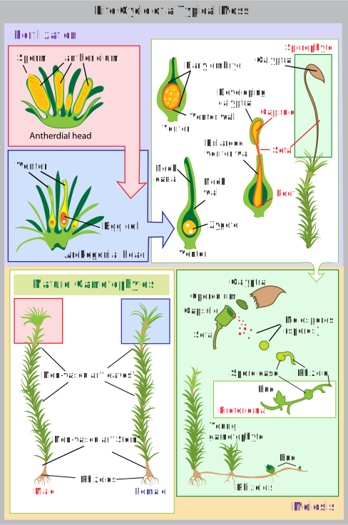
```

## View the prepared slides of mosses

1.  Moss archegonium (Figure \@ref(fig:mossarchegonium))
    * Identify: female gametophyte tissue; archegonium with egg inside the venter
2.  Moss antheridium (Figure \@ref(fig:mossantheridium))
    * Identify: male gametophyte tissue; antheridia with sperms inside; paraphyses (sterile filaments)
3.  Moss mature capsule (Figure \@ref(fig:mosscapsule))
    * Identify: capsule; spores; operculum (cap); seta
4.  Moss protonema with bulbs w.m.
    * Identify: protonema filaments; gametophyte bulbs

```{r mossarchegonium, fig.cap='Moss archegonium.', echo=FALSE, message=FALSE, warning=FALSE}
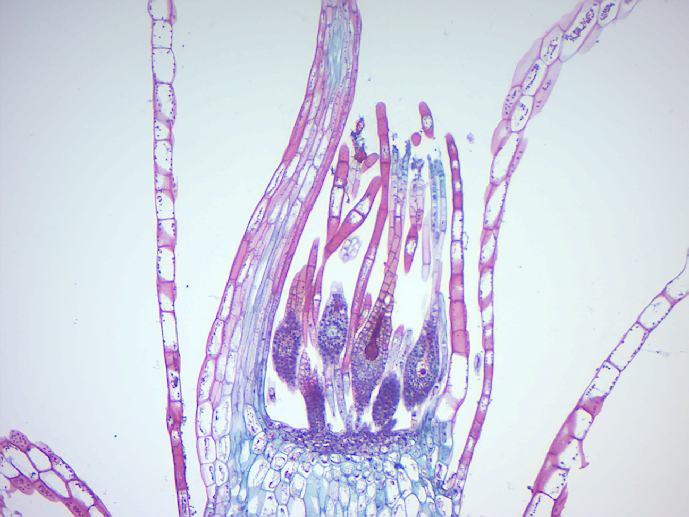
```

```{r mossantheridium, fig.cap='Moss antheridium.', echo=FALSE, message=FALSE, warning=FALSE}
knitr::include_graphics("./figures/mosses/moss_antheridium.jpg")
```

```{r mosscapsule, fig.cap='Moss mature capsule.', echo=FALSE, message=FALSE, warning=FALSE}
knitr::include_graphics("./figures/mosses/moss_capsule.jpg")
```

## Liverworts
The [Marchantiophyta](https://en.wikipedia.org/wiki/Marchantiophyta) ([Figure \@ref(fig:hepatica)](https://commons.wikimedia.org/wiki/File:Haeckel_Hepaticae.jpg)) are a division of non-vascular land plants commonly referred to as hepatics or liverworts. Like mosses and hornworts, they have a gametophyte-dominant life cycle, in which cells of the plant carry only a single set of genetic information. It is estimated that there are about 9000 species of liverworts. Some of the more familiar species grow as a flattened leafless thallus, but most species are leafy with a form very much like a flattened moss. Liverworts are typically small, usually from 2–20 mm wide with individual plants less than 10 cm long, and are therefore often overlooked. However, certain species may cover large patches of ground, rocks, trees or any other reasonably firm substrate on which they occur. They are distributed globally in almost every available habitat, most often in humid locations although there are desert and Arctic species as well. Some species can be a nuisance in shady greenhouses or a weed in gardens.

(ref:hepatica) [Liverworts](https://commons.wikimedia.org/wiki/File:Haeckel_Hepaticae.jpg) from Ernst Haeckel's [Kunstformen der Natur](https://en.wikipedia.org/wiki/Kunstformen_der_Natur), 1904.

```{r hepatica, fig.cap='(ref:hepatica)', echo=FALSE, message=FALSE, warning=FALSE}
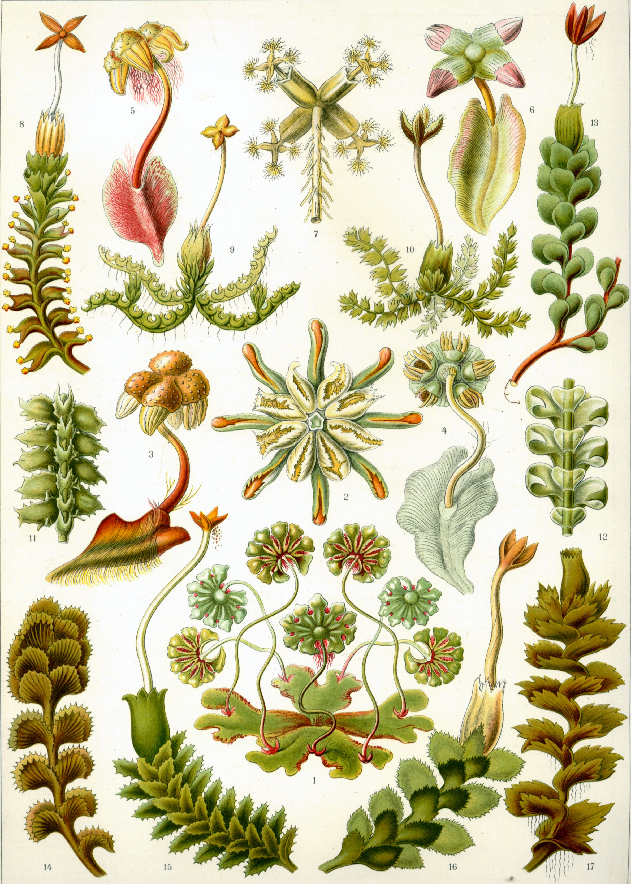
```

### Life cycle
The life of a liverwort starts from the germination of a haploid spore to produce a protonema, which is either a mass of thread-like filaments or else a flattened thallus. The protonema is a transitory stage in the life of a liverwort, from which will grow the mature gametophyte plant that produces the sex organs. The male organs are known as antheridia (singular: antheridium) and produce the sperm cells. Clusters of antheridia are enclosed by a protective layer of cells called the perigonium (plural: perigonia). As in other land plants, the female organs are known as archegonia (singular: archegonium) and are protected by the thin surrounding perichaetum (plural: perichaeta). Each archegonium has a slender hollow tube, the "neck", down which the sperm swim to reach the egg cell.
Liverwort species may be either dioecious or monoecious. In dioecious liverworts, female and male sex organs are borne on different and separate gametophyte plants. In monoecious liverworts, the two kinds of reproductive structures are borne on different branches of the same plant. In either case, the sperm must move from the antheridia where they are produced to the archegonium where the eggs are held. The sperm of liverworts is biflagellate, i.e. they have two tail-like flagellae that enable them to swim short distances, provided that at least a thin film of water is present. Their journey may be assisted by the splashing of raindrops.
When sperm reach the archegonia, fertilization occurs, leading to the production of a diploid sporophyte. After fertilization, the immature sporophyte within the archegonium develops three distinct regions: (1) a foot, which both anchors the sporophyte in place and receives nutrients from its "mother" plant, (2) a spherical or ellipsoidal capsule, inside which the spores will be produced for dispersing to new locations, and (3) a seta (stalk) which lies between the other two regions and connects them. When the sporophyte has developed all three regions, the seta elongates, pushing its way out of the archegonium and rupturing it. While the foot remains anchored within the parent plant, the capsule is forced out by the seta and is extended away from the plant and into the air. Within the capsule, cells divide to produce both elater cells and spore-producing cells. The elaters are spring-like, and will push open the wall of the capsule to scatter themselves when the capsule bursts. The spore-producing cells will undergo meiosis to form haploid spores to disperse, upon which point the life cycle can start again.
Some liverworts are capable of asexual reproduction. Some thallose liverworts such as *Marchantia polymorpha* produce small disc-shaped gemmae in shallow cups. *Marchantia* gemmae can be dispersed up to 120 cm by rain splashing into the cups.

(ref:liverwort) [Life cycle of liverworts.](https://commons.wikimedia.org/wiki/File:Liverwort_life_cycle.jpg)

```{r liverwort, fig.cap='(ref:liverwort)', echo=FALSE, message=FALSE, warning=FALSE}
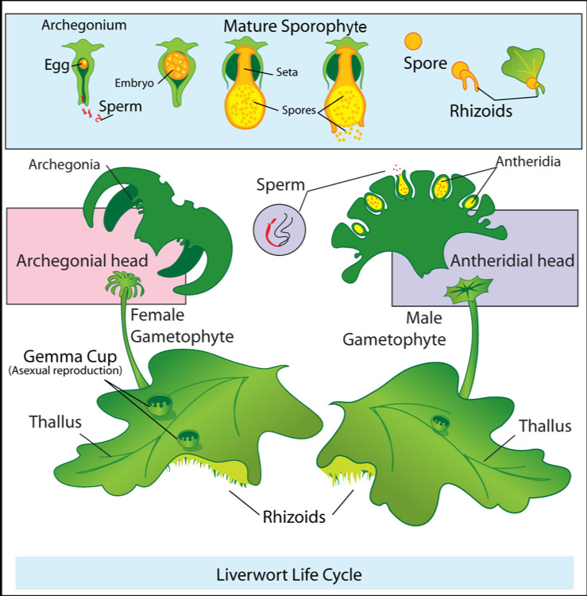
```

## View Prepared Slides of Liverworts

1.  *Marchantia*  life history
2.  *Marchantia* thallus (Figure \@ref(fig:marchantiathallus))
    * Identify: pores, tissue of lamina, rhizoids
3.  *Marchantia* archegonia
    * Identify: archegonium with egg inside the venter; tissue of archegoniophore (female gametophyte)
4.  *Marchantia* antheridia (Figure \@ref(fig:marchantiaantheridia))
    * Identify: antheridia with sperms; tissue of antheridiophore (Male gametophyte); air chambers
5.  *Marchantia* sporophyte (Figure \@ref(fig:marchantiasporophyte))
    * Identify: sporophyte and its three parts: foot, seta (stalk), and capsule; spores and elaters inside the capsule; tissue of the female gametophyte
6.  *Marchantia* gemma cup (Figure \@ref(fig:gemma))
    * Identify: gemma cup and gemmae

```{r marchantiathallus, fig.cap='*Marchantia* thallus.', echo=FALSE, message=FALSE, warning=FALSE}
knitr::include_graphics("./figures/mosses/marchantia_thallus.jpg")
```

```{r marchantiaarchegonia, fig.cap='*Marchantia* archegonia.', echo=FALSE, message=FALSE, warning=FALSE}
knitr::include_graphics("./figures/mosses/marchantia_archegonia.jpg")
```

```{r marchantiaantheridia, fig.cap='*Marchantia* antheridia.', echo=FALSE, message=FALSE, warning=FALSE}
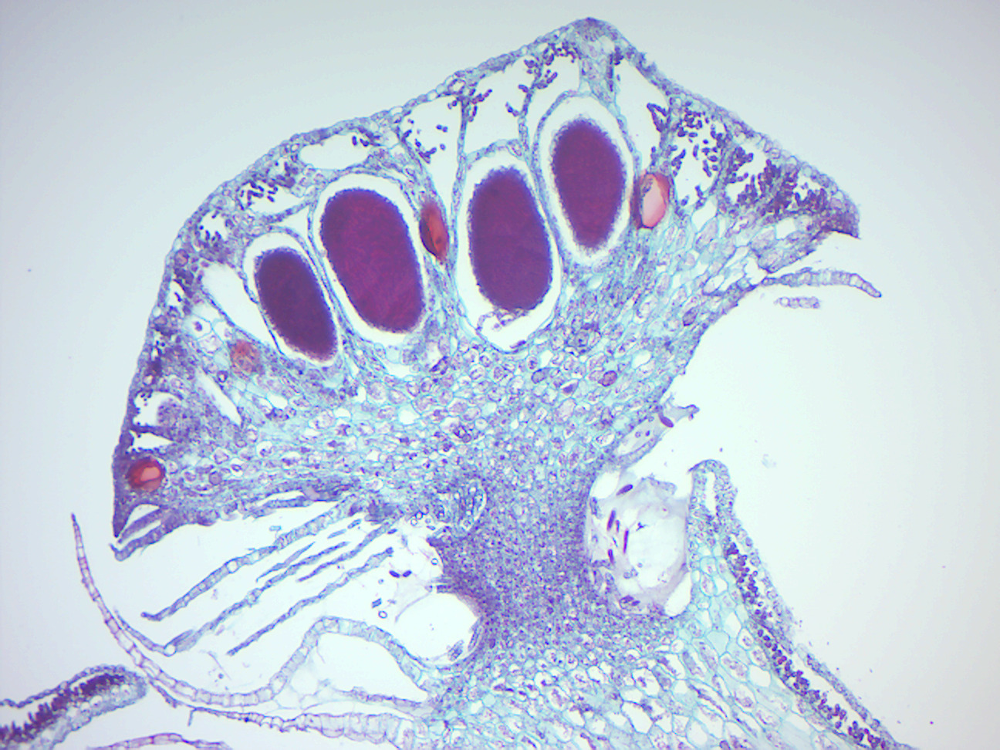
```

```{r marchantiasporophyte, fig.cap='*Marchantia* sporophyte.', echo=FALSE, message=FALSE, warning=FALSE}
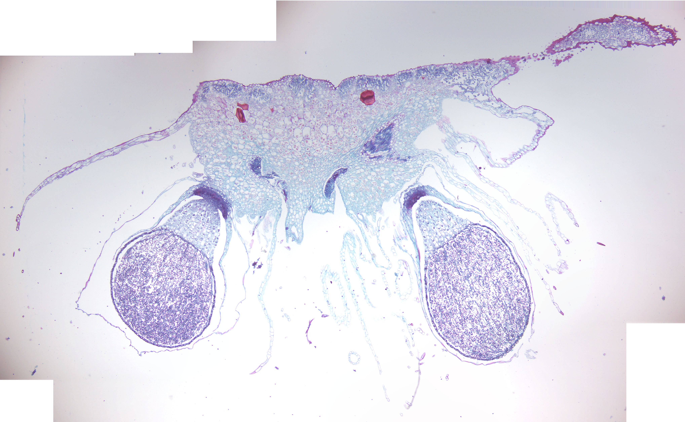
```

```{r gemma, fig.cap='*Marchantia* gemma cup.', echo=FALSE, message=FALSE, warning=FALSE}
knitr::include_graphics("./figures/mosses/marchantia_gemma_cup.jpg")
```

## Vascular plants
[Vascular plants](https://en.wikipedia.org/wiki/Vascular_plant) (from Latin vasculum: duct), also known as tracheophytes (from the equivalent Greek term trachea) and also higher plants, form a large group of plants (c. 308,312 accepted known species) that are defined as those land plants that have lignified tissues (the xylem) for conducting water and minerals throughout the plant. They also have a specialized non-lignified tissue (the phloem) to conduct products of photosynthesis. Vascular plants include the clubmosses, horsetails, ferns, gymnosperms (including conifers) and angiosperms (flowering plants). Scientific names for the group include Tracheophyta and Tracheobionta.

Vascular plants are distinguished by two primary characteristics:

1.  Vascular plants have vascular tissues which distribute resources through the plant. This feature allows vascular plants to evolve to a larger size than non-vascular plants, which lack these specialized conducting tissues and are therefore restricted to relatively small sizes.
1.  In vascular plants, the principal generation phase is the sporophyte, which is usually diploid with two sets of chromosomes per cell. Only the germ cells and gametophytes are haploid. By contrast, the principal generation phase in non-vascular plants is the gametophyte, which is haploid with one set of chromosomes per cell. In these plants, only the spore stalk and capsule are diploid.

Vascular plants first appeared during the Silurian period, and by the Devonian had diversified and spread into many different terrestrial environments. They developed a number of adaptations that allowed them to spread into increasingly more arid places, notably the vascular tissues xylem and phloem, that transport water and food throughout the organism. Root systems capable of obtaining soil water and nutrients also evolved during the Devonian. In modern vascular plants, the sporophyte is typically large, branched, nutritionally independent and long-lived, but there is increasing evidence that Paleozoic gametophytes were just as complex as the sporophytes. The gametophytes of all vascular plant groups evolved to become reduced in size and prominence in the life cycle.

The first seed plants, pteridosperms (seed ferns), now extinct, appeared in the Devonian and diversified through the Carboniferous. In these the micro gametophyte is reduced to pollen and the mega gametophyte remains inside the megasporangium, attached to the parent plant. A megasporangium invested in protective layer called an integument is known as an ovule. After fertilization by means of sperm deposited by pollen grains, an embryo develops inside the ovule. The integument becomes a seed coat, and the ovule develops into a seed. Seed plants can survive and reproduce in extremely arid conditions, because they are not dependent on free water for the movement of sperm, or the development of free living gametophytes.

## Pteridophyta
The [pteridophytes](https://en.wikipedia.org/wiki/Pteridophyte) are vascular plants (with xylem and phloem) that reproduces via spores, and include the ferns, horsetails, and the lycophytes (clubmosses, spike mosses, and quillworts). These are not a monophyletic group because ferns and horsetails are more closely related to seed plants than to the lycophytes. Therefore, "Pteridophyta" is now an invalid taxon, although the term pteridophyte remains in common use.

(ref:ferns) [Ferns](https://commons.wikimedia.org/wiki/File:Haeckel_Filicinae_92.jpg) from Ernst Haeckel's [Kunstformen der Natur](https://en.wikipedia.org/wiki/Kunstformen_der_Natur), 1904.

```{r ferns, fig.cap='(ref:ferns)', echo=FALSE, message=FALSE, warning=FALSE}
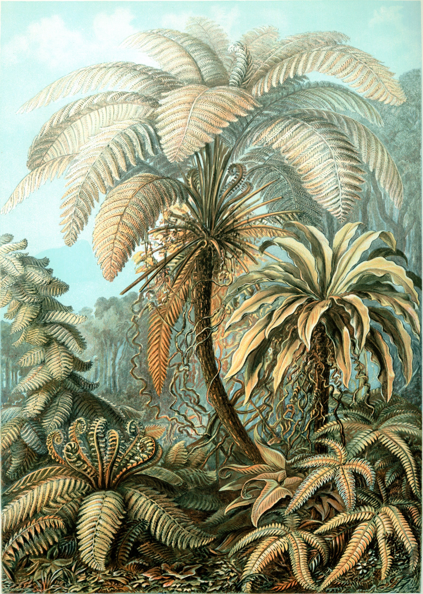
```

### Life cycle
Ferns are vascular plants differing from lycophytes by having true leaves (megaphylls). They differ from seed plants (gymnosperms and angiosperms) in their mode of reproduction—lacking flowers and seeds. Like all land plants, they have a life cycle referred to as alternation of generations, characterized by alternating diploid sporophytic and haploid gametophytic phases. The diploid sporophyte has 2n paired chromosomes, where n varies from species to species. The haploid gametophyte has n unpaired chromosomes, i.e. half the number of the sporophyte. The gametophyte of ferns is a free-living organism, whereas the gametophyte of the gymnosperms and angiosperms is dependent on the sporophyte.

The life cycle of a typical fern proceeds as follows:

1.  A diploid sporophyte phase produces haploid spores by meiosis.
2.  A spore grows into a haploid gametophyte by mitosis. The gametophyte typically consists of a photosynthetic prothallus.
3.  The gametophyte produces gametes (often both sperm and eggs on the same prothallus) by mitosis.
4.  A mobile, flagellate sperm fertilizes an egg that remains attached to the prothallus.
5.  The fertilized egg is now a diploid zygote and grows by mitosis into a diploid sporophyte (the typical "fern" plant).

## Clubmosses
[Lycopodiopsida](https://en.wikipedia.org/wiki/Lycopodiopsida) is a class of herbaceous vascular plants known as the clubmosses and firmosses. They have dichotomously branching stems bearing simple leaves without ligules and reproduce by means of spores borne in sporangia at the bases of the leaves. Traditionally, the group also included the spikemosses (Selaginella and relatives) and the quillworts (Isoetes and relatives) but because these groups have leaves with ligules and reproduce using spores of two different sizes both are now placed into another class, Isoetopsida that also includes the extinct Lepidodendrales. These groups, together with the horsetails are often referred to informally as fern allies.

## Spikemosses
[*Selaginella*](https://en.wikipedia.org/wiki/Selaginella) is the sole genus of primitive vascular plants in the family Selaginellaceae, the spikemosses or lesser clubmosses. Selaginella occurs mostly in the tropical regions of the world, with a handful of species to be found in the arctic-alpine zones of both hemispheres.

## View Prepared Slides of Selaginella

1.  *Selaginella* strobilus (Figure \@ref(fig:selaginstrobilus))
    *   Identify: micro- and megaspores

```{r selaginstrobilus, fig.cap='Selaginella strobilus.', echo=FALSE, message=FALSE, warning=FALSE}
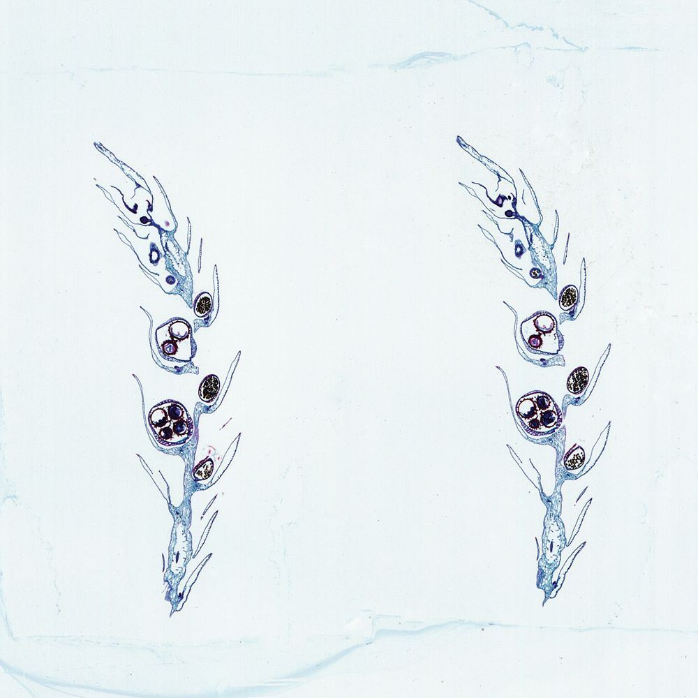
```

## Horsetails
[*Equisetum*](https://en.wikipedia.org/wiki/Equisetum) (horsetail) is the only living genus in Equisetaceae, a family of vascular plants that reproduce by spores rather than seeds. *Equisetum* is a "living fossil" as it is the only living genus of the entire class Equisetopsida, which for over one hundred million years was much more diverse and dominated the understory of late Paleozoic forests. Some Equisetopsida were large trees reaching to 30 meters tall.

## View Prepared Slides of *Equisetum*
1.  *Equisetum* strobilus (Figure \@ref(fig:equisetumstrobilus))
    *   Identify: sporangiphores and spores

```{r equisetumstrobilus, fig.cap='*Equisetum* strobilus.', echo=FALSE, message=FALSE, warning=FALSE}
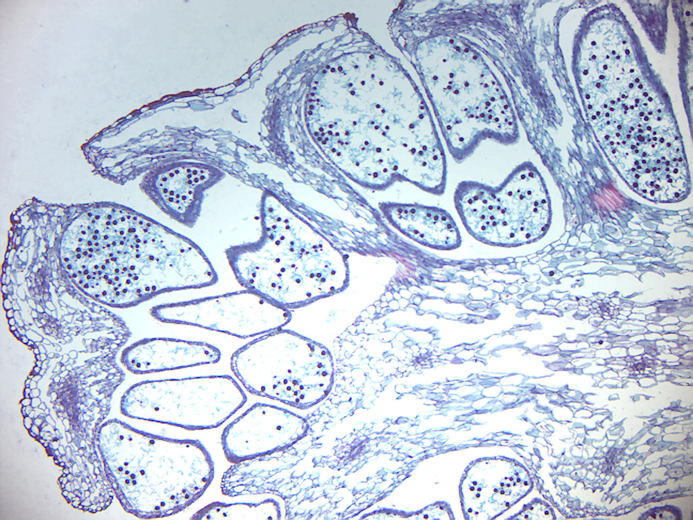
```

## Whisk ferns
[*Psilotum*](https://en.wikipedia.org/wiki/Psilotum) is a genus of fern-like vascular plants, commonly known as whisk ferns. It is one of two genera in the family Psilotaceae, the other being Tmesipteris. They lack true roots and leaves, the stems being the organs containing conducting tissue.

## View Prepared Slides of *Psilotum*
1.  *Psilotum* sporangium (Figure \@ref(fig:psilotumsporangium))
    *   Identify: Sporangium, spores.

```{r psilotumsporangium, fig.cap='*Psilotum* sporangium.', echo=FALSE, message=FALSE, warning=FALSE}
    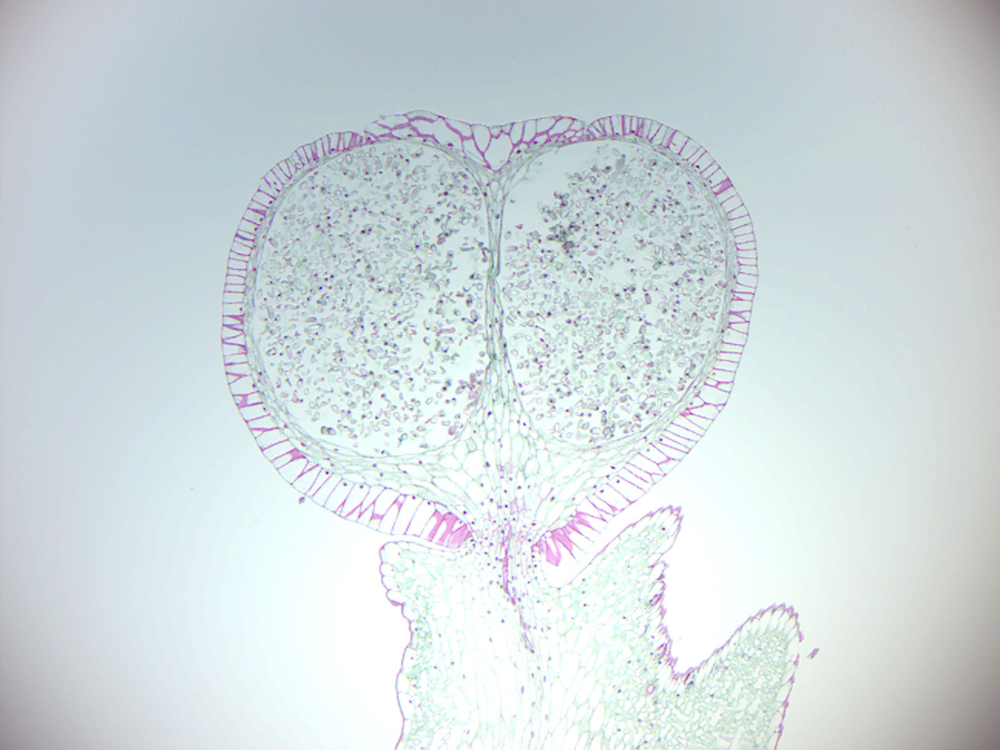
```

## View Prepared Slides of Ferns
1.  Fern sporophyte (Figure \@ref(fig:fernsporophyte))
2.  Fern antheridia & archegonia (Figure \@ref(fig:ferngametophyte))
    *   Identify: tissue of the gametophyte; antheridia; archegonia; rhizoids
3.  Fern prothallus young sporophyte (Figure \@ref(fig:fernprothallus))
    *   Identify: sporophyte, gametophyte; rhizoids

```{r fernsporophyte, fig.cap='Fern sporophyte.', echo=FALSE, message=FALSE, warning=FALSE}
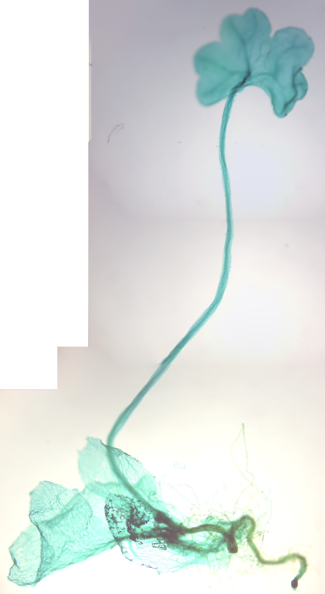
```

```{r ferngametophyte, fig.cap='Fern antheridia and archegonia.', echo=FALSE, message=FALSE, warning=FALSE}
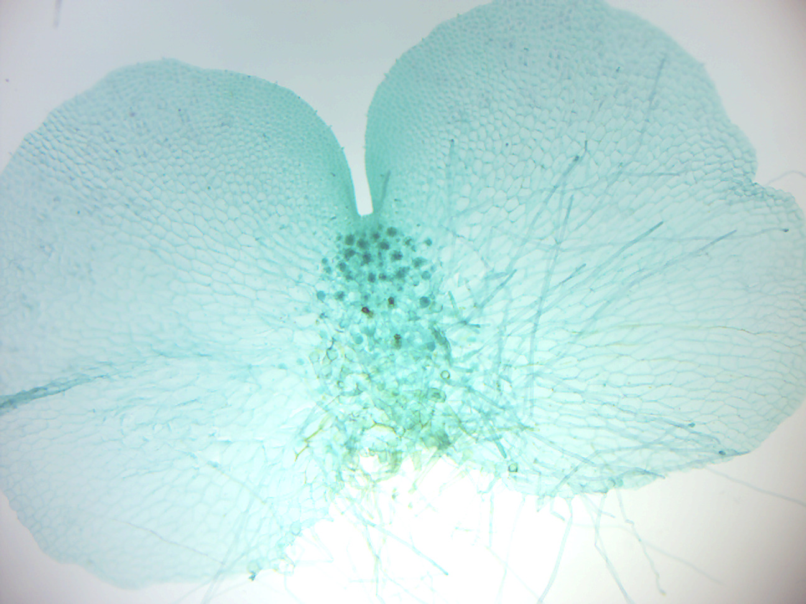
```

```{r fernprothallus, fig.cap='Fern prothallus young sporophyte.', echo=FALSE, message=FALSE, warning=FALSE}
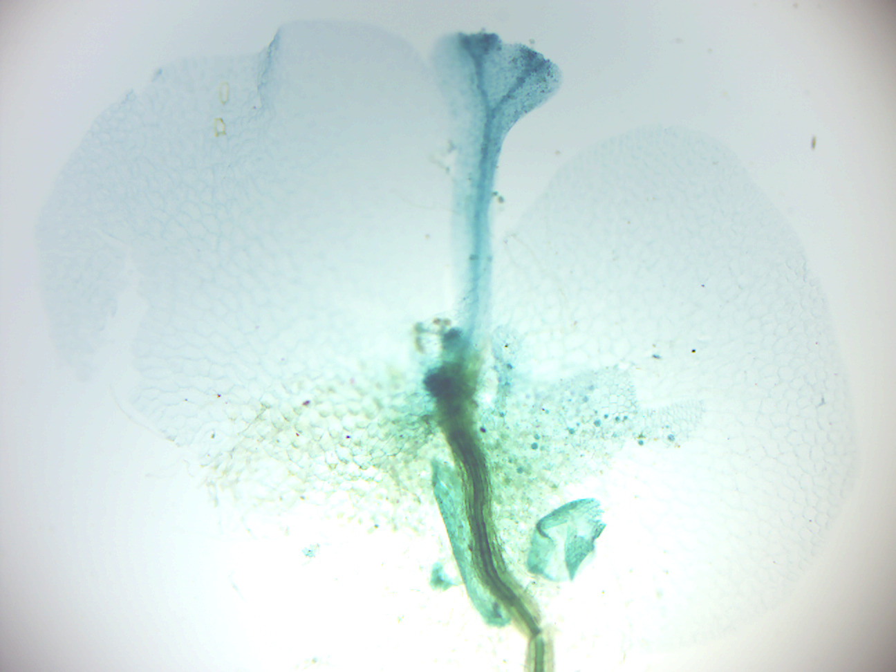
```

## View Prepared Slides of *Cyrtomium*
[*Cyrtomium*](https://en.wikipedia.org/wiki/Cyrtomium) is a genus of about 15-20 species of ferns in the family Dryopteridaceae, native to Asia, Africa (including Madagascar), and the Pacific Ocean islands (Hawaii). *Cyrtomium falcatum* is a species of fern known by the common names house holly-fern and Japanese holly fern. It is native to eastern Asia. It grows from crevices, coastal cliffs, streambanks, rocky slopes, and other moist, stable areas.

1.  *Cyrtomium falcatum* sorus on leaf
    *   Locate sorus and identify the following: sporangia with spores inside; annular cells (annulus); lip cells; indusium (covering of the sorus).

```{r cyrtomium, fig.cap='*Cyrtomium* falcatum sorus on leaf.', echo=FALSE, message=FALSE, warning=FALSE}
    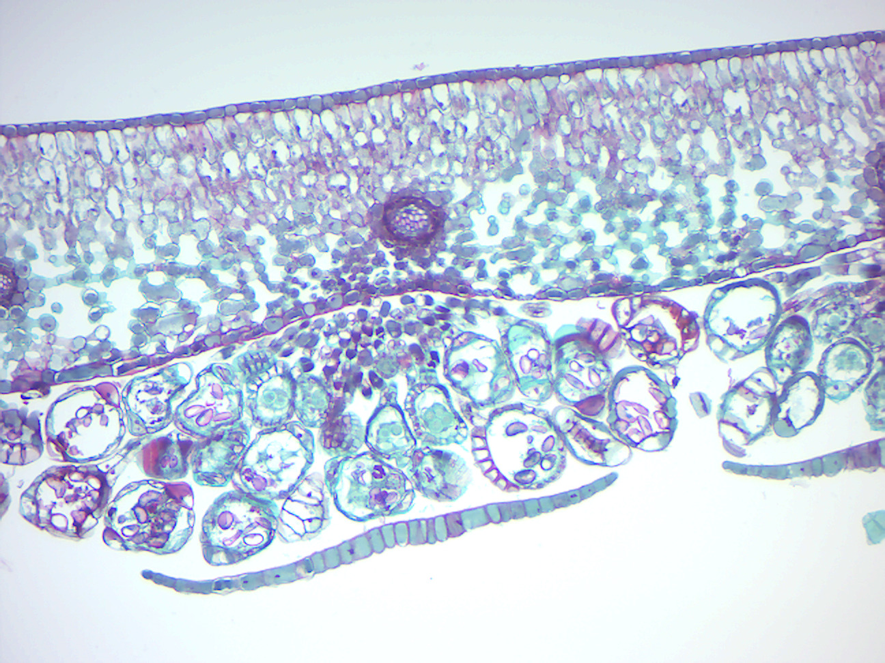
```

## View Living Organisms
1.  Four types of Mosses
2.  *Marchantia hepatica*
3.  *Lycopodium lucidulum*

## Review Questions
1.  What are plants?
2.  What are mosses?
3.  What are liverworts?
4.  What are ferns?
5.  What does alternation of generations mean in the life cycle of plants?
6.  What is a gametophyte?
7.  What is a sporophyte?
