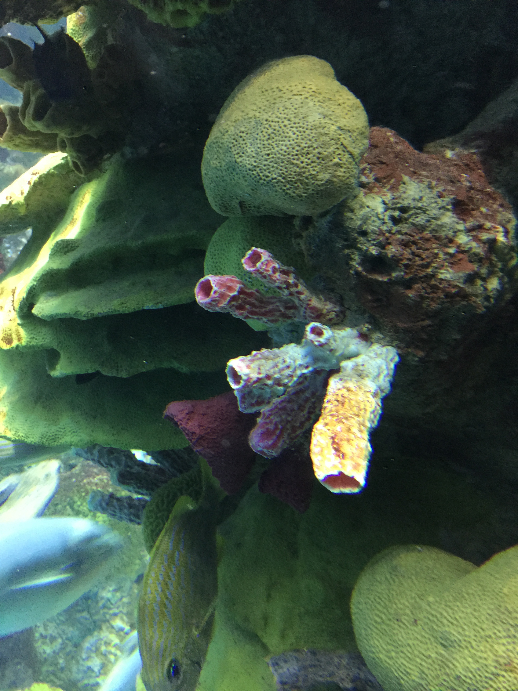
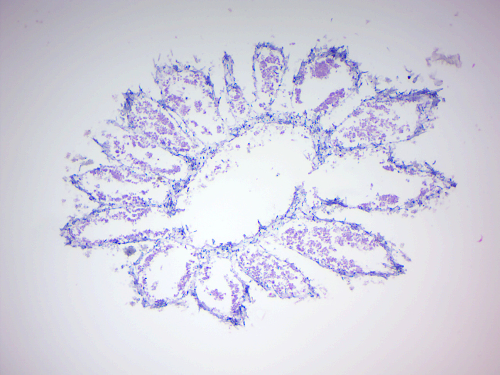
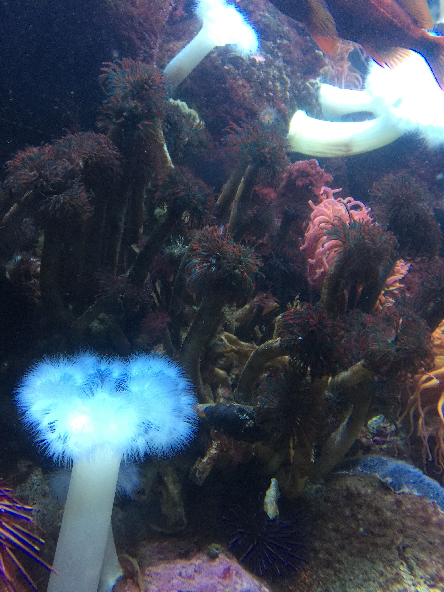

# Porifera, Cnidaria, Ctenophora

## Animals
[Animals](https://en.wikipedia.org/wiki/Animal) are eukaryotic, multicellular organisms that form the biological kingdom Animalia. With few exceptions, animals are motile (able to move), heterotrophic (consume organic material), reproduce sexually, and their embryonic development includes a blastula stage. The body plan of the animal derives from this blastula, differentiating specialized tissues and organs as it develops; this plan eventually becomes fixed, although some undergo metamorphosis at some stage in their lives.

Zoology is the study of animals. Currently there are over 66,000 (less than 5% of all animals) vertebrate species, and over 1.3 million (over 95% of all animals) invertebrate species in existence. Classification of animals into groups (taxonomy) is accomplished using either the hierarchical Linnaean system; or cladistics, which displays diagrams (phylogenetic trees) called cladograms to show relationships based on the evolutionary principle of the most recent common ancestor. Some recent classifications based on modern cladistics have explicitly abandoned the term "kingdom", noting that the traditional kingdoms are not monophyletic, i.e., do not consist of all the descendants of a common ancestor.

Animals are divided by body plan into vertebrates and invertebrates. Vertebrates—fishes, amphibians, reptiles, birds, and mammals—have a vertebral column (spine); invertebrates do not. All vertebrates and most invertebrates are bilaterally symmetrical (Bilateria). Invertebrates include arthropods, molluscs, roundworms, ringed worms, flatworms, and other phyla in Ecdysozoa and Spiralia. Echinoderm larvae are initially bilaterally symmetrical, but later as adults develop radial symmetry; Cnidarians are radially symmetrical; ctenophores are biradially symmetrical; and sponges have no symmetry.

Animal phyla appeared in the fossil record as marine species during the Cambrian explosion, about 542 million years ago. Animals emerged as a clade within [Apoikozoa](https://en.wikipedia.org/wiki/Apoikozoa) as the sister group to the choanoflagellates.

## Poriphera
[Sponges](https://en.wikipedia.org/wiki/Sponge), the members of the phylum Porifera (meaning "pore bearer"), are multicellular organisms that have bodies full of pores and channels allowing water to circulate through them, consisting of jelly-like mesohyl sandwiched between two thin layers of cells. Sponges have unspecialized cells that can transform into other types and that often migrate between the main cell layers and the mesohyl in the process. Sponges do not have nervous, digestive or circulatory systems. Instead, most rely on maintaining a constant water flow through their bodies to obtain food and oxygen and to remove wastes. Sponges are thought to be the first to branch off the evolutionary tree from the common ancestor of all animals, making them the sister group of all other animals.

The phylum Porifera is further divided into four classes mainly according to the composition of their skeletons:

1.  Hexactinellida (glass sponges) have silicate spicules, the largest of which have six rays and may be individual or fused. The main components of their bodies are syncytia in which large numbers of cell share a single external membrane.
1.  Calcarea have skeletons made of calcite, a form of calcium carbonate, which may form separate spicules or large masses. All the cells have a single nucleus and membrane.
1.  Most Demospongiae have silicate spicules or spongin fibers or both within their soft tissues. However a few also have massive external skeletons made of aragonite, another form of calcium carbonate. All the cells have a single nucleus and membrane.
1.  Archeocyatha are known only as fossils from the Cambrian period.

Sponges are similar to other animals in that they are multicellular, heterotrophic, lack cell walls and produce sperm cells. Unlike other animals, they lack true tissues and organs, and have no body symmetry. The shapes of their bodies are adapted for maximal efficiency of water flow through the central cavity, where it deposits nutrients, and leaves through a hole called the osculum. Many sponges have internal skeletons of spongin and/or spicules of calcium carbonate or silicon dioxide. All sponges are sessile aquatic animals. Although there are freshwater species, the great majority are marine (salt water) species, ranging from tidal zones to depths exceeding 8,800 m (5.5 mi).

While most of the approximately 5,000–10,000 known species feed on bacteria and other food particles in the water, some host photosynthesizing micro-organisms as endosymbionts and these alliances often produce more food and oxygen than they consume. A few species of sponge that live in food-poor environments have become carnivores that prey mainly on small crustaceans.

```{r sponges, fig.cap='Sponges and corals.', echo=FALSE, message=FALSE, warning=FALSE}

```

Sponges in temperate regions live for at most a few years, but some tropical species and perhaps some deep-ocean ones may live for 200 years or more. Some calcified demosponges grow by only 0.2 mm (0.0079 in) per year and, if that rate is constant, specimens 1 m (3.3 ft) wide must be about 5,000 years old. Some sponges start sexual reproduction when only a few weeks old, while others wait until they are several years old.

Most species use sexual reproduction, releasing sperm cells into the water to fertilize ova that in some species are released and in others are retained by the "mother". The fertilized eggs form larvae which swim off in search of places to settle. Sponges are known for regenerating from fragments that are broken off, although this only works if the fragments include the right types of cells. A few species reproduce by budding. When conditions deteriorate, for example as temperatures drop, many freshwater species and a few marine ones produce gemmules, "survival pods" of unspecialized cells that remain dormant until conditions improve and then either form completely new sponges or recolonize the skeletons of their parents.

The mesohyl functions as an endoskeleton in most sponges, and is the only skeleton in soft sponges that encrust hard surfaces such as rocks. More commonly, the mesohyl is stiffened by mineral spicules, by spongin fibers or both. Demosponges use spongin, and in many species, silica spicules and in some species, calcium carbonate exoskeletons. Demosponges constitute about 90% of all known sponge species, including all freshwater ones, and have the widest range of habitats. Calcareous sponges, which have calcium carbonate spicules and, in some species, calcium carbonate exoskeletons, are restricted to relatively shallow marine waters where production of calcium carbonate is easiest. The fragile glass sponges, with "scaffolding" of silica spicules, are restricted to polar regions and the ocean depths where predators are rare. Fossils of all of these types have been found in rocks dated from 580 million years ago.

The few species of demosponge that have entirely soft fibrous skeletons with no hard elements have been used by humans over thousands of years for several purposes, including as padding and as cleaning tools. By the 1950s, though, these had been overfished so heavily that the industry almost collapsed, and most sponge-like materials are now synthetic. Sponges and their microscopic endosymbionts are now being researched as possible sources of medicines for treating a wide range of diseases. Dolphins have been observed using sponges as tools while foraging.

A sponge's body is hollow and is held in shape by the mesohyl, a jelly-like substance made mainly of collagen and reinforced by a dense network of fibers also made of collagen. The inner surface is covered with choanocytes, cells with cylindrical or conical collars surrounding one flagellum per choanocyte. The wave-like motion of the whip-like flagella drives water through the sponge's body. All sponges have ostia, channels leading to the interior through the mesohyl, and in most sponges these are controlled by tube-like porocytes that form closable inlet valves. Pinacocytes, plate-like cells, form a single-layered external skin over all other parts of the mesohyl that are not covered by choanocytes, and the pinacocytes also digest food particles that are too large to enter the ostia, while those at the base of the animal are responsible for anchoring it.

The single-celled choanoflagellates resemble the choanocyte cells of sponges which are used to drive their water flow systems and capture most of their food. This along with phylogenetic studies of ribosomal molecules have been used as morphological evidence to suggest sponges are the sister group to the rest of animals. Some studies have shown that sponges do not form a monophyletic group, in other words do not include all and only the descendants of a common ancestor. Recent phylogenetic analyses suggest that comb jellies rather than sponges are the sister group to the rest of animals.

Most sponges work rather like chimneys: they take in water at the bottom and eject it from the osculum ("little mouth") at the top. Since ambient currents are faster at the top, the suction effect that they produce by Bernoulli's principle does some of the work for free. Sponges can control the water flow by various combinations of wholly or partially closing the osculum and ostia (the intake pores) and varying the beat of the flagella, and may shut it down if there is a lot of sand or silt in the water.

Although the layers of pinacocytes and choanocytes resemble the epithelia of more complex animals, they are not bound tightly by cell-to-cell connections or a basal lamina (thin fibrous sheet underneath). The flexibility of these layers and re-modeling of the mesohyl by lophocytes allow the animals to adjust their shapes throughout their lives to take maximum advantage of local water currents.

### Reproduction
Sponges have three asexual methods of reproduction: after fragmentation; by budding; and by producing gemmules. Fragments of sponges may be detached by currents or waves. They use the mobility of their pinacocytes and choanocytes and reshaping of the mesohyl to re-attach themselves to a suitable surface and then rebuild themselves as small but functional sponges over the course of several days. The same capabilities enable sponges that have been squeezed through a fine cloth to regenerate. A sponge fragment can only regenerate if it contains both collencytes to produce mesohyl and archeocytes to produce all the other cell types. A very few species reproduce by budding. Gemmules are "survival pods" which a few marine sponges and many freshwater species produce by the thousands when dying and which some, mainly freshwater species, regularly produce in autumn. Spongocytes make gemmules by wrapping shells of spongin, often reinforced with spicules, round clusters of archeocytes that are full of nutrients.

Most sponges are hermaphrodites (function as both sexes simultaneously), although sponges have no gonads (reproductive organs). Sperm are produced by choanocytes or entire choanocyte chambers that sink into the mesohyl and form spermatic cysts while eggs are formed by transformation of archeocytes, or of choanocytes in some species. Each egg generally acquires a yolk by consuming "nurse cells". During spawning, sperm burst out of their cysts and are expelled via the osculum. If they contact another sponge of the same species, the water flow carries them to choanocytes that engulf them but, instead of digesting them, metamorphose to an ameboid form and carry the sperm through the mesohyl to eggs, which in most cases engulf the carrier and its cargo.

A few species release fertilized eggs into the water, but most retain the eggs until they hatch. There are four types of larvae, but all are balls of cells with an outer layer of cells whose flagellae or cilia enable the larvae to move. After swimming for a few days the larvae sink and crawl until they find a place to settle. Most of the cells transform into archeocytes and then into the types appropriate for their locations in a miniature adult sponge.

Glass sponge embryos start by dividing into separate cells, but once 32 cells have formed they rapidly transform into larvae that externally are ovoid with a band of cilia round the middle that they use for movement, but internally have the typical glass sponge structure of spicules with a cobweb-like main syncytium draped around and between them and choanosyncytia with multiple collar bodies in the center. The larvae then leave their parents' bodies.

## *Grantia*
[*Grantia*](https://en.wikipedia.org/wiki/Grantia) is a genus of calcareous sponges belonging to the family Grantiidae. Grantias contain spicules and spongin fibers.

## View Prepared Slides of *Grantia*

1.  *Grantia* c.s.  l.s. (Figures \@ref(fig:grantiaxs) and \@ref(fig:grantials))
    * Identify spongocoel, radial canals, ostium, incurrent canals, collar cells (choanocytes).
2.  *Grantia* thick x.s.
    * Identify spongocoel, incurrent canals, ostium, radial canals, collar cells (choanocytes).
3.  *Grantia* spicules x.s. (Figure \@ref(fig:spicules))
    * Notice shape.

```{r grantiaxs, fig.cap='*Grantia* cross section.', echo=FALSE, message=FALSE, warning=FALSE}

```

```{r grantials, fig.cap='*Grantia* longitudinal section.', echo=FALSE, message=FALSE, warning=FALSE}

```

```{r spicules, fig.cap='Spicules.', echo=FALSE, message=FALSE, warning=FALSE}

```

## *Cnidaria*
[Cnidaria](https://en.wikipedia.org/wiki/Cnidaria) is a phylum containing over 10,000 species of animals found exclusively in aquatic (freshwater and marine) environments: they are predominantly marine species. Their distinguishing feature is the presence of cnidocytes, specialized cells that they use mainly for capturing prey. Their bodies consist of mesoglea, a non-living jelly-like substance, sandwiched between two layers of epithelium that are mostly one cell thick. They have two basic body forms: swimming medusae (singuar: medusa) and sessile polyps, both of which are radially symmetrical with mouths surrounded by tentacles that bear cnidocytes. Both forms have a single orifice and body cavity that are used for digestion and respiration. Many cnidarian species produce colonies that are single organisms composed of medusa-like or polyp-like zooids, or both (hence they are trimorphic). Cnidarians' activities are coordinated by a decentralized nerve net and simple receptors. Several free-swimming species of Cubozoa and Scyphozoa possess balance-sensing statocysts, and some have simple eyes. Statocysts are sac-like structure sensory structures containing a mineralized mass (statolith) and numerous innervated sensory hairs (setae). The statolith's inertia causes it to push against the setae when the animal accelerates. Deflection of setae by the statolith in response to gravity activates neurons, providing feedback to the animal on change in orientation and allowing balance to be maintained.

(ref:chrysaora) [Purple striped jellyfish *Chrysaora colorata*.](https://en.wikipedia.org/wiki/Chrysaora_colorata)

```{r chrysaora, fig.cap='(ref:chrysaora)', echo=FALSE, message=FALSE, warning=FALSE}
knitr::include_graphics("./figures/porifera/chrysaora_colorata.jpg")
```

Not all cnidarians reproduce sexually, with many species having complex life cycles of asexual polyp stages and sexual medusae. Some, however, omit either the polyp or the medusa stage.

Cnidarians are classified into five groups:

1.  Anthozoa (sea anemones, corals, sea pens)
1.  Scyphozoa (jellyfish)
1.  Cubozoa (box jellies)
1.  Hydrozoa (a diverse group that includes all the freshwater cnidarians, such as *Hydra*, as well as many marine forms, and has both sessile members and colonial swimmers, such as the Portuguese Man o' War)
1.  Staurozoa (stalked jellyfish that do not have an alternation of polyp and medusa life cycle phases but are instead interpreted as an attached medusa stage, with a life style more resembling that of polypoid forms)

Most cnidarians prey on organisms ranging in size from plankton to animals several times larger than themselves, but many obtain much of their nutrition from dinoflagellates, and a few are parasites. Many are preyed on by other animals including starfish, sea slugs, fish, turtles, and even other cnidarians. Many scleractinian corals—which form the structural foundation for coral reefs—possess polyps that are filled with symbiotic photo-synthetic zooxanthellae. While reef-forming corals are almost entirely restricted to warm and shallow marine waters, other cnidarians can be found at great depths, in polar regions, and in freshwater.

(ref:anthopleura) [Giant green giant green anemone *Anthopleura xanthogrammica*.](https://en.wikipedia.org/wiki/Anthopleura_xanthogrammica)

```{r anthopleura, fig.cap='(ref:anthopleura)', echo=FALSE, message=FALSE, warning=FALSE}
knitr::include_graphics("./figures/porifera/anthopleura_xanthogrammica.jpg")
```

Recent phylogenetic analyses support monophyly of cnidarians, as well as the position of cnidarians as the sister group of bilaterians. Fossil cnidarians have been found in rocks formed about 580 million years ago, and other fossils show that corals may have been present shortly before 490 million years ago and diversified a few million years later. However, molecular clock analysis of mitochondrial genes suggests a much older age for the crown group of cnidarians, estimated around 741 million years ago, almost 200 million years before the Cambrian period as well as any fossils.

(ref:nematocyst) [A firing *Hydra* nematocyst.](https://commons.wikimedia.org/wiki/File:Hydra_nematocyst_firing_01.jpg)

```{r nematocyst, fig.cap='(ref:nematocyst)', echo=FALSE, message=FALSE, warning=FALSE}

```

### Reproduction
Cnidarian sexual reproduction often involves a complex life cycle with both polyp and medusa stages. For example, in Scyphozoa (jellyfish) and Cubozoa (box jellies) larvae swim until they settle down and become polyps. Polyps grow normally but then absorb their tentacles and split horizontally into a series of disks that become juvenile medusae, a process called strobilation. The juveniles swim off and slowly grow to maturity, while the polyps re-grow and may continue strobilating periodically. The adults have gonads in the gastroderm, and these release ova and sperm into the water in the breeding season.

This phenomenon of succession of differently organized generations (one asexually reproducing, sessile polyp, followed by a free-swimming medusa or a sessile polyp that reproduces sexually) is sometimes called "alternation of asexual and sexual phases" or "metagenesis", but should not be confused with the alternation of generations as found in plants.

Shortened forms of this life cycle are common, for example some oceanic scyphozoans omit the polyp stage completely, and cubozoan polyps produce only one medusa. Hydrozoa have a variety of life cycles. Some have no polyp stages and some (e.g. hydra) have no medusae. In some species, the medusae remain attached to the polyp and are responsible for sexual reproduction; in extreme cases these reproductive zooids may not look much like medusae. Meanwhile, life cycle reversal, in which polyps are formed directly from medusae without the involvement of sexual reproduction process, was observed in both Hydrozoa (Turritopsis dohrnii and Laodicea undulata) and Scyphozoa (e. g. Aurelia]). Anthozoa have no medusa stage at all and the polyps are responsible for sexual reproduction.

Spawning is generally driven by environmental factors such as changes in the water temperature, and their release is triggered by lighting conditions such as sunrise, sunset or the phase of the moon. Many species of Cnidaria may spawn simultaneously in the same location, so that there are too many ova and sperm for predators to eat more than a tiny percentage — one famous example is the Great Barrier Reef, where at least 110 corals and a few non-cnidarian invertebrates produce enough gametes to turn the water cloudy. These mass spawnings may produce hybrids, some of which can settle and form polyps, but it is not known how long these can survive. In some species the ova release chemicals that attract sperm of the same species.

The fertilized eggs develop into larvae by dividing until there are enough cells to form a hollow sphere (blastula) and then a depression forms at one end (gastrulation) and eventually becomes the digestive cavity. However, in cnidarians the depression forms at the end further from the yolk (at the animal pole), while in bilaterians it forms at the other end (vegetal pole). The larvae, called planulae, swim or crawl by means of cilia. They are cigar-shaped but slightly broader at the "front" end, which is the aboral, vegetal-pole end and eventually attaches to a substrate if the species has a polyp stage.

Anthozoan larvae either have large yolks or are capable of feeding on plankton, and some already have endosymbiotic algae that help to feed them. Since the parents are immobile, these feeding capabilities extend the larvae's range and avoid overcrowding of sites. Scyphozoan and hydrozoan larvae have little yolk and most lack endosymbiotic algae, and therefore have to settle quickly and metamorphose into polyps. Instead, these species rely on their medusae to extend their ranges.

All known cnidaria can reproduce asexually by various means, in addition to regenerating after being fragmented. Hydrozoan polyps only bud, while the medusae of some hydrozoans can divide down the middle. Scyphozoan polyps can both bud and split down the middle. In addition to both of these methods, Anthozoa can split horizontally just above the base. Asexual reproduction makes the daughter cnidarian a clone of the adult.

## *Hydra*
[*Hydra*](https://en.wikipedia.org/wiki/Hydra_(genus)) is a genus of small, fresh-water organisms of the phylum Cnidaria and class Hydrozoa. They are native to the temperate and tropical regions. Biologists are especially interested in *Hydra* because of their regenerative ability — they do not appear to die of old age, or indeed to age at all.
*Hydra has a tubular, radially symmetric body up to 10 mm long when extended, secured by a simple adhesive foot called the basal disc. Gland cells in the basal disc secrete a sticky fluid that accounts for its adhesive properties.

At the free end of the body is a mouth opening surrounded by one to twelve thin, mobile tentacles. Each tentacle, or cnida (plural: cnidae), is clothed with highly specialized stinging cells called cnidocytes. Cnidocytes contain specialized structures called nematocysts, which look like miniature light bulbs with a coiled thread inside. At the narrow outer edge of the cnidocyte is a short trigger hair called a cnidocil. Upon contact with prey, the contents of the nematocyst are explosively discharged, firing a dart-like thread containing neurotoxins into whatever triggered the release which can paralyse the prey, especially if many hundreds of nematocysts are fired.

*Hydra* has two main body layers, which makes it "diploblastic". The layers are separated by mesoglea, a gel-like substance. The outer layer is the epidermis, and the inner layer is called the gastrodermis, because it lines the stomach. The cells making up these two body layers are relatively simple. Hydramacin is a bactericide recently discovered in *Hydra*; it protects the outer layer against infection.

The nervous system of *Hydra* is a nerve net, which is structurally simple compared to more derived animal nervous systems. *Hydra* does not have a recognizable brain or true muscles. Nerve nets connect sensory photoreceptors and touch-sensitive nerve cells located in the body wall and tentacles.

Respiration and excretion occur by diffusion everywhere through the epidermis.

If *Hydra* are alarmed or attacked, the tentacles can be retracted to small buds, and the body column itself can be retracted to a small gelatinous sphere. *Hydra* generally react in the same way regardless of the direction of the stimulus, and this may be due to the simplicity of the nerve nets.

*Hydra* are generally sedentary or sessile, but do occasionally move quite readily, especially when hunting.

### Reproduction and life cycle
When food is plentiful, many *Hydra* reproduce asexually by producing buds in the body wall, which grow to be miniature adults and break away when they are mature. When a hydra is well fed, a new bud can form every two days. When conditions are harsh, often before winter or in poor feeding conditions, sexual reproduction occurs in some *Hydra*. Swellings in the body wall develop into either an ovary or testes. The testes release free-swimming gametes into the water, and these can fertilize the egg in the ovary of another individual. The fertilized eggs secrete a tough outer coating, and, as the adult dies (due to starvation and/or cold), these resting eggs fall to the bottom of the lake or pond to await better conditions, whereupon they hatch into nymph *Hydra*. Some, like *Hydra circumcincta* and *Hydra viridissima*, are hermaphrodites and may produce both testes and an ovary at the same time.

Many members of the Hydrozoa go through a body change from a polyp to an adult form called a medusa. However, all *Hydra*, despite being hydrozoans, remain as polyps throughout their lives.

(ref:hydra) [A budding hydra.](https://en.wikipedia.org/wiki/Hydra_(genus)#/media/File:Hydra-Foto.jpg)

```{r hydra, fig.cap='(ref:hydra)', echo=FALSE, message=FALSE, warning=FALSE}

```

## View Prepared Slides of *Hydra*

1. *Hydra* x.s. (Figure \@ref(fig:hydraxs))
    * Identify:  epidermis (ectoderm), gastrodermis (endoderm), gastrovascular cavity.
2. *Hydra* spermary (Figure \@ref(fig:spermary))
    * Identify:  testis, sperms, epidermis, mesoglea, gastrodermis, gastrovascular cavity.

```{r hydraxs, fig.cap='Hydra cross section.', echo=FALSE, message=FALSE, warning=FALSE}

```

```{r spermary, fig.cap='Hydra spermary', echo=FALSE, message=FALSE, warning=FALSE}
knitr::include_graphics("./figures/porifera/hydra_spermary.jpg")
```

## *Aurelia*
[*Aurelia*](https://en.wikipedia.org/wiki/Aurelia_(name)) is a genus of scyphozoan jellyfish, commonly called moon jellies. Species of *Aurelia* can be found in the Atlantic Ocean, the Arctic Ocean and the Pacific Ocean, and are common to the waters off California, northern China, Japan, Korea, Australia, New Zealand, the Black Sea, Indonesia, the East Coast of the United States as well as Europe. *Aurelia* undergoes alternation of generations, whereby the sexually-reproducing pelagic medusa stage is either male or female, and the benthic polyp stage reproduces asexually.

## View Prepared Slides of *Aurelia*

1.  *Aurelia* Planula (Figure \@ref(fig:planula))
2.  *Aurelia* Scyphistoma (Figure \@ref(fig:scyphistoma))
    * Identify: tentacles, and base.
3.  *Aurelia* Strobilus (Figure \@ref(fig:strobilus))
    * Identify:  tentacles, base, developing medusae (ephyrae).

```{r planula, fig.cap='Aurelia planula larva', echo=FALSE, message=FALSE, warning=FALSE}

```

```{r scyphistoma, fig.cap='Aurelia scyphistoma', echo=FALSE, message=FALSE, warning=FALSE}
knitr::include_graphics("./figures/porifera/aurelia_scyphistoma.jpg")
```

```{r strobilus, fig.cap='Aurelia strobilus', echo=FALSE, message=FALSE, warning=FALSE}
knitr::include_graphics("./figures/porifera/aurelia_strobilus.jpg")
```

## *Obelia*
[*Obelia*](https://en.wikipedia.org/wiki/Obelia) is a genus in the class Hydrozoa, which consists of mainly marine and some freshwater animal species and have both the polyp and medusa stages in their life cycle. The genus belongs to the phylum Cnidaria, which are all aquatic and mainly marine organisms that are relatively simple in structure. It is also called sea fur. *Obelia* has a worldwide distribution except the high-arctic and Antarctic seas. The medusa stage of *Obelia* species are common in coastal and offshore plankton around the world. *Obelia* are usually found no deeper than 200 meters from the water's surface, growing in intertidal rock pools and at the extreme low water of spring tides.

Through its life cycle, *Obelia* take two forms: polyp and medusa. They are diploblastic, with two true tissue layers – an epidermis (ectodermis) and a gastrodermis (endodermis), with a jelly-like mesoglea filling the area between the two true tissue layers. They carry a nerve net with no brain or ganglia. A gastrovascular cavity is present where the digestion starts and later becomes intracellular. They have incomplete digestive tracts where the food enters, is digested, and expelled through the same opening. During the polyp stage, the mouth is situated at the top of the body, surrounded by tentacles, whereas during the medusa stage, the mouth is situated at the distal end of the main body structure. Four gonads lie in this main body structure, or manubrium. When food is taken in through the mouth, it enters the manubrium. The food is then distributed through a canal system, consisting of four radial canals and an outer ring. Defense and the capture of prey are helped by unique stinging cells called cnidocytes that contain nematocysts, which are triggered by the cnidocil. It has a ridge-like structure on the inner margin, called velum. If the velum is present, it is named as craspedote medusa.

The polyp colony reproduces asexually. During this stage of life, *Obelia* are confined to substrate surfaces. On this mature colony there are individual hydranths called gastrozooids, which can be found expanded or contracted, to aid in the growth of this organism by feeding; the reproductive polyp gonozooids has medusa buds. Other hydranths are specialized for defense. The main stalky body of the colony is composed of a coenosarc, which is covered by a protective perisarc.

The next generation of the life cycle begins when the medusae are released from these gonozooids, producing free swimming only male medusae velum with gonads, a mouth, and tentacles. The physical appearance of the male and female medusae velum, including their gonads, are indistinguishable, and the sex can only be determined by observing the inside of the gonads, which will either contain sperm or eggs. The medusae reproduce sexually, releasing sperm and eggs that fertilize to form a zygote, which later morphs into a blastula, then a ciliated swimming larva called a planula.

The planulae live free-swimming for a while but eventually attach themselves to some solid surface, where they begin their reproductive phase of life. Once attached to a substrate, a planula quickly develops into one feeding polyp. As the polyp grows, it begins developing branches of other feeding individuals, thus forming a new generation of polyps by asexual budding.

(ref:obelia) [*Obelia geniculata* colony with 3 hydranths and 2 gonophores.](https://commons.wikimedia.org/wiki/File:Obelia_geniculata.jpg)

```{r obelia, fig.cap='(ref:obelia)', echo=FALSE, message=FALSE, warning=FALSE}

```

## View Prepared Slides of *Obelia*
1.  *Obelia* medusa w.m. (Figure \@ref(fig:obeliamedusa))
    * Identify:  tentacles, manubrium, mouth, gonads.
2.  *Obelia* w.m. (Figure \@ref(fig:obeliacolony))
    * Identify:  hydranth, tentacles, mouth, hydrotheca, gonangium, gonotheca, gonopore, medusa buds, blastostyle.

(ref:medusa) *Obelia* medusa.

```{r obeliamedusa, fig.cap='(ref:medusa)', echo=FALSE, message=FALSE, warning=FALSE}

```

(ref:obeliacolony) *Obelia* colony.

```{r obeliacolony, fig.cap='(ref:obeliacolony)', echo=FALSE, message=FALSE, warning=FALSE}

```

## *Metridium*
Members of the genus [*Metridium*](https://en.wikipedia.org/wiki/Metridium), also known as plumose anemones, are sea anemones found mostly in the cooler waters of the northern Pacific and Atlantic oceans. They are characterized by their numerous threadlike tentacles extending from atop a smooth cylindrical column, and can vary from a few centimeters in height up to one meter or more. In larger specimens, the oral disk becomes densely curved and frilly.

```{r metridum, fig.cap='*Metridium*.', echo=FALSE, message=FALSE, warning=FALSE}

```

## View Prepared Slides of *Metridium*

1.  *Metridium* x.s. (Figure \@ref(fig:metridiumxs))
    * Identify:  tentacles, mouth, type of symmetry.

```{r metridiumxs, fig.cap='*Metridium*.', echo=FALSE, message=FALSE, warning=FALSE}
knitr::include_graphics("./figures/porifera/metridium.jpg")
```

## View Living Organisms
1.	*Hydra*

## *Ctenophora*
[Ctenophora](https://en.wikipedia.org/wiki/Ctenophora) (singular ctenophore; from the Greek kteis 'comb' and pherō 'carry'; commonly known as comb jellies) is a phylum of invertebrate animals that live in marine waters worldwide. They are notable for the groups of cilia they use for swimming (commonly referred to as "combs"), and they are the largest animals that swim by means of cilia. Depending on the species, adult ctenophores range from a few millimeters to 1.5 m in size. Only 100–150 species have been validated, and possibly another 25 have not been fully described and named. The textbook examples are cydippids with egg-shaped bodies and a pair of retractable tentacles fringed with tentilla ("little tentacles") that are covered with colloblasts, sticky cells that capture prey.

The phylum has a wide range of body forms, including the flattened, deep-sea platyctenids, in which the adults of most species lack combs, and the coastal beroids, which lack tentacles and prey on other ctenophores by using huge mouths armed with groups of large, stiffened cilia that act as teeth. Almost all ctenophores are predators, taking prey ranging from microscopic larvae and rotifers to the adults of small crustaceans; the exceptions are juveniles of two species, which live as parasites on the salps on which adults of their species feed. Most species are hermaphrodites, and juveniles of at least some species are capable of reproduction before reaching the adult size and shape. This combination of hermaphroditism and early reproduction enables small populations to grow at an explosive rate.

Early writers combined ctenophores with cnidarians into a single phylum called Coelenterata on account of morphological similarities between the two groups. Like cnidarians, the bodies of ctenophores consist of a mass of jelly, with one layer of cells on the outside and another lining the internal cavity. In ctenophores, however, these layers are two cells deep, while those in cnidarians are only a single cell deep. Ctenophores also resemble cnidarians in relying on water flow through the body cavity for both digestion and respiration, as well as in having a decentralized nerve net rather than a brain. However, genomic studies have suggested that the neurons of Ctenophora, which differ in many ways from other animal neurons, evolved independently from those of the other animals, and increasing awareness of the differences between the groups has persuaded more recent authors to classify the two as separate phyla. The position of the ctenophores in the evolutionary family tree of animals has long been debated, and the majority view at present, based on molecular phylogenetics, is that cnidarians and bilaterians are more closely related to each other than either is to ctenophores.

The traditional classification divides ctenophores into two classes, those with tentacles (Tentaculata) and those without (Nuda). The Nuda contains only one order (Beroida) and family (Beroidae), and two genera, Beroe (several species) and Neis (one species).

The *Tentaculata* are divided into the following eight orders:

1.  Cydippida, egg-shaped animals with long tentacles
1.  Lobata, with paired thick lobes
1.  Platyctenida, flattened animals that live on or near the sea-bed; most lack combs as adults, and use their pharynges as suckers to attach themselves to surfaces
1.  Ganeshida, with a pair of small lobes round the mouth, but an extended pharynx like that of platyctenids
1.  Cambojiida
1.  Cryptolobiferida
1.  Thalassocalycida, with short tentacles and a jellyfish-like "umbrella"
1.  Cestida, ribbon-shaped and the largest ctenophores

Despite their soft, gelatinous bodies, fossils thought to represent ctenophores, apparently with no tentacles but many more comb-rows than modern forms, have been found as far back as the early Cambrian, about 515 million years ago.

Adults of most species can regenerate tissues that are damaged or removed, although only platyctenids reproduce by cloning, splitting off from the edges of their flat bodies fragments that develop into new individuals.

Almost all species are hermaphrodites. Some are simultaneous hermaphrodites, which can produce both eggs and sperm at the same time, while others are sequential hermaphrodites, in which the eggs and sperm mature at different times. The gonads are located in the parts of the internal canal network under the comb rows, and eggs and sperm are released via pores in the epidermis. Fertilization is generally external, but some use internal fertilization and keep the eggs in brood chambers until they hatch. Self-fertilization has occasionally been seen in some species and it is thought that most of the hermaphroditic species are self-fertile.

Development of the fertilized eggs is direct, in other words there is no distinctive larval form. Juveniles of all groups are generally planktonic, and in most species, resemble miniature adult cydippids, gradually developing their adult body forms as they grow.

## Review Questions
1. What are animals?
2. What are porifera?
3. What are choanocytes?
4. What are cnidaria?
5. What are cnidocytes?
6. What is a statocyst?
7. What are ctenophora?
8. Ctenophora move by means of `_________`.
