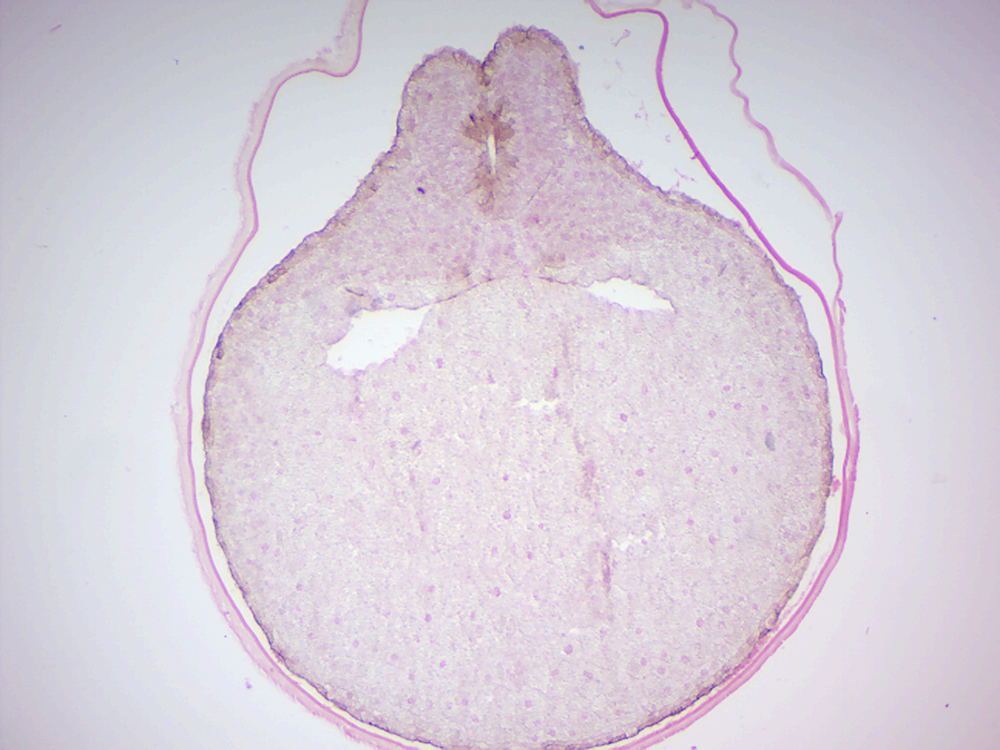

# Reproduction in Animals and Gametogenesis

Nearly all animals undergo some form of sexual reproduction. They produce haploid gametes by meiosis. The smaller, motile gametes are spermatozoa and the larger, non-motile gametes are ova. The gametes fuse to form zygotes, which develop via multiple successive mitoses and differentiation into new individuals.

Some animals are also capable of asexual reproduction. This may take place through parthenogenesis (from the Greek parthenos, "virgin", + genesis, "creation”), the development of an embryo from an unfertilized egg cell.  During sexual reproduction, mating with a close relative (inbreeding) generally leads to reduced biological fitness, i.e. the organism's reduced ability to survive and perpetuate its genetic material. Inbreeding results in more recessive traits manifesting themselves, as the genomes of pair-mates are more similar. Animals have evolved numerous diverse mechanisms for avoiding close inbreeding and promoting outcrossing.

## Gametogenesis
[Gametogenesis](https://en.wikipedia.org/wiki/Gametogenesis) is a biological process by which diploid or haploid precursor cells undergo cell division and differentiation to form mature haploid gametes. Depending on the biological life cycle of the organism, gametogenesis occurs by meiotic division of diploid gametocytes into various gametes, or by mitosis, as we have seen in plants, for example.

Animals produce gametes directly through meiosis in organs called gonads (testis in males and ovaries in females). Males and females of a species that reproduces sexually have different forms of gametogenesis

*   spermatogenesis (male)
*   oogenesis (female)

[Spermatogenesis](https://en.wikipedia.org/wiki/Spermatogenesis) is the process in which an animal produces spermatozoa from spermatogonial stem cells by way of mitosis and meiosis. The initial cells in this pathway are called spermatogonia, which yield primary spermatocytes by mitosis. The primary spermatocyte divides meiotically (Meiosis I) into two secondary spermatocytes; each secondary spermatocyte divides into two spermatids by Meiosis II. These develop into mature spermatozoa, also known as sperm cells. Thus, the primary spermatocyte gives rise to two cells, the secondary spermatocytes, and the two secondary spermatocytes by their subdivision produce four spermatozoa.

Spermatozoa are the mature male gametes in many sexually reproducing organisms. Thus, spermatogenesis is the male version of gametogenesis, of which the female equivalent is oogenesis. In mammals, it occurs in the seminiferous tubules of the male testes in a stepwise fashion. Spermatogenesis is highly dependent upon optimal conditions for the process to occur correctly, and is essential for sexual reproduction. It starts at puberty and usually continues uninterrupted until death, although a slight decrease can be discerned in the quantity of produced sperm with increase in age

Spermatogenesis takes place within several structures of the male reproductive system. The initial stages occur within the testes and progress to the epididymis where the developing gametes mature and are stored until ejaculation. The seminiferous tubules of the testes are the starting point for the process, where spermatogonial stem cells adjacent to the inner tubule wall divide in a centripetal direction—beginning at the walls and proceeding into the innermost part, or lumen—to produce immature sperm. Maturation occurs in the epididymis. The location [Testes/Scrotum] is specifically important as the process of spermatogenesis requires a lower temperature to produce viable sperm, specifically 1-8°C lower than normal body temperature of 37°C. For humans, the entire process of spermatogenesis is variously estimated as taking between 74 days and approximately 120 days. Including the transport on ductal system, it takes 3 months. Testes produce 200 to 300 million spermatozoa daily. However, only about half or 100 million of these become viable sperm.

[Oogenesis](https://en.wikipedia.org/wiki/Oogenesis) is the differentiation of the ovum (egg cell) into a cell competent to further development when fertilized. It is developed from the primary oocyte by maturation. Oogenesis starts with the process of developing oogonia, which occurs via the transformation of primordial follicles into primary oocytes, a process called oocytogenesis. Oocytogenesis is complete either before or shortly after birth. It is commonly believed that, when oocytogenesis is complete, no additional primary oocytes are created, in contrast to the male process of spermatogenesis, where gametocytes are continuously created. In other words, primary oocytes reach their maximum development at ~20 weeks of gestational age, when approximately seven million primary oocytes have been created; however, at birth, this number has already been reduced to approximately 1-2 million.
The succeeding phase of ootidogenesis occurs when the primary oocyte develops into an ootid. This is achieved by the process of meiosis. In fact, a primary oocyte is, by its biological definition, a cell whose primary function is to divide by the process of meiosis. However, although this process begins at prenatal age, it stops at prophase I. In late fetal life, all oocytes, still primary oocytes, have halted at this stage of development, called the dictyate. After menarche, these cells then continue to develop, although only a few do so every menstrual cycle. Meiosis I of ootidogenesis begins during embryonic development, but halts in the diplotene stage of prophase I until puberty. For those primary oocytes that continue to develop in each menstrual cycle, however, synapsis occurs and tetrads form, enabling chromosomal crossover to occur. As a result of meiosis I, the primary oocyte has now developed into the secondary oocyte and the first polar body. Immediately after meiosis I, the haploid secondary oocyte initiates meiosis II. However, this process is also halted at the metaphase II stage until fertilization, if such should ever occur. When meiosis II has completed, an ootid and another polar body have now been created. Synchronously with ootidogenesis, the ovarian follicle surrounding the ootid has developed from a primordial follicle to a preovulatory one. Both polar bodies disintegrate at the end of Meiosis II, leaving only the ootid, which then eventually undergoes maturation into a mature ovum. The function of forming polar bodies is to discard the extra haploid sets of chromosomes that have resulted as a consequence of meiosis.

## Embryogenesis and Embryonic development
[Embryogenesis](https://en.wikipedia.org/wiki/Embryogenesis) is the process by which the embryo forms and develops. In mammals, the term refers chiefly to early stages of prenatal development, whereas the terms fetus and fetal development describe later stages. Embryogenesis starts with the fertilization of the egg cell (ovum) by a sperm cell, (spermatozoon). Once fertilized, the ovum is referred to as a zygote, a single diploid cell. The zygote undergoes mitotic divisions with no significant growth (a process known as cleavage) and cellular differentiation, leading to development of a multicellular embryo. At least four initial cell divisions occur, resulting in a dense ball of at least sixteen cells called the morula. The different cells derived from cleavage, up to the blastula stage, are called blastomeres. After the 7th cleavage has produced 128 cells, the embryo is called a blastula. The blastula is usually a spherical layer of cells (the blastoderm) surrounding a fluid-filled or yolk-filled cavity (the blastocoel). During gastrulation cells migrate to the interior of the blastula, subsequently forming two (in diploblastic animals) or three (triploblastic) germ layers. The embryo during this process is called a gastrula. The germ layers are referred to as the ectoderm, mesoderm and endoderm. In diploblastic animals only the ectoderm and the endoderm are present.
In bilateral animals, the blastula develops in one of two ways that divides the whole animal kingdom into two halves. If in the blastula the first pore (blastopore) becomes the mouth of the animal, it is a protostome; if the first pore becomes the anus then it is a deuterostome. The protostomes include most invertebrate animals, such as insects, worms and mollusks, while the deuterostomes include the vertebrates. In due course, the blastula changes into a more differentiated structure called the gastrula.
The gastrula with its blastopore soon develops three distinct layers of cells (the germ layers) from which all the bodily organs and tissues then develop:

*   The endoderm, the innermost layer, gives a rise to the digestive organs, the gills, lungs or swim bladder if present, and kidneys or nephrites.
*   The mesoderm, the middle layer, gives rise to the muscles, skeleton if any, and blood system.
*   The ectoderm, the outer layer of cells, gives rise to the nervous system, including the brain, and skin or carapace and hair, bristles, or scales.

[Somitogenesis](https://en.wikipedia.org/wiki/Somitogenesis) is the process by which somites (primitive segments) are produced. These segmented tissue blocks differentiate into skeletal muscle, vertebrae, and dermis of all vertebrates. At some point after the different germ layers are defined, organogenesis begins. The first stage in vertebrates is called neurulation, where the neural plate folds forming the neural tube. Other common organs or structures that arise at this time include the heart and somites, but from now on embryogenesis follows no common pattern among the different taxa of the animal kingdom. In most animals, organogenesis along with morphogenesis will result in a larva. The hatching of the larva, which must then undergo metamorphosis, marks the end of embryonic development.

## Comparative embryology
[Comparative embryology](https://en.wikipedia.org/wiki/Comparative_embryology) is the branch of embryology that compares and contrasts embryos of different species. It is used to show how all animals are related. Many things are compared (such as whether or not the organism has a notochord or gill arches). Many components go into comparative embryology, and much information about the developmental similarities between species can be taken from its study, from which many conclusions can be drawn. These similarities among species are called homologous structures, which are structures that have the same or similar function and mechanism, having evolved from a common ancestor.
The goal of comparative embryology is to make sense of how an embryo develops, and of how all animals are related. Comparative embryology also supports evolutionary theory, in the sense that all vertebrates develop similarly. The conclusion is that all vertebrates must have a common ancestor.

## View Prepared Slides

## Starfish embryology
1.  Starfish development slide (Figure \@ref(fig:development))
    + Locate: unfertilized egg, fertilized egg, 2-cell, 4-cell, 8-cell, morula, blastula, early gastrula, late gastrula, bipinnaria larva.  In a late gastrula, locate the primary germ layers (ectoderm, mesoderm, endoderm), archenteron (primitive gut), blastopore and blastocoel.

```{r development, fig.cap='Starfish development.', echo=FALSE, message=FALSE, warning=FALSE}

```

## Frog embryology
1.  Frog early cleavage (Figure \@ref(fig:cleavage))
      + Count the cells in this early from embryo.
2.  Frog blastula (Figure \@ref(fig:blastula))
3.  Frog gastrulation: yolk plug stage (Figure \@ref(fig:plug))
      + Locate: yolk plug, ectoderm, endoderm, archenteron (gastrocoel)
3.  Frog gastrula (Figure \@ref(fig:gastrula))
4.  Frog early neural groove x.s. (Figure \@ref(fig:groove))
      + Locate neural groove, ectoderm, endoderm, mesoderm, archenteron, location of presumptive notochord
5.  Frog late neural tube x.s. (Figure \@ref(fig:tube))
      + Locate: neural tube, ectoderm, endoderm, mesoderm, coelom, archenteron, notochord

```{r cleavage, fig.cap='Frog early cleavage.', echo=FALSE, message=FALSE, warning=FALSE}

```

```{r blastula, fig.cap='Frog blastula.', echo=FALSE, message=FALSE, warning=FALSE}
knitr::include_graphics("./figures/development/frog_blastula.jpg")
```

```{r plug, fig.cap='Frog gastrulation with yolk plug.', echo=FALSE, message=FALSE, warning=FALSE}
knitr::include_graphics("./figures/development/frog_gastrula_yolk_plug.jpg")
```

```{r gastrula, fig.cap='Frog gastrula.', echo=FALSE, message=FALSE, warning=FALSE}
knitr::include_graphics("./figures/development/frog_gastrula.jpg")
```

```{r groove, fig.cap='Frog neural groove.', echo=FALSE, message=FALSE, warning=FALSE}

```

```{r tube, fig.cap='Frog neural tube.', echo=FALSE, message=FALSE, warning=FALSE}

```

## Chicken embryology

```{block2, type='rmdcaution'}
**Notice that these slides are very thick, since they contain whole
mounts (w.m.) of chicken embryos. Use only the 4x (low power) objective of your microscope to avoid crushing these slides.**
```

1.  Chick embryo 33 hrs (Figure \@ref(fig:chick33h)).
      + Locate: head amniotic fold, forebrain, midbrain, hindbrain, heart, somites, neural tube. What structures will develop from the somites later?
2.  Chick embryo 48 hrs (Figure \@ref(fig:chick48h)).
      + Locate: same structures as above plus: optic cup with lens, ventricle and atrium of the heart, auditory vesicle, tail, and tail amniotic fold, notochord.
3.  Chick embryo 72 hrs (Figure \@ref(fig:chick72h)).
      + Locate: same structures as above plus; allantois, hind limb bud.
4.  Chick Embryo 96 hrs (Figure \@ref(fig:chick96h)).
      + Locate: same structures as above.

```{r chick33h, fig.cap='Chick embryo at 33 hours.', echo=FALSE, message=FALSE, warning=FALSE}

```

```{r chick48h, fig.cap='Chick embryo at 48 hours.', echo=FALSE, message=FALSE, warning=FALSE}
knitr::include_graphics("./figures/development/chick_48h.jpg")
```

```{r chick72h, fig.cap='Chick embryo at 72 hours.', echo=FALSE, message=FALSE, warning=FALSE}
knitr::include_graphics("./figures/development/chick_72h.jpg")
```

```{r chick96h, fig.cap='Chick embryo at 96 hours.', echo=FALSE, message=FALSE, warning=FALSE}

```

## Mammalian reproductive organs and gametes

1.  Cat ovary (Figure \@ref(fig:ovary))
      + Identify primary, secondary and Graffian follicles
1.  Graafian follicle (Figure \@ref(fig:graafian)).
1.  Cat ovary Corpus Luteum
      + ocate corpus luteum
1.  Uterus (Figure \@ref(fig:uterus))
      + Identfy: endometrium, myometrium, perimetrium
1.  Monkey testis (Figure \@ref(fig:monkeytestis))
      + Locate: semimiferous tubules, spermatozoa
1.  Human testis (Figure \@ref(fig:humantestis))
      + Locate: semimiferous tubules, spermatozoa
1.  Human sperm smear (Figure \@ref(fig:sperm))
      + Identify: sperm, sperm head, sperm neck and sperm tail

```{r ovary, fig.cap='Cat ovary.', echo=FALSE, message=FALSE, warning=FALSE}

```

```{r uterus, fig.cap='Uterus.', echo=FALSE, message=FALSE, warning=FALSE}

```

```{r graafian, fig.cap='Graafian follicle in cat ovary.', echo=FALSE, message=FALSE, warning=FALSE}

```

```{r monkeytestis, fig.cap='Monkey testis.', echo=FALSE, message=FALSE, warning=FALSE}
knitr::include_graphics("./figures/development/monkey_testis.jpg")
```

```{r humantestis, fig.cap='Human testis.', echo=FALSE, message=FALSE, warning=FALSE}

```

```{r sperm, fig.cap='Human sperm.', echo=FALSE, message=FALSE, warning=FALSE}

```

## Review Questions
1.  What are gametes?
2.  Spermatogenesis is the process in which an animal produces ________ .
3.  Oogenesis is the process in which an animal produces ________.
4.  The gametes fuse to form _________, which develop via multiple successive mitoses and differentiation into new individuals.
5.  In bilateral animals, the blastula develops in one of two ways that divides the whole animal kingdom into two halves.
6.  If in the blastula the first pore (blastopore) becomes the mouth of the animal, it is a `________`; if the first pore becomes the anus then it is a `________`.
7.  In triplobastic animals, the three tissue (germ) layers of the gastrula are the

        1. __________

        2. __________

        3. __________
8.  Somitogenesis is the process by which __________ are produced.
9.  In frog embryology, what structures are formed during neurulation?
