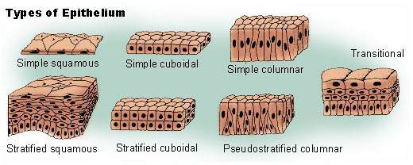
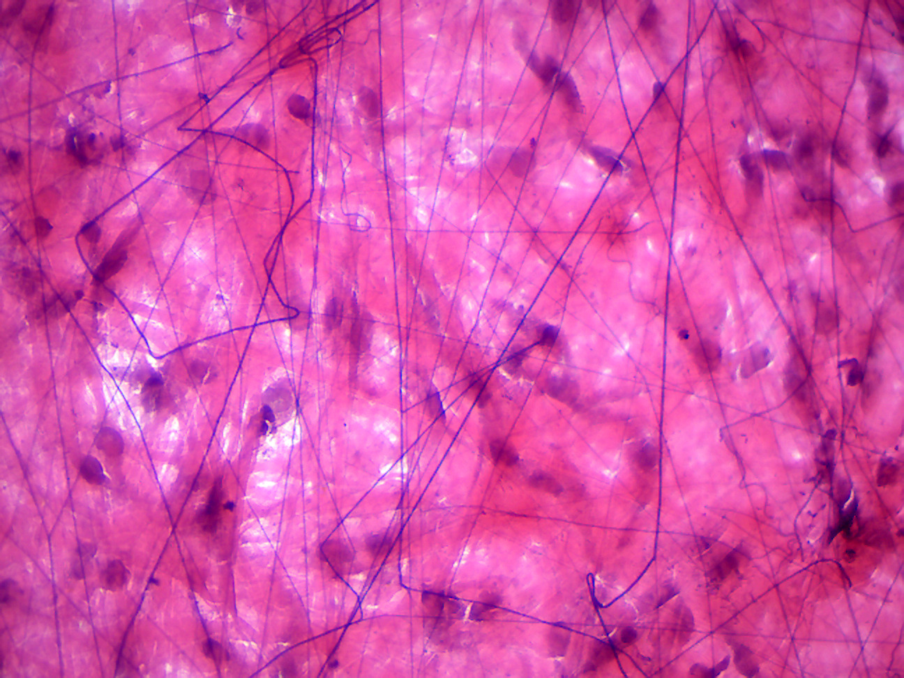
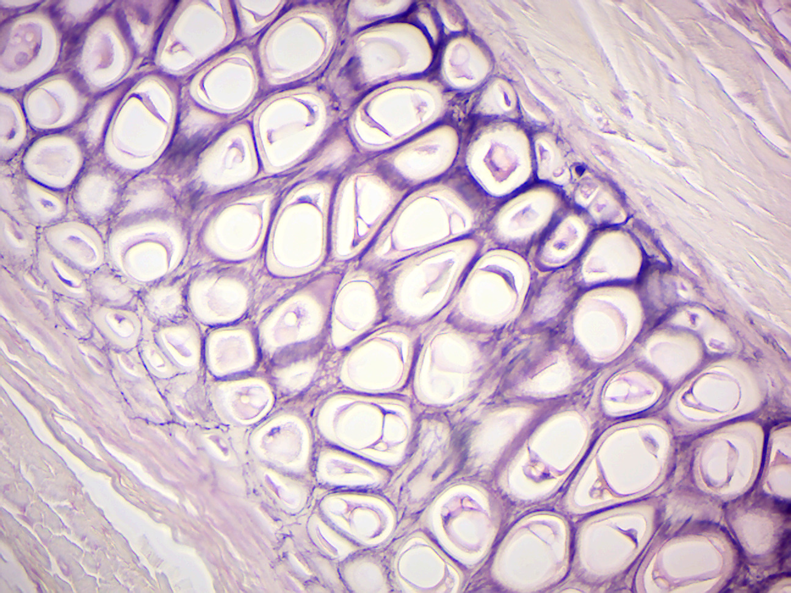

# Mammalian Tissues

In biology, [tissue](https://en.wikipedia.org/wiki/Tissue_(biology)) is a cellular organizational level between cells and a complete organ. A tissue is an ensemble of similar cells and their extracellular matrix from the same origin that together carry out a specific function. Organs are then formed by the functional grouping together of multiple tissues. The English word is derived from the French tissu, meaning something that is woven, from the verb tisser, "to weave".

The study of human and animal tissues is known as histology or, in connection with disease, histopathology. For plants, the discipline is called plant anatomy. The classical tools for studying tissues are the paraffin block in which tissue is embedded and then sectioned, the histological stain, and the optical microscope. In the last couple of decades, developments in electron microscopy, immunofluorescence, and the use of frozen tissue sections have enhanced the detail that can be observed in tissues. With these tools, the classical appearances of tissues can be examined in health and disease, enabling considerable refinement of medical diagnosis and prognosis.

## Animal tissues
Animal tissues are grouped into four basic types: connective, muscle, nervous, and epithelial. Collections of tissues joined in structural units to serve a common function compose organs. While all animals can generally be considered to contain the four tissue types, the manifestation of these tissues can differ depending on the type of organism. For example, the origin of the cells comprising a particular tissue type may differ developmentally for different classifications of animals.

## [Connective tissue](https://en.wikipedia.org/wiki/Connective_tissue)
Connective tissues are made up of cells separated by non-living material, which is called an extracellular matrix. This matrix can be liquid or rigid. For example, blood contains plasma as its matrix and bone's matrix is rigid. Connective tissue gives shape to organs and holds them in place. Blood, bone, tendon, ligament, adipose and areolar tissues are examples of connective tissues.

## [Muscle tissue](https://en.wikipedia.org/wiki/Muscle_tissue)
Muscle cells form the active contractile tissue of the body known as muscle tissue or muscular tissue. Muscle tissue functions to produce force and cause motion, either locomotion or movement within internal organs. Muscle tissue is separated into three distinct categories: visceral or smooth muscle, found in the inner linings of organs; skeletal muscle, typically attached to bones and which generates gross movement; and cardiac muscle, found in the heart where it contracts to pump blood throughout an organism.

## [Nervous tissue](https://en.wikipedia.org/wiki/Nervous_tissue)
Cells comprising the central nervous system and peripheral nervous system are classified as nervous (or neural) tissue. In the central nervous system, neural tissues form the brain and spinal cord. In the peripheral nervous system, neural tissues form the cranial nerves and spinal nerves, inclusive of the motor neurons.

## [Epithelial tissue](https://en.wikipedia.org/wiki/Epithelium)
The epithelial tissues are formed by cells that cover the organ surfaces such as the surface of skin, the airways, the reproductive tract, and the inner lining of the digestive tract. The cells comprising an epithelial layer are linked via semi-permeable, tight junctions; hence, this tissue provides a barrier between the external environment and the organ it covers. In addition to this protective function, epithelial tissue may also be specialized to function in secretion, excretion and absorption. Epithelial tissue helps to protect organs from microorganisms, injury, and fluid loss.

Functions of epithelial tissue:

*   The cells of the body's surface form the outer layer of skin.
*   Inside the body, epithelial cells form the lining of the mouth and alimentary canal and protect these organs.
*   Epithelial tissues help in absorption of water and nutrients.
*   Epithelial tissues help in elimination of waste.
*   Epithelial tissues secrete enzymes and/or hormones in the form of glands.

There are many kinds of epithelium, and nomenclature is somewhat variable. Most classification schemes combine a description of the cell-shape in the upper layer of the epithelium with a word denoting the number of layers: either simple (one layer of cells) or stratified (multiple layers of cells). However, other cellular features, such as cilia may also be described in the classification system.

Some common kinds of epithelium are listed below:

*   Simple squamous epithelium
*   Stratified squamous epithelium
*   Simple cuboidal epithelium
*   Transitional epithelium
*   Pseudostratified columnar epithelium (also known as Ciliated columnar epithelium)
*   Columnar epithelium
*   Glandular epithelium
*   Ciliated columnar epithelium


(ref:epithelium) [Types of epithelia](https://commons.wikimedia.org/wiki/File:Illu_epithelium.jpg)

```{r epithelium, fig.cap='(ref:epithelium)', echo=FALSE, message=FALSE, warning=FALSE}

```


## Animal Organs
In biology, an organ or viscus is a collection of tissues joined in a structural unit to serve a common function. In anatomy, a viscus is an internal organ, and viscera is the plural form.

Organs are composed of main tissue, parenchyma, and "sporadic" tissues, stroma. The main tissue is that which is unique for the specific organ, such as the myocardium, the main tissue of the heart, while sporadic tissues include the nerves, blood vessels, and connective tissues. The main tissues that make up an organ tend to have common embryologic origins, such as arising from the same germ layer. Functionally related organs often cooperate to form whole organ systems. Organs exist in all higher biological organisms, in particular they are not restricted to animals, but can also be identified in plants. In single-cell organisms like bacteria, the functional analogue of an organ is called organelle.

A hollow organ is a visceral organ that forms a hollow tube or pouch, such as the stomach, intestine, or bladder.

## Animal Organ Systems
Two or more organs working together in the execution of a specific body function form an organ system. The functions of organ systems often share significant overlap. For instance, the nervous and endocrine system both operate via a shared organ, the hypothalamus. For this reason, the two systems are combined and studied as the neuroendocrine system. The same is true for the musculoskeletal system because of the relationship between the muscular and skeletal systems.

Mammals such as humans have a variety of organ systems. These specific systems are also widely studied in human anatomy.

*	[Cardiovascular system](https://en.wikipedia.org/wiki/Circulatory_system): pumping and channeling blood to and from the body and lungs with heart, blood and blood vessels.
*	[Digestive system](https://en.wikipedia.org/wiki/Human_digestive_system): digestion and processing food with salivary glands, esophagus, stomach, liver, gallbladder, pancreas, intestines, colon, rectum and anus.
*	[Endocrine system](https://en.wikipedia.org/wiki/Endocrine_system): communication within the body using hormones made by endocrine glands such as the hypothalamus, pituitary gland, pineal body or pineal gland, thyroid, parathyroids and adrenals, i.e., adrenal glands.
*	[Excretory system](https://en.wikipedia.org/wiki/Excretory_system): kidneys, ureters, bladder and urethra involved in fluid balance, electrolyte balance and excretion of urine.
*	[Lymphatic system](https://en.wikipedia.org/wiki/Lymphatic_system): structures involved in the transfer of lymph between tissues and the blood stream, the lymph and the nodes and vessels that transport it including the Immune system: defending against disease-causing agents with leukocytes, tonsils, adenoids, thymus and spleen.
*	[Integumentary system](https://en.wikipedia.org/wiki/Integumentary_system): skin, hair and nails.
*	[Muscular system](https://en.wikipedia.org/wiki/Muscular_system): movement with muscles.
*	[Nervous system](https://en.wikipedia.org/wiki/Nervous_system): collecting, transferring and processing information with brain, spinal cord and nerves.
*	[Reproductive system](https://en.wikipedia.org/wiki/Reproductive_system): the sex organs, such as ovaries, fallopian tubes, uterus, vulva, vagina, testes, vas deferens, seminal vesicles, prostate and penis.
*	[Respiratory system](https://en.wikipedia.org/wiki/Respiratory_system): the organs used for breathing, the pharynx, larynx, trachea, bronchi, lungs and diaphragm.
*	[Skeletal system](https://en.wikipedia.org/wiki/Skeleton): structural support and protection with bones, cartilage, ligaments and tendons.

## View Prepared Slides of Tissues

1.  Lung simple squamous epithelium (Figure \@ref(fig:lung))
    * Identify flattened cells with noticeable nucleus.
2.  Stratified squamous epithelium (Figure \@ref(fig:stratifiedsquamous))
    * Identify:  layers of squamous epithelium cells, with a greater concentration of living, nucleate cells towards the side of contact with the rest of the tissues.
3.  Simple cuboidal epithelium (Figure \@ref(fig:cuboidal))
    * Identify:  cuboidal shaped cells with large, central nucleus.  Notice the attachment end versus the end facing the open space.
4.  Simple columnar epithelium (Figure \@ref(fig:columnar))
    * Identify: rectangular shaped cells with nucleus at the base, goblet cells with mucus, cilia, and basement membrane.
5.  Amphibian stratified ciliated columnar epithelium
    * Identify: ciliated columnar epithelial cells
6.  Pseudostratified ciliated columnar epithelium (Figure \@ref(fig:pseudociliated))
    * Identify: pseudostratification, position of nuclei, goblet cells filled with mucus, and cilia
7.  Areolar tissue spread (Figure \@ref(fig:areolar))
    * Identify:  fibroblasts, collagen fibers, elastic fibers.
8.  Dense fibrous irregular
    * Identify:  fibroblasts' nuclei, collagen bundles
9.  White fibrous tissue human (Figure \@ref(fig:whitefibrous))
    * Identify:  fibroblasts' nuclei, collagen bundles
10. Adipose tissue (Figure \@ref(fig:adipose))
    * Identify:  fibroblasts filled with fat, nucleus, cell membrane, intercellular matrix
11. Mammal hyaline cartilage (Figure \@ref(fig:hyaline))
    * Identify:  chondrocytes, lacunae, homogeneous matrix, perichondrium.
12. Trachea monkey (Figure \@ref(fig:trachea))
    * Identify:  chondrocytes, lacunae, homogeneous matrix, perichondrium.
13. Elastic cartilage human (Figure \@ref(fig:elastic))
    * Identify:  chondrocytes, lacunae, elastic fibers, perichondrium.
14. Fibrocartilage (Figure \@ref(fig:fibro))
    * Identify: chondrocytes, lacunae, collagen fibers
15. Bone ground human (Figure \@ref(fig:groundbone))
    * Identify:  Haversian Systems, osteocytes in lacunae, Haversian Canal, canaliculi, calcified matrix
16. Human blood Wright’s smear (Figure \@ref(fig:bloodsmear))
    * Identify:  erythrocytes (red blood cells) - notice the approximately round shape, and the lack of nucleus -; leukocytes (white blood cells) - up to 5 different types, with nuclei in various shapes-; and the platelets (very small pieces of cells in the matrix).
17. Sickle cell anemia (Figure \@ref(fig:sickle))
18. Human skeletal muscle (Figure \@ref(fig:skeletal))
    * Identify:  each individual muscle fiber, nuclei, and striations.
19. Cardiac muscle human
    * Identify:  individual cells with one nucleus per cell, striations, intercalated disks, and branched muscle fibers.
20. Cardiac muscle mammal (Figure \@ref(fig:cardiac))
    * Identify:  individual cells with one nucleus per cell, striations, intercalated disks, and branched muscle fibers.
21. Smooth muscle mammal (Figure \@ref(fig:smooth))
    * Identify:  individual cells with one nucleus per cell, homogeneous cytoplasm, shape, and arrangement of the muscle fibers.
22. Amphibian amooth muscle teased (Figure \@ref(fig:teased))
    * Identify: individual smooth muscle cells with nucleus.
23. Motor neuron smear (Figure \@ref(fig:neuron))
    * Identify:  cell body of neuron with nucleus, dendrites, axons (if possible), and neuroglial cells

```{r lung, fig.cap='Simple squamous epithelium (human lung).', echo=FALSE, message=FALSE, warning=FALSE}
knitr::include_graphics("./figures/tissues/lung_simple_squamous.jpg")
```

```{r stratifiedsquamous, fig.cap='Stratified squamous epithelium (human epidermis).', echo=FALSE, message=FALSE, warning=FALSE}
knitr::include_graphics("./figures/tissues/stratified_squamous.jpg")
```

```{r cuboidal, fig.cap='Simple cuboidal epithelium (kidney).', echo=FALSE, message=FALSE, warning=FALSE}
knitr::include_graphics("./figures/tissues/simple_cuboidal.jpg")
```

```{r columnar, fig.cap='Simple columnar epithelium (amphibian).', echo=FALSE, message=FALSE, warning=FALSE}

```

```{r pseudociliated, fig.cap='Pseudostratified ciliated columnar epithelium.', echo=FALSE, message=FALSE, warning=FALSE}
knitr::include_graphics("./figures/tissues/pseudostratified_ciliated_columnar.jpg")
```

```{r areolar, fig.cap='Areolar connective tissue.', echo=FALSE, message=FALSE, warning=FALSE}

```

```{r whitefibrous, fig.cap='White fibrous tissue.', echo=FALSE, message=FALSE, warning=FALSE}

```

```{r adipose, fig.cap='Adipose tissue.', echo=FALSE, message=FALSE, warning=FALSE}

```

```{r hyaline, fig.cap='Hyaline cartilage.', echo=FALSE, message=FALSE, warning=FALSE}
knitr::include_graphics("./figures/tissues/hyaline_cartilage.jpg")
```

```{r elastic, fig.cap='Elastic cartilage.', echo=FALSE, message=FALSE, warning=FALSE}

```

```{r trachea, fig.cap='Monkey trachea.', echo=FALSE, message=FALSE, warning=FALSE}
knitr::include_graphics("./figures/tissues/monkey_trachea.jpg")
```

```{r fibro, fig.cap='Fibrocartilage.', echo=FALSE, message=FALSE, warning=FALSE}
knitr::include_graphics("./figures/tissues/fibrocartilage.jpg")
```

```{r groundbone, fig.cap='Ground bone.', echo=FALSE, message=FALSE, warning=FALSE}

```

```{r bloodsmear, fig.cap='Human blood smear.', echo=FALSE, message=FALSE, warning=FALSE}
knitr::include_graphics("./figures/tissues/blood_smear.jpg")
```

```{r sickle, fig.cap='Sickle cell blood smear.', echo=FALSE, message=FALSE, warning=FALSE}
knitr::include_graphics("./figures/tissues/sickle_cell.jpg")
```

```{r skeletal, fig.cap='Skeletal muscle.', echo=FALSE, message=FALSE, warning=FALSE}
knitr::include_graphics("./figures/tissues/skeletal_muscle.jpg")
```

```{r cardiac, fig.cap='Mammalian cardiac muscle.', echo=FALSE, message=FALSE, warning=FALSE}

```

```{r smooth, fig.cap='Smooth muscle.', echo=FALSE, message=FALSE, warning=FALSE}

```

```{r teased, fig.cap='A teased smooth muscle fiber.', echo=FALSE, message=FALSE, warning=FALSE}
knitr::include_graphics("./figures/tissues/smooth_muscle_teased.jpg")
```

```{r neuron, fig.cap='Motor neuron smear.', echo=FALSE, message=FALSE, warning=FALSE}
knitr::include_graphics("./figures/tissues/neuron_smear.jpg")
```

## Review Questions
1.  What are tissues?
2.  What are the four main types of animal tissues?
3.  What is the difference between skeletal and smooth muscle?
4.  What is epithelial tissue?
5.  What is connective tissue?
6.  What are the characteristics that distinguish cardiac muscle from skeletal muscle?
 
