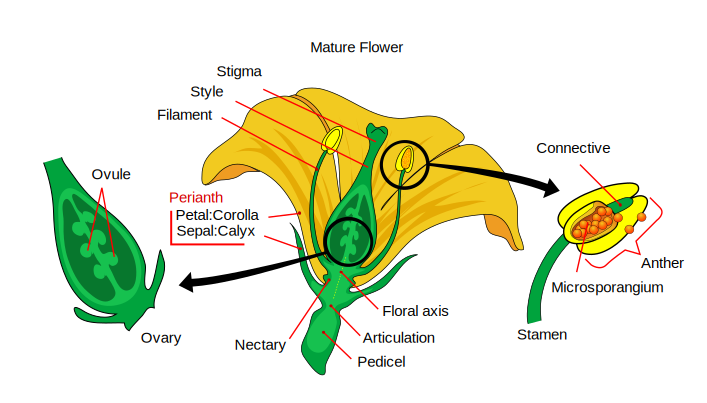

# Gymnosperms and Angiosperms

The gymnosperms and angiosperms together compose the spermatophytes or seed plants.

## Gymnosperms
The [gymnosperms](https://en.wikipedia.org/wiki/Gymnosperm) are a group of seed-producing plants (spermatophytes) that includes conifers (Pinophyta), cycads, Ginkgo, and gnetophytes. The term "gymnosperm" comes from the Greek composite word gymnos, "naked" and sperma, "seed", meaning "naked seeds". The name is based on the unenclosed condition of their seeds (called ovules in their unfertilized state). The non-encased condition of their seeds stands in contrast to the seeds and ovules of flowering plants (angiosperms), which are enclosed within an ovary. Gymnosperm seeds develop either on the surface of scales or leaves, which are often modified to form cones, or solitary as in Yew, Torreya, Ginkgo. By far the largest group of living gymnosperms are the conifers (pines, cypresses, and relatives), followed by cycads, gnetophytes (*Gnetum*, *Ephedra* and *Welwitschia*), and *Ginkgo biloba* (a single living species). Roots in some genera have fungal association with roots in the form of mycorrhiza (*Pinus*), while in some others (*Cycas*) small specialized roots called coralloid roots are associated with nitrogen-fixing cyanobacteria.

Gymnosperms, like all vascular plants, have a sporophyte-dominant life cycle, which means they spend most of their life cycle with diploid cells, while the gametophyte (gamete-bearing phase) is relatively short-lived. Two spore types, microspores and megaspores, are typically produced in pollen cones or ovulate cones, respectively. Gametophytes, as with all heterosporous plants, develop within the spore wall. Pollen grains (microgametophytes) mature from microspores, and ultimately produce sperm cells. Megagametophytes develop from megaspores and are retained within the ovule. Gymnosperms produce multiple archegonia, which produce the female gamete. During pollination, pollen grains are physically transferred between plants from the pollen cone to the ovule. Pollen is usually moved by wind or insects. Whole grains enter each ovule through a microscopic gap in the ovule coat (integument) called the micropyle. The pollen grains mature further inside the ovule and produce sperm cells. Two main modes of fertilization are found in gymnosperms. Cycads and Ginkgo have motile sperm that swim directly to the egg inside the ovule, whereas conifers and gnetophytes have sperm with no flagella that are moved along a pollen tube to the egg. After syngamy (joining of the sperm and egg cell), the zygote develops into an embryo (young sporophyte). More than one embryo is usually initiated in each gymnosperm seed. The mature seed comprises the embryo and the remains of the female gametophyte, which serves as a food supply, and the seed coat.

## View Prepared Slides of Gymnosperms

1.  *Zamia* young ovule (Figure \@ref(fig:zamia))
2.  Pine ovule (Figure \@ref(fig:pine))
    * Identify: female gametophyte, egg, archegonia, micropyle
3.  Pine young ovulate cone (Figure \@ref(fig:ovulate))
    * Identify: ovules, megasporophylls (scales)
5.  Pine staminate cone (Figure \@ref(fig:staminate))
    * Identify: microsporophyll, microsporangium, pollen grains (microspores). In pollen grains, differentiate between the cells and the “wings”
6.  Pine pollen (Figure \@ref(fig:pollen))
    * Identify: generative cell with nucleus, tube cell with nucleus, “wings”
7.  Pine - mature embryo
8.  Pine needle (Figure \@ref(fig:needle))
    * Identify: epidermis, stomata with guard cells, hypodermis, mesophyll, resin canals, endodermis, xylem, and phloem

```{r zamia, fig.cap='Young *Zamia* ovule.', echo=FALSE, message=FALSE, warning=FALSE}
knitr::include_graphics("./figures/gymnosperms/zamia.png")
```

```{r pine, fig.cap='Pine ovule', echo=FALSE, message=FALSE, warning=FALSE}
knitr::include_graphics("./figures/gymnosperms/pine_ovule.png")
```

```{r ovulate, fig.cap='Pine young ovulate cone.', echo=FALSE, message=FALSE, warning=FALSE}

```

```{r staminate, fig.cap='Pine staminate cone.', echo=FALSE, message=FALSE, warning=FALSE}

```

```{r pollen, fig.cap='Pine pollen.', echo=FALSE, message=FALSE, warning=FALSE}

```

```{r needle, fig.cap='Pine needle.', echo=FALSE, message=FALSE, warning=FALSE}
knitr::include_graphics("./figures/gymnosperms/pine_needle.png")
```

## Angiosperms
The flowering plants, also known as angiosperms, Angiospermae or Magnoliophyta, are the most diverse group of land plants, with 416 families, approximately 13,164 known genera and c. 295,383 known species. Like gymnosperms, angiosperms are seed-producing plants. However, they are distinguished from gymnosperms by characteristics including flowers, endosperm within the seeds, and the production of fruits that contain the seeds. Etymologically, angiosperm means a plant that produces seeds within an enclosure; in other words, a fruiting plant. The term comes from the Greek words angeion ("case" or "casing") and sperma ("seed"). The ancestors of flowering plants diverged from gymnosperms in the Triassic Period, 245 to 202 million years ago (mya), and the first flowering plants are known from 160 mya. They diversified extensively during the Lower Cretaceous, became widespread by 120 mya, and replaced conifers as the dominant trees from 100 to 60 mya.

The characteristic feature of angiosperms is the flower. Flowers show remarkable variation in form and elaboration, and provide the most trustworthy external characteristics for establishing relationships among angiosperm species. The function of the flower is to ensure fertilization of the ovule and development of fruit containing seeds. The floral apparatus may arise terminally on a shoot or from the axil of a leaf (where the petiole attaches to the stem). Occasionally, as in violets, a flower arises singly in the axil of an ordinary foliage-leaf. More typically, the flower-bearing portion of the plant is sharply distinguished from the foliage-bearing or vegetative portion, and forms a more or less elaborate branch-system called an inflorescence.

(ref:flower) [Anatomy of the flower.](https://commons.wikimedia.org/wiki/File:Mature_flower_diagram.svg)

```{r flower, fig.cap='(ref:flower)', echo=FALSE, message=FALSE, warning=FALSE}

```

There are two kinds of reproductive cells produced by flowers. Microspores, which will divide to become pollen grains, are the "male" cells and are borne in the stamens (or microsporophylls). The "female" cells called megaspores, which will divide to become the egg cell (megagametogenesis), are contained in the ovule and enclosed in the carpel (or megasporophyll).

The flower may consist only of these parts, as in willow, where each flower comprises only a few stamens or two carpels. Usually, other structures are present and serve to protect the sporophylls and to form an envelope attractive to pollinators. The individual members of these surrounding structures are known as sepals and petals (or tepals in flowers such as *Lilium* where sepals and petals are not distinguishable from each other). The outer series (calyx of sepals) is usually green and leaf-like, and functions to protect the rest of the flower, especially the bud. The inner series (corolla of petals) is, in general, white or brightly colored, and is more delicate in structure. It functions to attract insect or bird pollinators. Attraction is effected by color, scent, and nectar, which may be secreted in some part of the flower. The characteristics that attract pollinators account for the popularity of flowers and flowering plants among humans.

While the majority of flowers are perfect or hermaphrodite (having both pollen and ovule producing parts in the same flower structure), flowering plants have developed numerous morphological and physiological mechanisms to reduce or prevent self-fertilization. Heteromorphic flowers have short carpels and long stamens, or vice versa, so animal pollinators cannot easily transfer pollen to the pistil (receptive part of the carpel). Homomorphic flowers may employ a biochemical (physiological) mechanism called self-incompatibility to discriminate between self and non-self pollen grains. In other species, the male and female parts are morphologically separated, developing on different flowers.

### Sexual Reproduction
Double fertilization refers to a process in which two sperm cells fertilize cells in the ovary. This process begins when a pollen grain adheres to the stigma of the pistil (female reproductive structure), germinates, and grows a long pollen tube. While this pollen tube is growing, a haploid generative cell travels down the tube behind the tube nucleus. The generative cell divides by mitosis to produce two haploid (n) sperm cells. As the pollen tube grows, it makes its way from the stigma, down the style and into the ovary. Here the pollen tube reaches the micropyle of the ovule and digests its way into one of the synergids, releasing its contents (which include the sperm cells). The synergid that the cells were released into degenerates and one sperm makes its way to fertilize the egg cell, producing a diploid (2n) zygote. The second sperm cell fuses with both central cell nuclei, producing a triploid (3n) cell. As the zygote develops into an embryo, the triploid cell develops into the endosperm, which serves as the embryo's food supply. The ovary will now develop into a fruit and the ovule will develop into a seed.

As the development of embryo and endosperm proceeds within the embryo sac, the sac wall enlarges and combines with the nucellus (which is likewise enlarging) and the integument to form the seed coat. The ovary wall develops to form the fruit or pericarp, whose form is closely associated with type of seed dispersal system.

Frequently, the influence of fertilization is felt beyond the ovary, and other parts of the flower take part in the formation of the fruit, e.g., the floral receptacle in the apple, strawberry, and others.

The character of the seed coat bears a definite relation to that of the fruit. They protect the embryo and aid in dissemination; they may also directly promote germination. Among plants with indehiscent fruits, in general, the fruit provides protection for the embryo and secures dissemination. In this case, the seed coat is only slightly developed. If the fruit is dehiscent and the seed is exposed, in general, the seed-coat is well developed, and must discharge the functions otherwise executed by the fruit.

Flowering plants generate gametes using meiosis. Meiosis takes place in the ovule (a structure within the ovary that is located within the pistil at the center of the flower). A diploid cell (megaspore mother cell) in the ovule undergoes meiosis (involving two successive cell divisions) to produce four cells (megaspores or female gametes) with haploid nuclei. One of these four cells (megaspore) then undergoes three successive mitotic divisions to produce an immature embryo sac (megagametocyte) with eight haploid nuclei. Next, these nuclei are segregated into separate cells by cytokinesis to producing 3 antipodal cells, 2 synergid cells and an egg cell. Two polar nuclei are left in the central cell of the embryo sac.

Pollen is also produced by meiosis in the male anther (microsporangium). During meiosis, a diploid microspore mother cell undergoes two successive meiotic divisions to produce 4 haploid cells (microspores or male gametes). Each of these microspores, after further mitoses, becomes a pollen grain (microgametophyte) containing two haploid generative (sperm) cells and a tube nucleus. When a pollen grain makes contact with the female stigma, the pollen grain forms a pollen tube that grows down the style into the ovary. In the act of fertilization, a male sperm nucleus fuses with the female egg nucleus to form a diploid zygote that can then develop into an embryo within the newly forming seed. Upon germination of the seed, a new plant can grow and mature.

(ref:angiosperm) [Life cycle of angiosperms.](https://commons.wikimedia.org/wiki/File:Angiosperm_life_cycle_diagram-en.svg)

```{r angiosperm, fig.cap='(ref:angiosperm)', echo=FALSE, message=FALSE, warning=FALSE}

```

## View Prepared Slides of Angiosperms

1.  Lily anther (Figure \@ref(fig:lilianther))
    * Identify: anther, microsporangium, pollen grains with tube and generative nuclei. The structure in the middle of the slide is the Lily ovary. The anthers are around the ovary.
2.  Lily anther with mature pollen (Figure \@ref(fig:lilipollen))
    * Identify: pollen grain, tube cell with nucleus, generative cell with nucleus
3.  Lily pollen tubes (Figure \@ref(fig:lilitubes))
    * Identify: sigma tissue, pollen tubes
4.  Lily ovary (Figure \@ref(fig:liliovary))
    * Identify: ovary, ovules, female gametophytes (embryo sac). If this slides is not available, you can observe the lily ovary in the “Lily anther x.s.” slide.
5.  *Tilia* 2 year old stem (Figure \@ref(fig:tilia))
6. *Capsella* seeds (Figure \@ref(fig:capsella))
    * Identify: embryo, cotyledons, root tip, shoot tip

```{r lilianther, fig.cap='Lily anther.', echo=FALSE, message=FALSE, warning=FALSE}
knitr::include_graphics("./figures/gymnosperms/lily_anther.png")
```

```{r lilipollen, fig.cap='Lily anther with mature pollen.', echo=FALSE, message=FALSE, warning=FALSE}
knitr::include_graphics("./figures/gymnosperms/lily_pollen.png")
```

```{r lilitubes, fig.cap='Lily pollen tubes.', echo=FALSE, message=FALSE, warning=FALSE}
knitr::include_graphics("./figures/gymnosperms/lily_tubes.png")
```

```{r liliovary, fig.cap='Lily ovary.', echo=FALSE, message=FALSE, warning=FALSE}
knitr::include_graphics("./figures/gymnosperms/lily_ovary.png")
```

```{r tilia, fig.cap='*Tilia* 2 year old stem', echo=FALSE, message=FALSE, warning=FALSE}
knitr::include_graphics("./figures/gymnosperms/tilia.png")
```

```{r capsella, fig.cap='*Capsella* seeds.', echo=FALSE, message=FALSE, warning=FALSE}
knitr::include_graphics("./figures/gymnosperms/capsella_embryo.png")
```

## Monocotyledons and Dicotyledons

Monocotyledons, commonly referred to as monocots are flowering plants (angiosperms) whose seeds typically contain only one embryonic leaf, or cotyledon. They constitute one of the major groups into which the flowering plants have traditionally been divided, the rest of the flowering plants having two cotyledons and therefore classified as dicotyledons, or dicots. However, molecular phylogenetic research has shown that while the monocots form a monophyletic group or clade (comprising all the descendants of a common ancestor), the dicots do not.

The eudicots, eudicotyledons are a monophyletic clade of flowering plants. The term means "true dicotyledons", as it contains the majority of plants that have been considered dicots and have characteristics of the dicots. The term "eudicots" has subsequently been widely adopted in botany to refer to one of the two largest clades of angiosperms (constituting over 70% of the angiosperm species), monocots being the other.

Table: (\#tab:moncots) Structural differences between monocots and dicots.

|Feature|In monocots|In dicots|
|:------|:----------|:--------|
|Leaves|Leaf shape oblong or linear, often sheathed at base, petiole seldom developed, stipules absent. Major leaf veins usually parallel.|Broad, seldom sheathed, petiole common often with stipules. Veins usually reticulate (pinnate or palmate).|
|Roots|Primary root of short duration, replaced by adventitial roots forming fibrous or fleshy root systems.|Develops from the radicle. Primary root often persists forming strong taproot and secondary roots.|
Plant stem: Vascular bundles|Numerous scattered bundles in ground parenchyma, cambium rarely present, no differentiation between cortical and stelar regions.|Ring of primary bundles with cambium, differentiated into cortex and stele (eustelic).|
|Flowers|Parts in threes or multiples of three (e.g. 3, 6 or 9 petals)|Parts in fours or fives.|

## View Prepared Slides of Monocots and Eudicots
1.  Monocot and dicot roots (Figures \@ref(fig:monocotroot) and \@ref(fig:dicotroot))
    * Identify monocot and eudicot root.
2.  Monocot and dicot stems (Figures \@ref(fig:monocotstem) and \@ref(fig:dicotstem))
    * Identify monocot and eudicot sterm.
3.  Monocot and dicot leaves (Figures \@ref(fig:monocotleave) and \@ref(fig:dicotleave))
    * Identify monocot and eudicot leaf.
4.  Monocot and dicot flower buds (Figures \@ref(fig:monocotbud) and \@ref(fig:dicotbud))
    * Identify monocot and eudicot flower.

```{r monocotroot, fig.cap='Monocot root.', echo=FALSE, message=FALSE, warning=FALSE}
knitr::include_graphics("./figures/gymnosperms/monocot_root.png")
```

```{r dicotroot, fig.cap='Dicot root.', echo=FALSE, message=FALSE, warning=FALSE}
knitr::include_graphics("./figures/gymnosperms/Dicot_root.png")
```

```{r monocotstem, fig.cap='Monocot stem.', echo=FALSE, message=FALSE, warning=FALSE}
knitr::include_graphics("./figures/gymnosperms/monocot_stem.png")
```

```{r dicotstem, fig.cap='Dicot stem', echo=FALSE, message=FALSE, warning=FALSE}
knitr::include_graphics("./figures/gymnosperms/dicot_stem.png")
```

```{r monocotleave, fig.cap='Monocot leave.', echo=FALSE, message=FALSE, warning=FALSE}
knitr::include_graphics("./figures/gymnosperms/monocot_leave.png")
```

```{r dicotleave, fig.cap='Dicot leave.', echo=FALSE, message=FALSE, warning=FALSE}
knitr::include_graphics("./figures/gymnosperms/dicot_leave.png")
```

```{r monocotbud, fig.cap='Monocot flower bud.', echo=FALSE, message=FALSE, warning=FALSE}
knitr::include_graphics("./figures/gymnosperms/monocot_flower_bud.png")
```

```{r dicotbud, fig.cap='Dicot flower bud.', echo=FALSE, message=FALSE, warning=FALSE}
knitr::include_graphics("./figures/gymnosperms/dicot_flower_bud.png")
```

## *Lilium*
*Lilium* is a genus of herbaceous flowering plants growing from bulbs, all with large prominent flowers. Lilies are a group of flowering plants which are important in culture and literature in much of the world. Most species are native to the temperate northern hemisphere, though their range extends into the northern subtropics. Lilies are tall perennials ranging in height from 2–6 ft.

```{r Lilies, fig.cap='Lilies', echo=FALSE, message=FALSE, warning=FALSE}
knitr::include_graphics("./figures/gymnosperms/lily.png")
```

The flowers are large, often fragrant, and come in a wide range of colors including whites, yellows, oranges, pinks, reds and purples. Markings include spots and brush strokes. The plants are late spring- or summer-flowering. Flowers are at the tip of the stem, with six tepals (sepals and petals are not distinct). The tepals are free from each other, and bear a nectary at the base of each flower. The ovary is 'superior', borne above the point of attachment of the anthers. The fruit is a three-celled capsule. Seeds ripen in late summer. They exhibit varying and sometimes complex germination patterns, many adapted to cool temperate climates. 

## Dissection of Fresh Lilies

1.  The outer ring of the flower consists of sepals, and the inner ring of petals. In lilies they look nearly identical. In many other flowers, the sepals are green and the petals are colorful.
2.  Peel off first the sepals and then the petals.
3.  Count the number of sepals and petals. Do you notice any (orange colored) pollen on any of them?
4.  After you have peeled away the sepals and petals, you can clearly see the stamens (the "male" parts of the flower). The stamens mostly consist of anthers (the long, elliptical and brown heads on top of the filaments (the supporting stalks). Some anthers may have split open to expose othe pollen grains inside.
5.  Cut off the stamens and examine the anther and pollen using the stereo dissection microscope.
6.  The long stalk remainin in the center of the flower is the pistil (the "female" parts) with the stigma at its top end. If the flowers are fresh, the stigma will be sticky for catching pollen. You can cut it open along the path down the style (the stalky part), to the ovule.
7.  At the base of the style is the ovary. It contains the   ovules that will develop into vseeds if they are fertilized by sperm from the pollen.
8.  Cut the ovary in half to see the  ovules.
9.  Examine the cut ovary using the stereo dissection microscope.
10. At the base of the the ovary is the main nectary. Cut it open to see the xylem (the water conducting vessels of vascular plants) and phloem (the sugar conductiong vessels).

## Review Questions
1. What are gymnosperms?
2. What are angiosperms?
3. What are pollen?
4. What are cotyledons?
5. What is xylem?
6. What is phloem?
